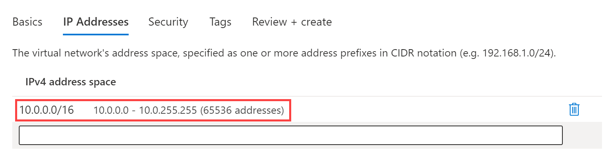

---
Exercise:
  title: 'M01: Unidad 4 Diseño e implementación de una red virtual en Azure'
  module: Module 01 - Introduction to Azure Virtual Networks
---

# M01: Unidad 4 Diseño e implementación de una red virtual en Azure

## Escenario del ejercicio

Ahora está listo para implementar redes virtuales en Azure Portal.

Considere la organización ficticia Contoso Ltd, que está en proceso de migrar la infraestructura y las aplicaciones a Azure. Como ingeniero de red, debe planear e implementar tres redes virtuales y subredes para admitir recursos en esas redes virtuales.

**Nota:** Hay disponible una **[simulación de laboratorio interactiva](https://mslabs.cloudguides.com/guides/AZ-700%20Lab%20Simulation%20-%20Design%20and%20implement%20a%20virtual%20network%20in%20Azure)** que le permite realizar sus propias selecciones a su entera discreción. Es posible que encuentres pequeñas diferencias entre la simulación interactiva y el laboratorio hospedado, pero las ideas y los conceptos básicos que se muestran son los mismos.

### Tiempo estimado: 20 minutos

La red virtual **CoreServicesVnet** se implementa en la región **Este de EE. UU.**. Esta red virtual tendrá el mayor número de recursos. Tendrá conectividad con redes locales a través de una conexión VPN. Esta red tendrá servicios web, bases de datos y otros sistemas que son fundamentales para las operaciones de la empresa. Los servicios compartidos, como los controladores de dominio y DNS, también se ubicarán aquí. Se prevé una gran cantidad de crecimiento, por lo que se necesita un gran espacio de direcciones para esta red virtual.

La red virtual **ManufacturingVnet** se implementa en la región **Oeste de Europa**, cerca de las instalaciones de fabricación de la organización. Esta red virtual contendrá sistemas para las operaciones de las instalaciones de fabricación. La organización prevé un gran número de dispositivos conectados internos para que sus sistemas recuperen datos, como la temperatura, y necesitarán un espacio de direcciones IP en el que se puedan expandir.

La red virtual **ResearchVnet** se implementa en la región **Sudeste Asiático**, cerca de la ubicación del equipo de investigación y desarrollo de la organización. El equipo de investigación y desarrollo usa esta red virtual. El equipo tiene un conjunto de recursos pequeño y estable que no se espera que crezca. Para su trabajo, necesitan un pequeño número de direcciones IP para algunas máquinas virtuales.

Creará los recursos siguientes:

| **Virtual Network** | **Región**     | **Espacio de direcciones de red virtual** | **Subred**                | **Subred**    |
| ------------------- | -------------- | --------------------------------- | ------------------------- | ------------- |
| CoreServicesVnet    | Este de EE. UU.        | 10.20.0.0/16                      |                           |               |
|                     |                |                                   | GatewaySubnet             | 10.20.0.0/27  |
|                     |                |                                   | SharedServicesSubnet      | 10.20.10.0/24 |
|                     |                |                                   | DatabaseSubnet            | 10.20.20.0/24 |
|                     |                |                                   | PublicWebServiceSubnet    | 10.20.30.0/24 |
| ManufacturingVnet   | Oeste de Europa    | 10.30.0.0/16                      |                           |               |
|                     |                |                                   | ManufacturingSystemSubnet | 10.30.10.0/24 |
|                     |                |                                   | SensorSubnet1             | 10.30.20.0/24 |
|                     |                |                                   | SensorSubnet2             | 10.30.21.0/24 |
|                     |                |                                   | SensorSubnet3             | 10.30.22.0/24 |
| ResearchVnet        | Sudeste de Asia | 10.40.0.0/16                      |                           |               |
|                     |                |                                   | ResearchSystemSubnet      | 10.40.0.0/24  |

Estas redes virtuales y subredes están estructuradas de manera que se adaptan a los recursos existentes, pero permiten el crecimiento previsto. A continuación se crearán estas redes virtuales y subredes para sentar las bases de la infraestructura de red.

En este ejercicio, aprenderá a:

+ Tarea 1: Creación del grupo de recursos de Contoso
+ Tarea 2: Creación de la red virtual CoreServicesVnet y de las subredes
+ Tarea 3: Creación de la red virtual ManufacturingVnet y de las subredes
+ Tarea 4: Creación de la red virtual ResearchVnet y de las subredes
+ Tarea 5: Comprobación de la creación de las redes virtuales y las subredes

## Tarea 1: Creación del grupo de recursos de Contoso

1. Vaya a [Azure Portal](https://portal.azure.com/).

1. En la página principal, en **Servicios de Azure**, seleccione **Grupos de recursos**.  

1. En el grupo de recursos, selecciona **+ Crear**.

1. Use la información de la tabla siguiente para crear el grupo de recursos.

   | **Tab**         | **Opción**                                 | **Valor**            |
   | --------------- | ------------------------------------------ | -------------------- |
   | Aspectos básicos          | Resource group                             | ContosoResourceGroup |
   |                 | Región                                     | (EE. UU.) Este de EE. UU.         |
   | Etiquetas            | No se necesitan cambios                        |                      |
   | Revisar y crear | Revise la configuración y seleccione **Crear**. |                      |

1. En Grupos de recursos, compruebe que **ContosoResourceGroup** aparece en la lista.

## Tarea 2: Creación de la red virtual CoreServicesVnet y de las subredes

1. En la página principal de Azure Portal, vaya a la barra Búsqueda global, busque **Redes virtuales** y seleccione Redes virtuales en servicios.  

1. En la página Redes virtuales, seleccione **Crear**.  
1. Use la información de la tabla siguiente para crear la red virtual CoreServicesVnet.  
   Quitar o sobrescribir el espacio de direcciones IP predeterminado. 

   | **Tab**      | **Opción**         | **Valor**            |
   | ------------ | ------------------ | -------------------- |
   | Aspectos básicos       | Grupo de recursos     | ContosoResourceGroup |
   |              | Nombre               | CoreServicesVnet     |
   |              | Región             | (EE. UU.) Este de EE. UU.         |
   | Direcciones IP | Espacio de direcciones IPv4 | 10.20.0.0/16         |

1. Use la información de la tabla siguiente para crear las subredes de CoreServicesVnet.

1. Para empezar a crear cada subred, seleccione **+ Agregar subred**. Para terminar de crear cada subred, seleccione **Agregar**.

   | **Subred**             | **Opción**           | **Valor**              |
   | ---------------------- | -------------------- | ---------------------- |
   | GatewaySubnet          | Nombre de subred          | GatewaySubnet          |
   |                        | Intervalo de direcciones de subred | 10.20.0.0/27           |
   | SharedServicesSubnet   | Nombre de subred          | SharedServicesSubnet   |
   |                        | Intervalo de direcciones de subred | 10.20.10.0/24          |
   | DatabaseSubnet         | Nombre de subred          | DatabaseSubnet         |
   |                        | Intervalo de direcciones de subred | 10.20.20.0/24          |
   | PublicWebServiceSubnet | Nombre de subred          | PublicWebServiceSubnet |
   |                        | Intervalo de direcciones de subred | 10.20.30.0/24          |

1. Para terminar de crear la red virtual CoreServicesVnet y las subredes asociadas, seleccione **Revisar y crear**.

1. Compruebe que la configuración superó la validación y, luego, seleccione **Crear**.

1. Repita los pasos del 1 al 8 con cada red virtual en función de las tablas siguientes.  

## Tarea 3: Creación de la red virtual ManufacturingVnet y de las subredes

   | **Tab**      | **Opción**         | **Valor**            |
   | ------------ | ------------------ | -------------------- |
   | Aspectos básicos       | Grupo de recursos     | ContosoResourceGroup |
   |              | Nombre               | ManufacturingVnet    |
   |              | Region             | (Europa) Oeste de Europa |
   | Direcciones IP | Espacio de direcciones IPv4 | 10.30.0.0/16         |

   | **Subred**                | **Opción**           | **Valor**                 |
   | ------------------------- | -------------------- | ------------------------- |
   | ManufacturingSystemSubnet | Nombre de subred          | ManufacturingSystemSubnet |
   |                           | Intervalo de direcciones de subred | 10.30.10.0/24             |
   | SensorSubnet1             | Nombre de subred          | SensorSubnet1             |
   |                           | Intervalo de direcciones de subred | 10.30.20.0/24             |
   | SensorSubnet2             | Nombre de subred          | SensorSubnet2             |
   |                           | Intervalo de direcciones de subred | 10.30.21.0/24             |
   | SensorSubnet3             | Nombre de subred          | SensorSubnet3             |
   |                           | Intervalo de direcciones de subred | 10.30.22.0/24             |

## Tarea 4: Creación de la red virtual ResearchVnet y de las subredes

   | **Tab**      | **Opción**         | **Valor**            |
   | ------------ | ------------------ | -------------------- |
   | Aspectos básicos       | Grupo de recursos     | ContosoResourceGroup |
   |              | Nombre               | ResearchVnet         |
   |              | Region             | Sudeste de Asia       |
   | Direcciones IP | Espacio de direcciones IPv4 | 10.40.0.0/16         |

   | **Subred**           | **Opción**           | **Valor**            |
   | -------------------- | -------------------- | -------------------- |
   | ResearchSystemSubnet | Nombre de subred          | ResearchSystemSubnet |
   |                      | Intervalo de direcciones de subred | 10.40.0.0/24         |

## Tarea 5: Comprobación de la creación de las redes virtuales y las subredes

1. En la página principal de Azure Portal, seleccione **Todos los recursos**.

1. Compruebe que se muestran las redes virtuales CoreServicesVnet, ManufacturingVnet y ResearchVnet.

1. Seleccione **CoreServicesVnet**.

1. En CoreServicesVnet, en **Configuración**, seleccione **Subredes**.

1. En CoreServicesVnet \| Subredes, compruebe que las subredes que creó aparecen en la lista y que los intervalos de direcciones IP son correctos.

   

1. Repite los pasos del 3 al 5 con cada VNet.
   
## Ampliar el aprendizaje con Copilot

Copilot puede ayudarle a aprender a usar las herramientas de scripting de Azure. Copilot también puede ayudar en áreas no cubiertas en el laboratorio o donde necesita más información. Abra un explorador Edge y elija Copilot (superior derecha) o vaya a *copilot.microsoft.com*. Dedique unos minutos a probar estas indicaciones.
+ ¿Puedes proporcionar un ejemplo de cómo se usa la dirección IP 10.30.0.0/16 en un escenario real?
+ ¿Cuál es el comando de Azure PowerShell para crear una red virtual denominada CoreServicesVnet en la región Este (EE. UU.)? La red virtual debería utilizar el espacio de direcciones IP 10.20.0.0/16.
+ ¿Cuál es el comando de CLI de Azure para crear una red virtual denominada ManufacturingVnet en la región Oeste de Europa? La red virtual debería utilizar el espacio de direcciones IP 10.30.0.0/16.

## Más información con el aprendizaje autodirigido

+ [Diseño de un esquema de direccionamiento IP para la implementación de Azure](https://learn.microsoft.com/en-us/training/modules/design-ip-addressing-for-azure/). En este módulo, identificarás las funcionalidades de direcciones IP públicas y privadas de redes virtuales de Azure.
+ [Introducción a las redes virtuales de Azure](https://learn.microsoft.com/en-us/training/modules/introduction-to-azure-virtual-networks/). En este módulo, descubrirás cómo diseñar e implementar servicios de red de Azure. Obtendrás información sobre redes virtuales, direcciones IP públicas y privadas, DNS, emparejamiento de redes virtuales, enrutamiento y Azure Virtual NAT.

## Puntos clave

+ Azure Virtual Network es un servicio que proporciona el bloque de compilación fundamental para su red privada en Azure. Una instancia del servicio (una red virtual) permite que muchos tipos de recursos de Azure se comuniquen de forma segura entre sí, Internet y redes locales. Asegúrese de que los espacios de direcciones no se superpongan. Asegúrese de que el espacio de direcciones de su red virtual (bloque CIDR) no se solape con otros intervalos de red de su organización.
+ Todos los recursos de Azure en una red virtual se implementan en una subred de la red virtual. Las subredes te permiten segmentar la red virtual en una o varias subredes y asignar una parte del espacio de direcciones de la red virtual a cada subred. Las subredes no deberían cubrir el espacio de direcciones completo de la red virtual. Planee con antelación y reserve algún espacio de direcciones para el futuro.

