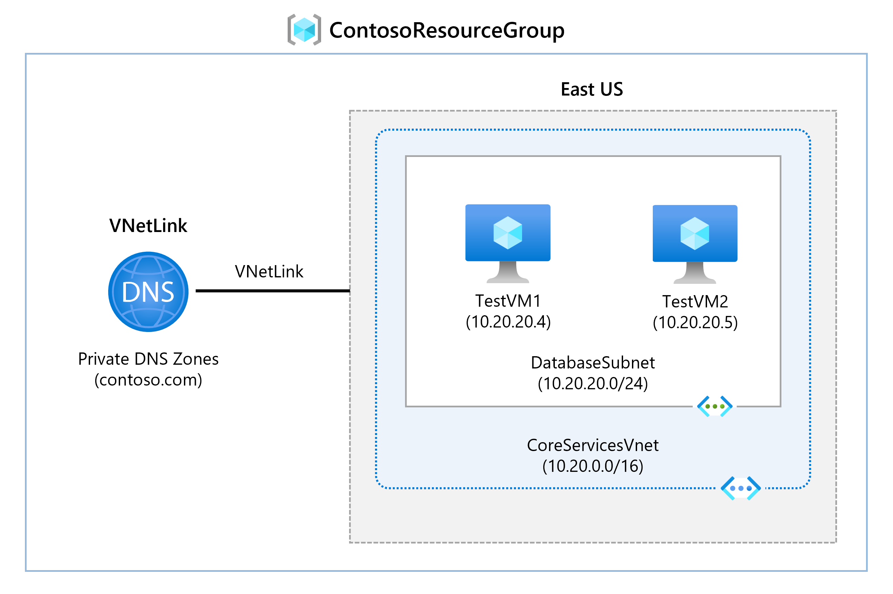
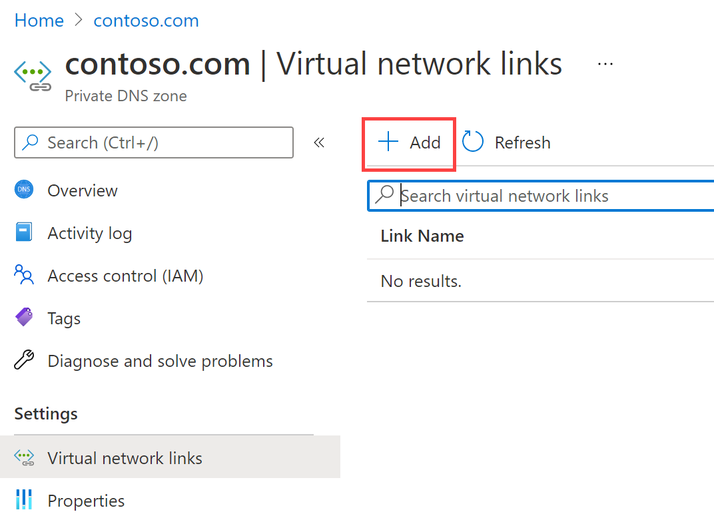
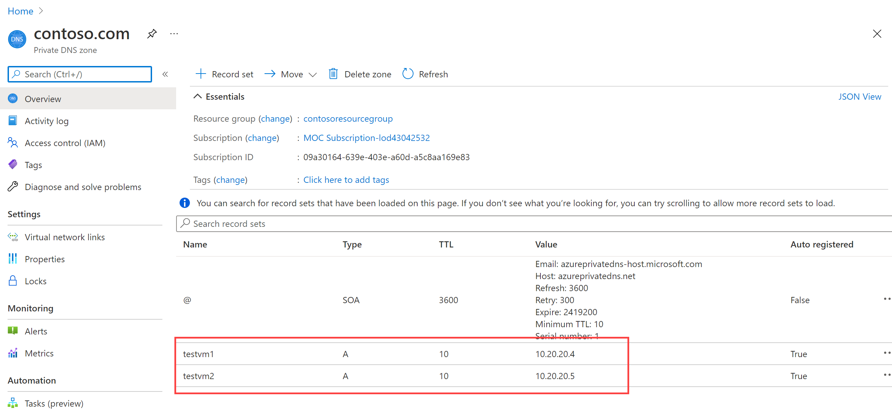

---
Exercise:
  title: 'CM01: Unidad 6 Configuración de las opciones de DNS en Azure'
  module: Module 01 - Introduction to Azure Virtual Networks
---

# CM01: Unidad 6 Configuración de las opciones de DNS en Azure

## Escenario del ejercicio

En esta unidad, configurará la resolución de nombres DNS para Contoso Ltd. Creará una zona DNS privada llamada contoso.com, vinculará las redes virtuales para el registro y la resolución y, luego, creará dos máquinas virtuales y probará la configuración.



En este ejercicio, aprenderá a:

+ Tarea 1: Creación de una zona DNS privada
+ Tarea 2: Vinculación de la subred para el registro automático
+ Tarea 3: Creación de máquinas virtuales para probar la configuración
+ Tarea 4: Comprobación de que existen registros en la zona DNS

   >**Nota:** Hay disponible una **[simulación de laboratorio interactiva](https://mslabs.cloudguides.com/guides/AZ-700%20Lab%20Simulation%20-%20Configure%20DNS%20settings%20in%20Azure)** que le permite realizar sus propias selecciones a su entera discreción. Es posible que encuentre pequeñas diferencias entre la simulación interactiva y el laboratorio hospedado, pero las ideas y los conceptos básicos que se muestran son los mismos.

### Tiempo estimado: 25 minutos

**Importante:** este ejercicio requiere una red virtual del laboratorio anterior. Esta se puede instalar mediante un archivo de [plantilla](https://github.com/MicrosoftLearning/AZ-700-Designing-and-Implementing-Microsoft-Azure-Networking-Solutions/tree/master/Allfiles/Exercises/M01/template.json). Todas las redes virtuales se instalarán, pero solo se necesita CoreServicesVNet. 

## Tarea 1: Creación de una zona DNS privada

1. Vaya a [Azure Portal](https://portal.azure.com/).

1. En la página principal de Azure, en la barra de búsqueda, escriba dns y, luego, seleccione **Zonas DNS privadas**.  
   

1. En Zonas DNS privadas, seleccione **+ Crear**.

1. Use la información de la tabla siguiente para crear la zona DNS privada.

    | **Tab**         | **Opción**                             | **Valor**            |
    | --------------- | -------------------------------------- | -------------------- |
    | Conceptos básicos          | Grupo de recursos (créalo de ser necesario) | `ContosoResourceGroup` |
    |                 | Nombre                                   | `Contoso.com`          |
    | Revisar y crear | Revise la configuración y seleccione Crear. |                      |

1. Espere hasta que se complete la implementación y, luego, seleccione **Ir al recurso**.

1. Compruebe que se ha creado la nueva zona.

## Tarea 2: Vinculación de la subred para el registro automático

1. En Contoso.com, en **Administración de DNS**, selecciona **Vínculos de red virtual**.

1. En Contoso.com \| Vínculos de red virtual, seleccione **+ Agregar**.

    

1. Use la información de la tabla siguiente para agregar el vínculo de la red virtual.

    | **Opción**                          | **Valor**                               |
    | ----------------------------------- | --------------------------------------- |
    | Nombre del vínculo                           | `CoreServicesVnetLink`                   |
    | Suscripción                        | No se necesitan cambios                     |
    | Virtual Network                     | CoreServicesVnet (ContosoResourceGroup) |
    | Habilitación del registro automático            | Seleccionada                                |
    | Revise la configuración y seleccione Aceptar. |                                         |

1. Seleccione **Actualizar**.

1. Compruebe que se ha creado CoreServicesVnetLink y que se ha habilitado el registro automático.

## Tarea 3: Creación de máquinas virtuales para probar la configuración

En esta sección, creará dos máquinas virtuales de prueba para probar la configuración de la zona DNS privada.

1. En Azure Portal, selecciona el icono Cloud Shell (parte superior derecha). Si es necesario, configura el shell.  
    + Selecciona **PowerShell**.
    + Selecciona **No se requiere cuenta de almacenamiento** y tu **Suscripción**, después, selecciona **Aplicar**.
    + Espera a que se cree el terminal y se muestre una solicitud. 

1. En la barra de herramientas del panel de Cloud Shell, selecciona el icono **Administrar archivos**, en el menú desplegable, selecciona **Cargar** y carga uno a uno los archivos de plantilla **azuredeploy.json** y **azuredeploy.parameters.json**.

   >**Nota:** si trabajas en tu propia suscripción, los [archivos de plantilla](https://github.com/MicrosoftLearning/AZ-700-Designing-and-Implementing-Microsoft-Azure-Networking-Solutions/tree/master/Allfiles/Exercises) están disponibles en el repositorio de laboratorio de GitHub.
   
1. Implementa las plantillas de ARM siguientes a fin de crear las máquinas virtuales necesarias para este ejercicio:

   >**Nota**: se te pedirá que proporciones una contraseña de administrador. Necesitarás esta contraseña en un paso posterior. 

   ```powershell
   $RGName = "ContosoResourceGroup"
   
   New-AzResourceGroupDeployment -ResourceGroupName $RGName -TemplateFile azuredeploy.json -TemplateParameterFile azuredeploy.parameters.json
   ```
  
1. Cuando la implementación esté completa, vaya a la página principal de Azure Portal y, luego, seleccione **Máquinas virtuales**.

1. Compruebe que se han creado ambas máquinas virtuales.

## Tarea 4: Comprobación de que existen registros en la zona DNS

1. En la página principal de Azure Portal, selecciona **Zonas DNS privadas**.

1. En Zonas DNS privadas, selecciona **contoso.com**.

1. Compruebe que los registros de host (D) aparecen en ambas máquinas virtuales, como se muestra a continuación:

    

1. Anote los nombres y las direcciones IP de las máquinas virtuales.

### Conexión a una máquina virtual para probar la resolución de nombres

1. En la página principal de Azure Portal, selecciona **Máquinas virtuales**.

1. Selecciona **TestVM1**.

1. En TestVM1, selecciona **Conectar &gt; Conectar** y descarga el archivo RDP. Asegúrate de que el archivo se descarga correctamente.

1. Busca el archivo RDP y haz doble clic para ejecutar el archivo.

1. Selecciona **Conectar** y proporciona la contraseña **TestUser** que proporcionaste durante la implementación de la plantilla.

1. Selecciona **Aceptar** y, después, **Sí** en la página de advertencia.

1. En TestVM1, abre un símbolo del sistema y escribe el comando `ipconfig /all`.

1. Observa que la dirección IP es la misma que en la zona DNS.

1. Escriba el comando `ping TestVM2.contoso.com`. Este comando agotará el tiempo de espera porque el firewall de Windows está habilitado en las máquinas virtuales.

1. En su lugar, usa el comando `nslookup TestVM2.contoso.com` para comprobar que recibes un registro de resolución de nombres correcto para VM2. Esto muestra la resolución de nombres de zona privada. 

## Ampliar el aprendizaje con Copilot

Copilot puede ayudarte a aprender a usar las herramientas de scripting de Azure. Copilot también puede ayudar en áreas no cubiertas en el laboratorio o donde necesitas más información. Abre un explorador Edge y elige Copilot (superior derecha) o ve a *copilot.microsoft.com*. Dedica unos minutos a probar estas indicaciones.
+ ¿Cuál es la diferencia entre Azure DNS y DNS privado de Azure? Proporciona ejemplos de cuándo usar DNS privado de Azure.
+ ¿Cuál es el propósito del registro automático al crear una zona de Azure DNS?

## Obtén más información con el aprendizaje autodirigido

+ [Introducción a Azure DNS](https://learn.microsoft.com/training/modules/intro-to-azure-dns/). En este módulo se explica Azure DNS, cómo funciona y cuándo debes elegir usar Azure DNS como solución para satisfacer las necesidades de tu organización.
+ [Hospeda el dominio en Azure DNS](https://learn.microsoft.com/training/modules/host-domain-azure-dns/). En este módulo, crearás una zona DNS y registros DNS para asignar el dominio a una dirección IP. Además, comprueba para tener la certeza de que el nombre de dominio se resuelve en tu servidor web.

## Puntos clave

Enhorabuena por completar el laboratorio. Estas son las principales conclusiones del laboratorio. 

+ Azure DNS es un servicio en la nube que permite hospedar y administrar dominios de sistema de nombres de dominio (DNS), también conocidos como zonas DNS. 
+ Los datos de las zonas de nombres de dominio de host de zona pública de Azure DNS para los registros que pretende que resuelva cualquier host de Internet.
+ Las zonas de DNS privado de Azure te permiten configurar un espacio de nombres de zona DNS privada para recursos privados de Azure.
+ Una zona DNS es una colección de registros DNS. Los registros DNS proporcionan información sobre el dominio.
