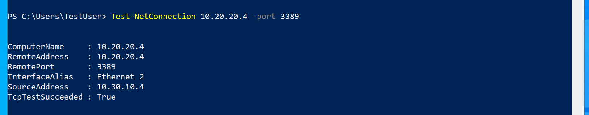

---
Exercise:
  title: 'M01: Unidad 8 Conexión de dos redes virtuales de Azure mediante el emparejamiento de red virtual global'
  module: Module 01 - Introduction to Azure Virtual Networks
---

# M01: Unidad 8 Conexión de dos redes virtuales de Azure mediante el emparejamiento de red virtual global

## Escenario del ejercicio

En esta unidad, configurará la conectividad entre CoreServicesVnet y ManufacturingVnet agregando emparejamientos para permitir el flujo de tráfico.


En esta unidad, aprenderá a:

+ Tarea 1: Creación de una máquina virtual para probar la configuración
+ Tarea 2: Conexión a las máquinas virtuales de prueba con RDP
+ Tarea 3: Prueba de la conexión entre las máquinas virtuales
+ Tarea 4: Creación de emparejamientos de VNet entre CoreServicesVnet y ManufacturingVnet
+ Tarea 5: Prueba de la conexión entre las máquinas virtuales
+ Tarea 6: limpiar los recursos

**Nota:** Hay disponible una **[simulación de laboratorio interactiva](https://mslabs.cloudguides.com/guides/AZ-700%20Lab%20Simulation%20-%20Connect%20two%20Azure%20virtual%20networks%20using%20global%20virtual%20network%20peering)** que le permite realizar sus propias selecciones a su entera discreción. Es posible que encuentre pequeñas diferencias entre la simulación interactiva y el laboratorio hospedado, pero las ideas y los conceptos básicos que se muestran son los mismos.

### Tiempo estimado: 20 minutos

## Tarea 1: Creación de una máquina virtual para probar la configuración

En esta sección, creará una máquina virtual de prueba en ManufacturingVNet para probar si, desde ella, puede acceder a los recursos que contiene otra red virtual de Azure.

### Creación de ManufacturingVM

1. En Azure Portal, selecciona el icono Cloud Shell (parte superior derecha). Si es necesario, configura el shell.  
    + Selecciona **PowerShell**.
    + Selecciona **No se requiere cuenta de almacenamiento** y tu **Suscripción**, después, selecciona **Aplicar**.
    + Espera a que se cree el terminal y se muestre una solicitud. 

1. En la barra de herramientas del panel de Cloud Shell, selecciona el icono **Administrar archivos**, en el menú desplegable, selecciona **Cargar** y carga los siguientes archivos **ManufacturingVMazuredeploy. json** y **ManufacturingVMazuredeploy.parameters.json** en el directorio principal de Cloud Shell uno a uno desde la carpeta de origen **F:\Allfiles\Exercises\M01**..

1. Implementa las plantillas de ARM siguientes a fin de crear las máquinas virtuales necesarias para este ejercicio:

   >**Nota**: Se le pedirá que proporcione una contraseña de administrador.

   ```powershell
   $RGName = "ContosoResourceGroup"
   
   New-AzResourceGroupDeployment -ResourceGroupName $RGName -TemplateFile ManufacturingVMazuredeploy.json -TemplateParameterFile ManufacturingVMazuredeploy.parameters.json
   ```
  
1. Cuando la implementación esté completa, vaya a la página principal de Azure Portal y, luego, seleccione **Máquinas virtuales**.

1. Compruebe que se ha creado la máquina virtual.

## Tarea 2: Conexión a las máquinas virtuales de prueba con RDP

1. En la página principal de Azure Portal, selecciona **Máquinas virtuales**.

1. Seleccione **ManufacturingVM**.

1. En ManufacturingVM, selecciona **Conectar &gt; RDP**.

1. En ManufacturingVM \| Conectar, selecciona **Descargar archivo RDP**.

1. Guarde el archivo RDP en el escritorio.

1. Conéctate a ManufacturingVM mediante el archivo RDP y el nombre de usuario **TestUser** y la contraseña que has proporcionado durante la implementación.

1. En la página principal de Azure Portal, selecciona **Máquinas virtuales**.

1. Seleccione **TestVM1**.

1. En TestVM1, selecciona **Conectar &gt; RDP**.

1. En TestVM1 \| Conectar, selecciona **Descargar archivo RDP**.

1. Guarde el archivo RDP en el escritorio.

1. Conéctate a TestVM1 mediante el archivo RDP y el nombre de usuario **TestUser** y la contraseña que proporcionaste durante la implementación.

1. En las dos máquinas virtuales, en **Elegir la configuración de privacidad para el dispositivo**, seleccione **Aceptar**.

1. En las dos máquinas virtuales, en **Redes**, seleccione **Sí**.

1. En TestVM1, abra un símbolo del sistema de PowerShell y ejecute el siguiente comando: ipconfig.

1. Anote la dirección IPv4.

## Tarea 3: Prueba de la conexión entre las máquinas virtuales

1. En ManufacturingVM, abra un símbolo del sistema de PowerShell.

1. Use el siguiente comando para comprobar que no hay ninguna conexión a TestVM1 en CoreServicesVnet. Asegúrese de usar la dirección IPv4 para TestVM1.

   ```powershell
    Test-NetConnection 10.20.20.4 -port 3389
    ```

1. La conexión de prueba producirá un error y verá un resultado similar al siguiente: 

## Tarea 4: Creación de emparejamientos de VNet entre CoreServicesVnet y ManufacturingVnet

1. En la página principal de Azure, seleccione **Redes virtuales** y, luego, **CoreServicesVnet**.

1. En CoreServicesVnet, en **Configuración**, seleccione **Emparejamientos**.
   

1. En CoreServicesVnet \| Emparejamientos, seleccione **+ Agregar**.

1. Usa esta información para crear el emparejamiento. Cuando termine, seleccione **Agregar**. 

   **Resumen de red virtual remota**

   | **Opción**                                    | **Valor**                             |
   | ------------------------------------ | --------------------------------------------- | 
   | Nombre del vínculo de emparejamiento    | `CoreServicesVnet-to-ManufacturingVnet` |
   | Red virtual | ManufacturingVnet |

    **Configuración de emparejamiento de red virtual remota**
   
   | **Opción**                                    | **Valor**                             |
   | ------------------------------------ | --------------------------------------------- | 
   | Permitir que "ManufacturingVnet" acceda a "CoreServicesVnet" | habilitado |
   |"ManufacturingVnet" recibirá tráfico reenviado desde "CoreServicesVnet" | habilitado |
 
    **Resumen de red virtual local**

    | **Opción**                                    | **Valor**                             |
    | ------------------------------------ | --------------------------------------------- | 
    | Nombre del vínculo de emparejamiento | `CoreServicesVnet-to-ManufacturingVnet` |
 
    **Configuración de emparejamiento de red virtual remota**
   
    | **Opción**                                    | **Valor**                             |
    | ------------------------------------ | --------------------------------------------- | 
    | Permitir que "CoreServicesVnet" acceda a "ManufacturingVnet" | habilitado
    | Permitir que "CoreServicesVnet" reciba tráfico reenviado desde "ManufacturingVnet" | habilitado |
 
1. En CoreServicesVnet \| Emparejamientos, compruebe que se muestra el emparejamiento **CoreServicesVnet-to-ManufacturingVnet**.

1. En Redes virtuales, seleccione **ManufacturingVnet** y compruebe que el emparejamiento **ManufacturingVnet-to-CoreServicesVnet** aparece en la lista.

## Tarea 5: Prueba de la conexión entre las máquinas virtuales

1. En ManufacturingVM, abra un símbolo del sistema de PowerShell.

1. Use el siguiente comando para comprobar que ahora hay una conexión a TestVM1 en CoreServicesVnet.

   ```powershell
    Test-NetConnection 10.20.20.4 -port 3389
    ```

1. La conexión de prueba se realizará correctamente y verá un resultado similar al siguiente: 

Felicidades. Ha configurado correctamente la conectividad entre redes virtuales mediante la adición de emparejamientos.

## Tarea 6: limpiar los recursos

   >**Nota**: No olvide quitar los recursos de Azure recién creados que ya no use. La eliminación de los recursos sin usar garantiza que no verá cargos inesperados.

1. En Azure Portal, abre la sesión de **PowerShell** en el panel **Cloud Shell**. (Crea el almacenamiento de Cloud Shell si es necesario, con la configuración predeterminada).

1. Ejecute el comando siguiente para eliminar todos los grupos de recursos que ha creado en los laboratorios de este módulo:

   ```powershell
   Remove-AzResourceGroup -Name 'ContosoResourceGroup' -Force -AsJob
   ```

   >**Nota**: El comando se ejecuta de forma asincrónica (según determina el parámetro -AsJob). Aunque podrá ejecutar otro comando de PowerShell inmediatamente después en la misma sesión de PowerShell, los grupos de recursos tardarán unos minutos en eliminarse.
