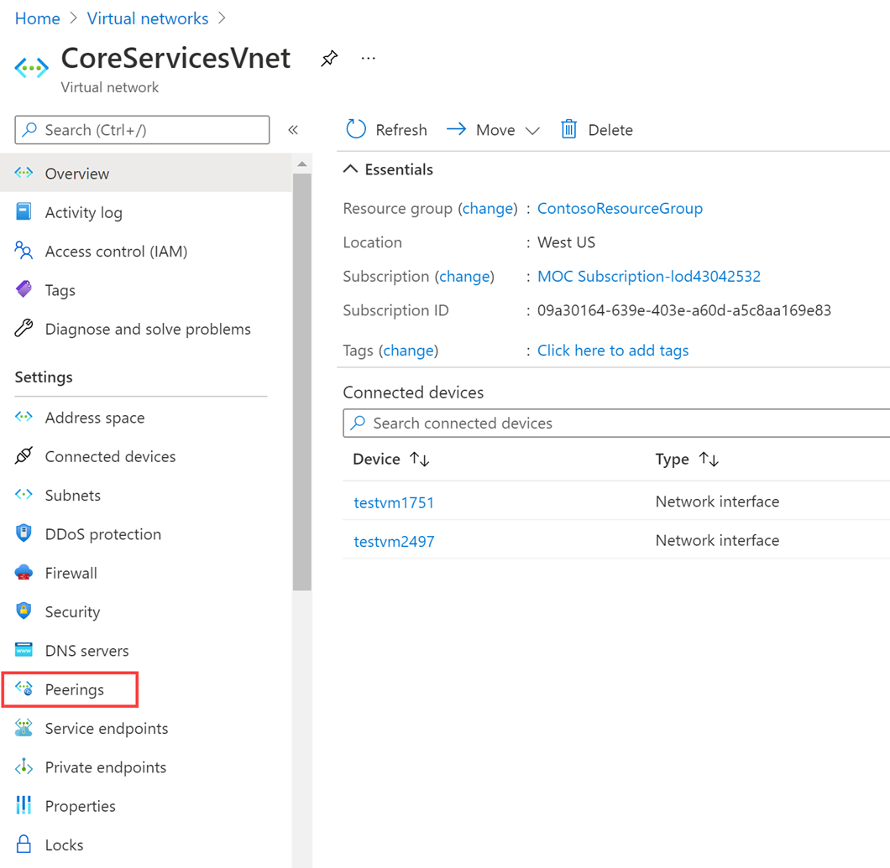

---
Exercise:
  title: 'M01: Unidad 8 Conexión de dos redes virtuales de Azure mediante el emparejamiento de red virtual global'
  module: Module 01 - Introduction to Azure Virtual Networks
---

# M01: Unidad 8 Conexión de dos redes virtuales de Azure mediante el emparejamiento de red virtual global

## Escenario del ejercicio

En esta unidad, configurarás la conectividad entre CoreServicesVnet y ManufacturingVnet agregando emparejamientos para permitir el flujo de tráfico.


### Aptitudes de trabajo

En este ejercicio, aprenderás a:

+ Tarea 1: Creación de una máquina virtual para probar la configuración
+ Tarea 2: Conexión a las máquinas virtuales de prueba con RDP
+ Tarea 3: Prueba de la conexión entre las máquinas virtuales
+ Tarea 4: Creación de emparejamientos de VNet entre CoreServicesVnet y ManufacturingVnet
+ Tarea 5: Prueba de la conexión entre las máquinas virtuales

### Simulaciones de laboratorio interactivas

>**Nota**: las simulaciones de laboratorio proporcionadas anteriormente se han retirado.

### Tiempo estimado: 20 minutos

## Tarea 1: Creación de una máquina virtual para probar la configuración

En esta sección, crearás una máquina virtual de prueba en VNet para probar si, desde ella, puedes acceder a los recursos que contiene otra red virtual de Azure.

### Creación de ManufacturingVM

1. En Azure Portal, selecciona el icono Cloud Shell (parte superior derecha). Si es necesario, configura el shell.  
    + Selecciona **PowerShell**.
    + Selecciona **No se requiere cuenta de almacenamiento** y tu **Suscripción**, después, selecciona **Aplicar**.
    + Espera a que se cree el terminal y se muestre una solicitud. 

1. En la barra de herramientas del panel de Cloud Shell, selecciona el icono **Administrar archivos**, en el menú desplegable, selecciona **Cargar** y carga los siguientes archivos **ManufacturingVMazuredeploy.json** y **ManufacturingVMazuredeploy.parameters.json**.

    >**Nota:** Si estás trabajando en tu propia suscripción los [archivos de plantilla](https://github.com/MicrosoftLearning/AZ-700-Designing-and-Implementing-Microsoft-Azure-Networking-Solutions/tree/master/Allfiles/Exercises) están disponibles en el repositorio de laboratorio de GitHub.

1. Implementa las plantillas de ARM siguientes a fin de crear las máquinas virtuales necesarias para este ejercicio:

   >**Nota**: se te pedirá que proporciones una contraseña de administrador.

   ```powershell
   $RGName = "ContosoResourceGroup"
   
   New-AzResourceGroupDeployment -ResourceGroupName $RGName -TemplateFile ManufacturingVMazuredeploy.json -TemplateParameterFile ManufacturingVMazuredeploy.parameters.json
   ```
  
1. Cuando la implementación esté completa, ve a la página principal de Azure Portal y, luego, selecciona **Máquinas virtuales**.

1. Comprueba que se ha creado la máquina virtual.

## Tarea 2: Conexión a las máquinas virtuales de prueba con RDP

1. En la página principal de Azure Portal, selecciona **Máquinas virtuales**.

1. Selecciona **ManufacturingVM**.

1. En ManufacturingVM, selecciona **Conectar &gt; RDP**.

1. En ManufacturingVM \| Conectar, selecciona **Descargar archivo RDP**.

1. Guarda el archivo RDP en el escritorio.

1. Conéctate a ManufacturingVM mediante el archivo RDP y el nombre de usuario **TestUser** y la contraseña que has proporcionado durante la implementación.

1. En la página principal de Azure Portal, selecciona **Máquinas virtuales**.

1. Selecciona **TestVM1**.

1. En TestVM1, selecciona **Conectar &gt; RDP**.

1. En TestVM1 \| Conectar, selecciona **Descargar archivo RDP**.

1. Guarda el archivo RDP en el escritorio.

1. Conéctate a TestVM1 mediante el archivo RDP y el nombre de usuario **TestUser** y la contraseña que proporcionaste durante la implementación.

1. En las dos máquinas virtuales, en **Elegir la configuración de privacidad para el dispositivo**, selecciona **Aceptar**.

1. En las dos máquinas virtuales, en **Redes**, selecciona **Sí**.

1. En TestVM1, abre un símbolo del sistema de PowerShell y ejecuta el siguiente comando: ipconfig.

1. Anota la dirección IPv4.

## Tarea 3: Prueba de la conexión entre las máquinas virtuales

1. En ManufacturingVM, abre un símbolo del sistema de PowerShell.

1. Usa el siguiente comando para comprobar que no hay ninguna conexión a TestVM1 en CoreServicesVnet. Asegúrate de usar la dirección IPv4 para TestVM1.

   ```powershell
    Test-NetConnection 10.20.20.4 -port 3389
    ```

1. La conexión de prueba producirá un error y verás un resultado similar al siguiente: 

## Tarea 4: Creación de emparejamientos de VNet entre CoreServicesVnet y ManufacturingVnet

1. En la página principal de Azure, selecciona **Redes virtuales** y, luego, **CoreServicesVnet**.

1. En CoreServicesVnet, en **Configuración**, selecciona **Emparejamientos**.
   

1. En CoreServicesVnet \| Emparejamientos, selecciona **+ Agregar**.

1. Usa esta información para crear el emparejamiento. Cuando termines, selecciona **Agregar**. 

   **Resumen de red virtual remota**

   | **Opción**                                    | **Valor**                             |
   | ------------------------------------ | --------------------------------------------- | 
   | Nombre del vínculo de emparejamiento    | `ManufacturingVnet-to-CoreServicesVnet` |
   | Red virtual | ManufacturingVnet |

    **Configuración de emparejamiento de red virtual remota**
   
   | **Opción**                                    | **Valor**                             |
   | ------------------------------------ | --------------------------------------------- | 
   | Permitir que "ManufacturingVNet" acceda a "CoreServicesVNet" | Habilitado |
   |"ManufacturingVnet" recibirá tráfico reenviado desde "CoreServicesVnet" | Habilitado |
 
    **Resumen de red virtual local**

    | **Opción**                                    | **Valor**                             |
    | ------------------------------------ | --------------------------------------------- | 
    | Nombre del vínculo de emparejamiento | `CoreServicesVnet-to-ManufacturingVnet` |
 
    **Configuración de emparejamiento de red virtual local**
   
    | **Opción**                                    | **Valor**                             |
    | ------------------------------------ | --------------------------------------------- | 
    | Permitir que "CoreServicesVnet" acceda a "ManufacturingVnet" | Habilitado
    | Permitir que "CoreServicesVnet" reciba tráfico reenviado desde "ManufacturingVnet" | Habilitado |
 
1. En CoreServicesVnet \| Emparejamientos, comprueba que el emparejamiento **CoreServicesVnet-to-ManufacturingVnet** está **Conectado**.

1. En Redes virtuales, selecciona **ManufacturingVnet** y comprueba que el emparejamiento **ManufacturingVnet-to-CoreServicesVnet** está **Conectado**.

## Tarea 5: Prueba de la conexión entre las máquinas virtuales

1. En ManufacturingVM, abre un símbolo del sistema de PowerShell.

1. Usa el siguiente comando para comprobar que ahora hay una conexión a TestVM1 en CoreServicesVnet.

   ```powershell
    Test-NetConnection 10.20.20.4 -port 3389
    ```

1. La conexión de prueba se realizará correctamente y verás un resultado similar al siguiente: 


## Limpieza de recursos

   >**Nota**: No olvide quitar los recursos de Azure recién creados que ya no use. La eliminación de los recursos sin usar garantiza que no verás cargos inesperados.

1. En Azure Portal, abre la sesión de **PowerShell** en el panel **Cloud Shell**. (Crea el almacenamiento de Cloud Shell si es necesario, con la configuración predeterminada).

1. Ejecuta el comando siguiente para eliminar todos los grupos de recursos que has creado en los laboratorios de este módulo:

   ```powershell
   Remove-AzResourceGroup -Name 'ContosoResourceGroup' -Force -AsJob
   ```
   >**Nota**: el comando se ejecuta de forma asincrónica (según determina el parámetro -AsJob). Aunque podrás ejecutar otro comando de PowerShell inmediatamente después en la misma sesión de PowerShell, los grupos de recursos tardarán unos minutos en eliminarse.
   
## Ampliar el aprendizaje con Copilot

Copilot puede ayudarte a aprender a usar las herramientas de scripting de Azure. Copilot también puede ayudar en áreas no cubiertas en el laboratorio o donde necesitas más información. Abre un explorador Edge y elige Copilot (superior derecha) o ve a *copilot.microsoft.com*. Dedica unos minutos a probar estas indicaciones.
+ ¿Cuáles son los errores más comunes al configurar el emparejamiento de red virtual de Azure?
+ En Azure, si se empareja Vnet1 con Vnet2 y, después, se empareja Vnet2 con Vnet3, ¿está emparejado Vnet1 con Vnet3?
+ ¿Pueden afectar los firewalls y las puertas de enlace al emparejamiento de red virtual de Azure?


## Obtén más información con el aprendizaje autodirigido

+ [Introducción a las redes virtuales de Azure](https://learn.microsoft.com/training/modules/introduction-to-azure-virtual-networks/). En este módulo, descubrirás cómo diseñar e implementar servicios de red de Azure. Obtendrás información sobre redes virtuales, direcciones IP públicas y privadas, DNS, emparejamiento de redes virtuales, enrutamiento y Azure Virtual NAT.
+ [Distribución de los servicios a través de redes virtuales de Azure e integración de estos mediante emparejamiento de red virtual](https://learn.microsoft.com/training/modules/integrate-vnets-with-vnet-peering/). En este módulo, aprenderás a configurar el emparejamiento de red virtual.

## Puntos clave

Enhorabuena por completar el laboratorio. Estas son las principales conclusiones del laboratorio. 

+ El emparejamiento de redes virtuales permite conectar sin problemas dos redes virtuales de Azure. A efectos de conectividad las redes virtuales aparecen como una sola.
+ Azure admite la conexión de redes virtuales dentro de la misma región de Azure y entre regiones de Azure (global).
+ El tráfico entre las máquinas virtuales en las redes virtuales emparejadas se enruta directamente a través de la infraestructura de red troncal de Microsoft, no de una puerta de enlace ni de una red Internet pública.
+ Puede cambiar el tamaño del espacio de direcciones de las redes virtuales de Azure emparejadas sin incurrir en ningún tiempo de inactividad en el espacio de direcciones actualmente emparejado.
