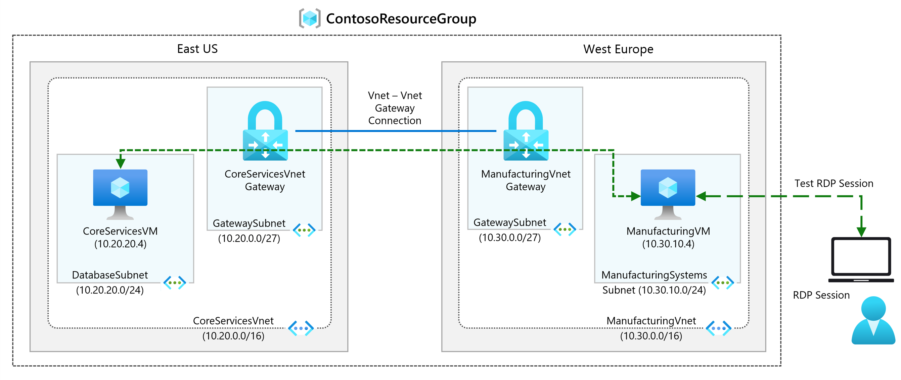
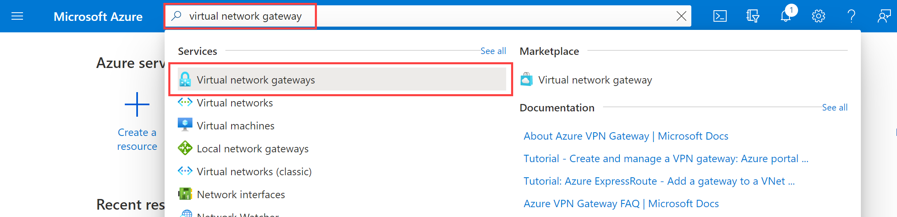

---
Exercise:
  title: 'M02: Unidad 3 Creación y configuración de una puerta de enlace de red virtual'
  module: Module 02 - Design and implement hybrid networking
---


# M02: Unidad 3 Creación y configuración de una puerta de enlace de red virtual

## Escenario del ejercicio

En este ejercicio, configurarás una puerta de enlace de red virtual para conectar la red virtual de Contoso Core Services y la red virtual Manufacturing.



En este ejercicio, aprenderás a:

+ Tarea 1: Creación de CoreServicesVnet y ManufacturingVnet
+ Tarea 2: Creación de CoreServicesVM
+ Tarea 3: Creación de ManufacturingVM
+ Tarea 4: Conexión a las máquinas virtuales mediante RDP
+ Tarea 5: Prueba de la conexión entre las máquinas virtuales
+ Tarea 6: Creación de la puerta de enlace CoreServicesVnet
+ Tarea 7: Creación de la puerta de enlace ManufacturingVnet
+ Tarea 8: Conexión de CoreServicesVnet a ManufacturingVnet
+ Tarea 9: Conexión de ManufacturingVnet a CoreServicesVnet
+ Tarea 10: Comprobación de las conexiones
+ Tarea 11: Prueba de la conexión entre las máquinas virtuales

**Nota:** hay disponible una **[simulación de laboratorio interactiva](https://mslabs.cloudguides.com/guides/AZ-700%20Lab%20Simulation%20-%20Create%20and%20configure%20a%20virtual%20network%20gateway)** que te permite realizar tus propias selecciones a tu entera discreción. Es posible que encuentres pequeñas diferencias entre la simulación interactiva y el laboratorio hospedado, pero las ideas y los conceptos básicos que se muestran son los mismos.

### Tiempo estimado: 70 minutos (incluido un tiempo de espera de implementación de aproximadamente 45 minutos)

## Tarea 1: Creación de CoreServicesVnet y ManufacturingVnet

1. En Azure Portal, selecciona el icono Cloud Shell (parte superior derecha). Si es necesario, configura el shell.  
    + Selecciona **PowerShell**.
    + Selecciona **No se requiere cuenta de almacenamiento** y tu **Suscripción**, después, selecciona **Aplicar**.
    + Espera a que se cree el terminal y se muestre una solicitud. 

1. En la barra de herramientas del panel de Cloud Shell, selecciona el icono **Administrar archivos**; en el menú desplegable, selecciona **Cargar** y carga los siguientes archivos **azuredeploy.json** y **azuredeploy.parameters.json** de uno en uno en el directorio principal de Cloud Shell desde la carpeta de origen **F:\Allfiles\Exercises\M02**

1. Implementa las siguientes plantillas de ARM para crear la red virtual y las subredes necesarias para este ejercicio:

   ```powershell
   $RGName = "ContosoResourceGroup"
   #create resource group if it doesnt exist
   New-AzResourceGroup -Name $RGName -Location "eastus"
   New-AzResourceGroupDeployment -ResourceGroupName $RGName -TemplateFile azuredeploy.json -TemplateParameterFile azuredeploy.parameters.json
   ```

 > **Nota:** actualmente, hay un problema en curso en la región Oeste de Europa que afecta a las implementaciones de puerta de enlace. Como solución alternativa, la región ManufacturingVnet se ha cambiado a Norte de Europa para esta implementación.

## Tarea 2: Creación de CoreServicesVM

1. En Azure Portal, abre la sesión de **PowerShell** en el panel **Cloud Shell**.

1. En la barra de herramientas del panel de Cloud Shell, selecciona el icono **Administrar archivos**; en el menú desplegable, selecciona **Cargar** y carga los siguientes archivos **CoreServicesVMazuredeploy.json** y **CoreServicesVMazuredeploy.parameters.json** de uno en uno en el directorio principal de Cloud Shell desde la carpeta de origen **F:\Allfiles\Exercises\M02**.

1. Implementa las plantillas de ARM siguientes a fin de crear las máquinas virtuales necesarias para este ejercicio:

   >**Nota**: se te pedirá que proporciones una contraseña de administrador.

   ```powershell
   $RGName = "ContosoResourceGroup"
   
   New-AzResourceGroupDeployment -ResourceGroupName $RGName -TemplateFile CoreServicesVMazuredeploy.json -TemplateParameterFile CoreServicesVMazuredeploy.parameters.json
   ```
  
1. Cuando la implementación esté completa, ve a la página principal de Azure Portal y, luego, selecciona **Máquinas virtuales**.

1. Comprueba que se ha creado la máquina virtual.

## Tarea 3: Creación de ManufacturingVM

1. En Azure Portal, abre la sesión de **PowerShell** en el panel **Cloud Shell**.

1. En la barra de herramientas del panel de Cloud Shell, selecciona el icono **Administrar archivos**; en el menú desplegable, selecciona **Cargar** y carga los siguientes archivos **ManufacturingVMazuredeploy.json** y **ManufacturingVMazuredeploy.parameters.json** de uno en uno en el directorio principal de Cloud Shell desde la carpeta de origen **F:\Allfiles\Exercises\M02**.

1. Implementa las plantillas de ARM siguientes a fin de crear las máquinas virtuales necesarias para este ejercicio:

   >**Nota**: se te pedirá que proporciones una contraseña de administrador.

   ```powershell
   $RGName = "ContosoResourceGroup"
   
   New-AzResourceGroupDeployment -ResourceGroupName $RGName -TemplateFile ManufacturingVMazuredeploy.json -TemplateParameterFile ManufacturingVMazuredeploy.parameters.json
   ```
  
1. Cuando la implementación esté completa, ve a la página principal de Azure Portal y, luego, selecciona **Máquinas virtuales**.

1. Comprueba que se ha creado la máquina virtual.

## Tarea 4: Conexión a las máquinas virtuales mediante RDP

1. En la página principal de Azure Portal, selecciona **Máquinas virtuales**.
1. Selecciona **ManufacturingVM**.
1. En **ManufacturingVM**, selecciona **Conectar &gt; RDP**.
1. En **ManufacturingTestVM | Conectar**, selecciona **Descargar archivo RDP**.
1. Guarda el archivo RDP en el escritorio.
1. Conéctate a **ManufacturingVM** con el archivo RDP y el nombre de usuario **TestUser** y la contraseña que has proporcionado durante la implementación. Después de conectarte, minimiza la sesión de RDP.
1. En la página principal de Azure Portal, selecciona **Máquinas virtuales**.
1. Selecciona **CoreServicesVM**.
1. En **CoreServicesTestVM**, selecciona **Conectar &gt; RDP**.
1. En **CoreServicesTestVM | Conectar**, selecciona **Descargar archivo RDP**.
1. Guarde el archivo RDP en el escritorio.
1. Conéctate a **CoreServicesVM** mediante el archivo RDP y el nombre de usuario **TestUser** y la contraseña que has proporcionado durante la implementación.
1. En las dos máquinas virtuales, en **Elegir la configuración de privacidad para el dispositivo**, seleccione **Aceptar**.
1. En las dos máquinas virtuales, en **Redes**, seleccione **Sí**.
1. En **CoreServicesVM**, abre PowerShell y ejecuta el siguiente comando: ipconfig.
1. Anote la dirección IPv4.

## Tarea 5: Prueba de la conexión entre las máquinas virtuales

1. En **ManufacturingVM**, abre PowerShell.

1. Usa el comando siguiente para comprobar que no haya ninguna conexión a CoreServicesVM en CoreServicesVnet. Asegúrate de usar la dirección IPv4 para CoreServicesVM.

   ```Powershell
   Test-NetConnection 10.20.20.4 -port 3389
   ```

1. Se debería producir un error en la conexión de prueba y verá un resultado similar al siguiente:

   

## Tarea 6: Creación de la puerta de enlace CoreServicesVnet

1. En **Buscar recursos, servicios y documentos (G+/)**, escribe **Puerta de enlace de red virtual** y, después, selecciona **Puertas de enlace de red virtual** en los resultados.
   

1. En Puertas de enlace de red virtual, seleccione **+ Crear**.

1. Use la información de la tabla siguiente para crear la puerta de enlace de red virtual:

   | **Tabulación**         | **Sección**       | **Opción**                                  | **Valor**                    |
   | --------------- | ----------------- | ------------------------------------------- | ---------------------------- |
   | Aspectos básicos          | Detalles del proyecto   | Suscripción                                | No se necesitan cambios          |
   |                 |                   | ResourceGroup                               | ContosoResourceGroup         |
   |                 | Detalles de la instancia  | NOMBRE                                        | CoreServicesVnetGateway      |
   |                 |                   | Region                                      | Este de EE. UU.                      |
   |                 |                   | Tipo de puerta de enlace                                | VPN                          |
   |                 |                   | Tipo de VPN                                    | basada en rutas                  |
   |                 |                   | SKU                                         | VpnGw1                       |
   |                 |                   | Generation                                  | Generación 1                  |
   |                 |                   | Virtual network                             | CoreServicesVnet             |
   |                 |                   | Subnet                                      | GatewaySubnet (10.20.0.0/27) |
   |                 |                   | Tipo de dirección IP pública                      | Estándar                     |
   |                 | Dirección IP pública | Dirección IP pública                           | Crear nuevo                   |
   |                 |                   | Nombre de la dirección IP pública                      | CoreServicesVnetGateway-ip   |
   |                 |                   | Habilitación del modo activo/activo                   | Disabled                     |
   |                 |                   | Configuración de BGP                               | Deshabilitada                     |
   | Revisar y crear |                   | Comprueba la configuración y selecciona **Crear**. |                              |

   > [!NOTE]
   >
   > El proceso de creación de una puerta de enlace de red virtual puede tardar entre 15 y 30 minutos. No es necesario esperar la implementación para completar. Continúa con la creación de la puerta de enlace siguiente. 

## Tarea 7: Creación de la puerta de enlace ManufacturingVnet

### Crea GatewaySubnet

**Nota:** la plantilla creó GatewaySubnet para CoreServicesVnet. Aquí crearás la subred manualmente. 

1. Busca y selecciona **ManufacturingVnet**.

1. En la hoja **Configuración**, selecciona **Subredes** y, a continuación **, + Subred**. 

    | Parámetro | Valor |
    | --------------- | ----------------- | 
    | Propósito de subred | **Puerta de enlace de red virtual** |
    | Size | **/27 (32 direcciones)** |

1. Selecciona **Agregar**. 

### Creación de la puerta de enlace de red virtual

1. En **Buscar recursos, servicios y documentos (G+/)**, escribe **Puerta de enlace de red virtual** y, después, selecciona **Puertas de enlace de red virtual** en los resultados.

1. En Puertas de enlace de red virtual, selecciona **+ Crear**.

1. Usa la información y la pestaña **Configuración** para crear la puerta de enlace de red virtual. 

   | **Tabulación**         | **Sección**       | **Opción**                                  | **Valor**                    |
   | --------------- | ----------------- | ------------------------------------------- | ---------------------------- |
   | Aspectos básicos          | Detalles del proyecto   | Suscripción                                | No se necesitan cambios          |
   |                 |                   | ResourceGroup                               | ContosoResourceGroup         |
   |                 | Detalles de la instancia  | Nombre                                        | ManufacturingVnetGateway     |
   |                 |                   | Región                                      | Norte de Europa                  |
   |                 |                   | Tipo de puerta de enlace                                | VPN                          |
   |                 |                   | Tipo de VPN                                    | basada en rutas                  |
   |                 |                   | SKU                                         | VpnGw1                       |
   |                 |                   | Generation                                  | Generación 1                  |
   |                 |                   | Virtual network                             | ManufacturingVnet            |
   |                 |                   | Subnet                                      | GatewaySubnet (10.30.0.0/27) |
   |                 |                   | Tipo de dirección IP pública                      | Estándar                     |
   |                 | Dirección IP pública | Dirección IP pública                           | Crear nuevo                   |
   |                 |                   | Nombre de la dirección IP pública                      | ManufacturingVnetGateway-ip  |
   |                 |                   | Habilitación del modo activo/activo                   | Disabled                     |
   |                 |                   | Configuración de BGP                               | Deshabilitada                     |
   | Revisar y crear |                   | Comprueba la configuración y selecciona **Crear**. |                              |

   > [!NOTE]
   >
   > El proceso de creación de una puerta de enlace de red virtual puede entre 15 y 30 minutos.

## Tarea 8: Conexión de CoreServicesVnet a ManufacturingVnet

1. En **Buscar recursos, servicios y documentos (G+/)**, escribe **Puerta de enlace de red virtual** y, después, selecciona **Puertas de enlace de red virtual** en los resultados.

1. En Puertas de enlace de red virtual, selecciona **CoreServicesVnetGateway**.

1. En CoreServicesGateway, selecciona **Conexiones** y después **+ Agregar**.

   > [!NOTE]
   >
   >  No podrás completar esta configuración hasta que las puertas de enlace de red virtual estén completamente implementadas.

1. Usa la información y la pestaña **Configuración** para crear la puerta de enlace de red virtual. 


   | **Opción**                     | **Valor**                         |
   | ------------------------------ | --------------------------------- |
   | Nombre                           | CoreServicesGW-to-ManufacturingGW |
   | Tipo de conexión                | De red virtual a red virtual                      |
   | Region                         | Este de EE. UU.                           |
   | Primera puerta de enlace de red virtual  | CoreServicesVnetGateway           |
   | Segunda puerta de enlace de red virtual | ManufacturingVnetGateway          |
   | Clave compartida (PSK)               | abc123                            |
   | Usar la dirección IP privada de Azure   | No seleccionado                      |
   | Habilitar BGP                     | No seleccionado                      |
   | Protocolo IKE                   | IKEv2                             |
   | Suscripción                   | No se necesitan cambios               |
   | Grupo de recursos                 | No se necesitan cambios               |


1. Selecciona **Revisar y crear** y, a continuación, selecciona **Crear** para crear la conexión.

## Tarea 9: Conexión de ManufacturingVnet a CoreServicesVnet

1. En **Buscar recursos, servicios y documentos (G+/)**, escribe **Puerta de enlace de red virtual** y, después, selecciona **Puertas de enlace de red virtual** en los resultados.

1. En Puertas de enlace de red virtual, selecciona **ManufacturingVnetGateway**.

1. En CoreServicesGateway, selecciona **Conexiones** y después **+ Agregar**.

1. Usa la información de la tabla siguiente para crear la conexión:

   | **Opción**                     | **Valor**                         |
   | ------------------------------ | --------------------------------- |
   | Nombre                           | ManufacturingGW-to-CoreServicesGW |
   | Tipo de conexión                | De red virtual a red virtual                      |
   | Ubicación                       | Oeste de Europa                       |
   | Primera puerta de enlace de red virtual  | ManufacturingVnetGateway          |
   | Segunda puerta de enlace de red virtual | CoreServicesVnetGateway           |
   | Clave compartida (PSK)               | abc123                            |
   | Usar la dirección IP privada de Azure   | No seleccionado                      |
   | Habilitar BGP                     | No seleccionado                      |
   | Protocolo IKE                   | IKEv2                             |
   | Suscripción                   | No se necesitan cambios               |
   | Grupo de recursos                 | No se necesitan cambios               |


1. Selecciona **Revisar y crear** y, a continuación, selecciona **Crear** para crear la conexión.

## Tarea 10: Comprobación de las conexiones

1. En **Buscar recursos, servicios y documentos (G+/)**, escribe **vpn** y, después, selecciona **conexiones** en los resultados.

1. Espera hasta que el estado de las dos conexiones sea **Conectado**. Es posible que tengas que actualizar la pantalla.

   

## Tarea 11: Prueba de la conexión entre las máquinas virtuales

1. En **ManufacturingVM**, abre PowerShell.

1. Usa el comando siguiente para comprobar que ahora hay una conexión a CoreServicesVM en CoreServicesVnet. Asegúrate de usar la dirección IPv4 para CoreServicesVM.

   ```Powershell
   Test-NetConnection 10.20.20.4 -port 3389
   ```

1. La conexión de prueba debería ser correcta y verá un resultado similar al siguiente:

   

1. Cierra la ventana de conexión de escritorio remoto.

¡Enhorabuena! Has configurado una conexión de red virtual a red virtual mediante una puerta de enlace de red virtual.
