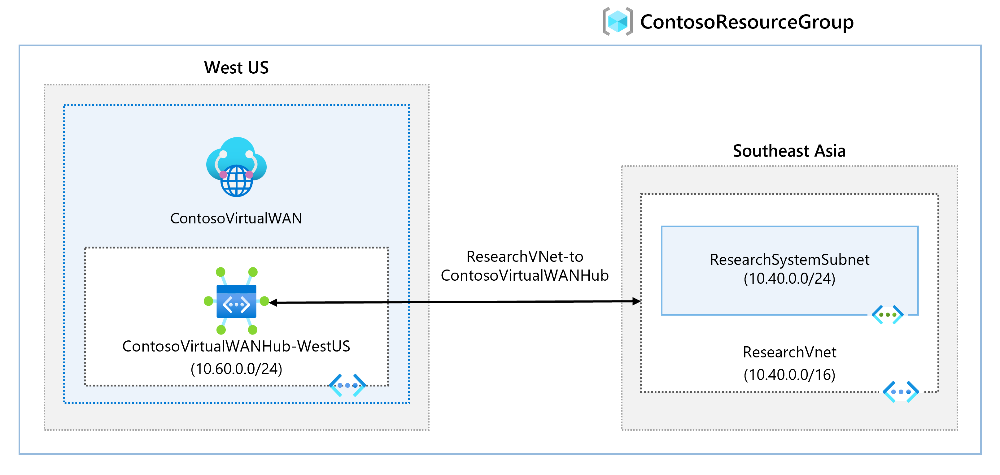
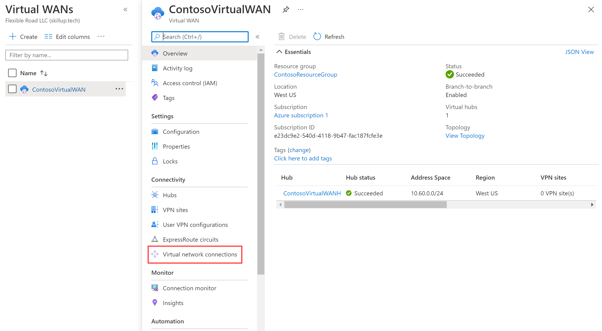

---
Exercise:
  title: 'M02: Unidad 7 Creación de una instancia de Virtual WAN mediante Azure Portal'
  module: Module 02 - Design and implement hybrid networking
---

# M02: Unidad 7 Creación de una instancia de Virtual WAN mediante Azure Portal

## Escenario del ejercicio

En este ejercicio, creará una instancia de Virtual WAN para Contoso.



En este ejercicio, aprenderá a:

+ Tarea 1: Creación de una instancia de Virtual WAN
+ Tarea 2: creación de un centro de conectividad mediante Azure Portal
+ Tarea 3: Conexión de una red virtual al centro de conectividad virtual
+ Tarea 4: Limpieza de recursos

**Nota:** Hay disponible una **[simulación de laboratorio interactiva](https://mslabs.cloudguides.com/guides/AZ-700%20Lab%20Simulation%20-%20Create%20a%20virtual%20WAN%20using%20the%20Azure%20portal)** que le permite realizar sus propias selecciones a su entera discreción. Es posible que encuentre pequeñas diferencias entre la simulación interactiva y el laboratorio hospedado, pero las ideas y los conceptos básicos que se muestran son los mismos.

### Tiempo estimado: 65 minutos (incluido un tiempo de espera de implementación de aproximadamente 45 minutos)

## Tarea 1: Creación de una instancia de Virtual WAN

1. Desde un explorador, vaya a Azure Portal e inicie sesión con su cuenta de Azure.

1. En el portal, escribe Virtual WAN virtual en el cuadro de búsqueda y selecciona ** WAN virtuales** en la lista de resultados.

   

1. En la página Red WAN virtual, seleccione **+ Crear**.

1. Dentro de la página Crear una red WAN, en la pestaña **Aspectos básicos**, rellene los campos siguientes:

   + **Suscripción:** use la suscripción existente.

   + **Grupo de recursos:** ContosoResourceGroup

   + **Ubicación del grupo de recursos:** elija una ubicación del recurso en la lista desplegable. Una red WAN es un recurso global y no reside en una región determinada. Pero tendrá que seleccionar una región para administrar y ubicar el recurso de WAN que cree.

   + **Nombre:** ContosoVirtualWAN.

   + **Tipo:** Estándar.

1. Cuando haya terminado de rellenar los campos, seleccione **Revisar y crear**.

1. Una vez que se supere la validación, seleccione **Crear** para crear la red WAN virtual.

## Tarea 2: creación de un centro de conectividad mediante Azure Portal

Un centro de conectividad contiene puertas de enlace para las funcionalidades de sitio a sitio, ExpressRoute o de punto a sitio. La creación de la puerta de enlace de VPN de sitio a sitio en el centro de conectividad virtual tarda 30 minutos. Debe crear una red WAN virtual para poder crear un centro.

1. Ubique la red WAN virtual que ha creado.
1. En la página Red WAN virtual, en **Conectividad**, seleccione **Centros**.
1. En la página Centros, seleccione **+Nuevo centro de conectividad** para abrir la página Crear centro de conectividad virtual.
   
1. En la página Crear centro de conectividad virtual, en la pestaña **Aspectos básicos** rellene los siguientes campos:
   + **Región:** Oeste de EE. UU.
   + **Nombre:** ContosoVirtualWANHub-WestUS
   + **Espacio de direcciones privadas del centro de conectividad:**  10.60.0.0/24
   + **Capacidad del centro virtual:** 2 unidades de infraestructura de enrutamiento
   + **Preferencia de enrutamiento del centro de conectividad**: deja por defecto
1. Seleccione **Siguiente: De sitio a sitio**.
1. En la pestaña **De sitio a sitio**, rellene los siguientes campos:
   + **¿Quiere crear una instancia de sitio a sitio (puerta de enlace de VPN)?:** Sí
   + El campo **Número AS** no se puede modificar.
   + **Unidades de escalado de puerta de enlace:** 1 unidad de escalado = 500 Mbps x 2
   + **Preferencia de enrutamiento**: deja por defecto
1. Seleccione **Revisar y crear** para validar.
1. Seleccione **Crear** para crear un centro de conectividad.
1. Pasados 30 minutos haga clic en **Actualizar** para ver el centro de conectividad en la página Centros.

## Tarea 3: Conexión de una red virtual al centro de conectividad virtual

1. Ubique la red WAN virtual que ha creado.

1. En ContosoVirtualWAN, en **Conectividad**, seleccione **Conexiones de red virtual**.

   

1. En ContosoVirtualWAN | Conexiones de red virtual, seleccione **+ Agregar conexión**.

1. En Agregar conexión, use la información siguiente para crear la conexión.

   + **Nombre de la conexión:** ContosoVirtualWAN-to-ResearchVNet

   + **Centros:** ContosoVirtualWANHub-WestUS

   + **Suscripción:** sin cambios

   + **Grupo de recursos:** ContosoResourceGroup

   + **Red virtual:** ResearchVNet

   + **Propagar a ninguno:** Sí

   + **Asociar tabla de rutas:** valor predeterminado

1. Seleccione **Crear**.

Felicidades. Ha creado una red WAN virtual y un centro de red WAN virtual, y ha conectado ResearchVNet al centro.

## Tarea 4: Limpieza de recursos

   >**Nota**: No olvide quitar los recursos de Azure recién creados que ya no use. La eliminación de los recursos sin usar garantiza que no verá cargos inesperados.

1. En Azure Portal, abre la sesión de **PowerShell** en el panel **Cloud Shell**.

1. Ejecute el comando siguiente para eliminar todos los grupos de recursos que ha creado en los laboratorios de este módulo:

   ```powershell
   Remove-AzResourceGroup -Name 'ContosoResourceGroup' -Force -AsJob
   ```

    >**Nota**: El comando se ejecuta de forma asincrónica (según determina el parámetro -AsJob). Aunque podrá ejecutar otro comando de PowerShell inmediatamente después en la misma sesión de PowerShell, los grupos de recursos tardarán unos minutos en eliminarse.
