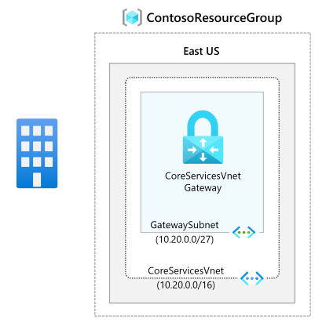

---
Exercise:
  title: 'M03: Unidad 4 Configuración de una puerta de enlace de ExpressRoute'
  module: Module 03 - Design and implement Azure ExpressRoute
---
# M03: Unidad 4 Configuración de una puerta de enlace de ExpressRoute

## Escenario del ejercicio

Para conectar una red virtual de Azure y una red local a través de ExpressRoute, primero debe crear una puerta de enlace de red virtual. Una puerta de enlace de red virtual tiene dos propósitos: intercambiar las rutas de IP entre las redes y enrutar el tráfico de red.

**Nota:** Hay disponible una **[simulación de laboratorio interactiva](https://mslabs.cloudguides.com/guides/AZ-700%20Lab%20Simulation%20-%20Configure%20an%20ExpressRoute%20gateway)** que le permite realizar sus propias selecciones a su entera discreción. Es posible que encuentre pequeñas diferencias entre la simulación interactiva y el laboratorio hospedado, pero las ideas y los conceptos básicos que se muestran son los mismos.

### Tiempo estimado: 60 minutos (incluye aproximadamente 45 minutos de tiempo de espera de implementación)

**Tipos de puerta de enlace**

Al crear una puerta de enlace de red virtual, debe especificar varios valores de configuración. Uno de los valores de configuración necesarios, "-GatewayType", especifica si la puerta de enlace se usará para el tráfico VPN o de ExpressRoute. Los dos tipos de puerta de enlace son los siguientes:

- **VPN**: para enviar tráfico cifrado por medio de una conexión a Internet pública, use la puerta de enlace de tipo "VPN". Este tipo también se conoce como VPN Gateway. Las conexiones de sitio a sitio, de punto a sitio y de red virtual a red virtual utilizan una puerta de enlace de VPN.
- **ExpressRoute**: para enviar tráfico de red en una conexión privada, use la puerta de enlace de tipo "ExpressRoute". Este tipo también se conoce como puerta de enlace de ExpressRoute y es el tipo de puerta de enlace que se utiliza al configurar ExpressRoute.

Cada red virtual tiene una única puerta de enlace de red virtual por cada tipo de puerta de enlace. Por ejemplo, puede tener una puerta de enlace de una red virtual en la que se use -GatewayType VPN y otra en la que se use -GatewayType ExpressRoute.

En este ejercicio, aprenderá a:

- Tarea 1: Creación de la red virtual y la subred de puerta de enlace
- Tarea 2: Creación de la puerta de enlace de red virtual

## Tarea 1: Creación de la red virtual y la subred de puerta de enlace

1. En cualquier página de Azure Portal, en **Buscar recursos, servicios y documentos**, escribe “red virtual” y luego selecciona **Redes virtuales** en los resultados.

1. En la página Redes virtuales, seleccione **+Crear**.

1. En el panel Crear redes virtuales, en la pestaña **Aspectos básicos**, use la información de la tabla siguiente para crear la red virtual:

   | **Configuración**          | **Valor**                        |
   | -------------------- | -------------------------------- |
   | El nombre de la red virtual | CoreServicesVNet                 |
   | Grupo de recursos       | ContosoResourceGroup             |
   | Location             | Este de EE. UU.                          |

1. Seleccione **Siguiente: Direcciones IP**.

1. En la pestaña **Direcciones IP**. en el **Espacio de direcciones IPv4**, escriba 10.20.0.0/16 y seleccione **+ Agregar subred**.

1. En el panel Agregar subred, use la información de la tabla siguiente para crear la subred:

   | **Configuración**                  | **Valor**     |
   | ---------------------------- | ------------- |
   | Nombre de la subred de puerta de enlace          | GatewaySubnet |
   | Espacio de direcciones de la subred de puerta de enlace | 10.20.0.0/27  |

1. Después, seleccione **Agregar**.

1. En la página Crear red virtual, seleccione **Revisar y crear**.

   

1. Confirme que la red virtual supera la validación y, después, seleccione **Crear**.

> [!Note]  
>
> Si usas una red virtual de doble pila y tienes previsto usar el emparejamiento privado basado en IPv6 a través de ExpressRoute, selecciona Agregar un espacio de direcciones IPv6 e indica los valores del Intervalo de direcciones IPv6.

## Tarea 2: Creación de la puerta de enlace de red virtual

1. En cualquier página de Azure Portal, en **Buscar recursos, servicios y documentos (G+/)**, escribe “puerta de enlace de red virtual” y después selecciona **Puertas de enlace de red virtual** en los resultados.

1. En la página Puertas de enlace de red virtual, selecciona **+Crear**.

1. En la página **Crear puerta de enlace de red virtual**, use la información de la tabla siguiente para crear la puerta de enlace:

   | **Configuración**               | **Valor**                  |
   | ------------------------- | -------------------------- |
   | **Detalles del proyecto**       |                            |
   | Grupo de recursos            | ContosoResourceGroup       |
   | **Detalles de instancia**      |                            |
   | NOMBRE                      | CoreServicesVnetGateway    |
   | Region                    | Este de EE. UU.                    |
   | Tipo de puerta de enlace              | ExpressRoute               |
   | SKU                       | Estándar                   |
   | Virtual network           | CoreServicesVNet           |
   | **Dirección IP pública**     |                            |
   | Dirección IP pública         | Crear nuevo                 |
   | Nombre de la dirección IP pública    | CoreServicesVnetGateway-IP |
   | SKU de la dirección IP pública     | Básico                      |
   | Asignación                | no configurable           |

1. Seleccione **Revisar + crear**.

1. Confirme que la configuración de puerta de enlace supera la validación y, después, **seleccione Crear**.

1. Cuando la implementación se complete, seleccione **Ir al recurso**.

> [!Note]
>
> Una puerta de enlace puede tardar hasta 45 minutos en completarse.

¡Enhorabuena! Ha creado correctamente una red virtual, una subred de puerta de enlace y una puerta de enlace de ExpressRoute.
