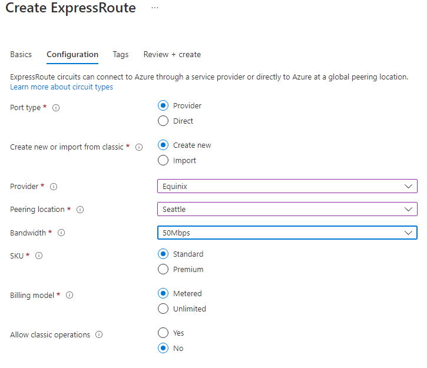

---
Exercise:
  title: 'M03: Unidad 5 Aprovisionamiento de un circuito ExpressRoute'
  module: Module 03 - Design and implement Azure ExpressRoute
---
# M03: Unidad 5 Aprovisionamiento de un circuito ExpressRoute

## Escenario del ejercicio

Este ejercicio, creará un circuito ExpressRoute mediante Azure Portal y el modelo de implementación de Azure Resource Manager.

### Simulaciones de laboratorio interactivas

>**Nota**: las simulaciones de laboratorio proporcionadas anteriormente se han retirado.

### Tiempo estimado: 15 minutos


### Aptitudes de trabajo

En este ejercicio, aprenderás a:

+ Tarea 1: Creación y aprovisionamiento de un circuito ExpressRoute
+ Tarea 2: Recuperación de la clave de servicio
+ Tarea 3: Desaprovisionamiento de un circuito ExpressRoute


## Tarea 1: Creación y aprovisionamiento de un circuito ExpressRoute

1. Desde un explorador, navegue al [Portal de Azure](https://portal.azure.com/) e inicie sesión con su cuenta de Azure.

   >**Importante**: tu circuito de ExpressRoute se factura a partir del momento en el que se emita una clave de servicio. Asegúrese de realizar esta operación cuando el proveedor de conectividad esté listo para aprovisionar el circuito.

1. En el menú de Azure Portal, busca y selecciona **Circuitos ExpressRoute**.

1. En la página **Crear ExpressRoute**, proporciona el **Grupo de recursos** como `ExpressRouteResourceGroup`. A continuación, selecciona **Resistencia estándar** para **Resistencia**

1. Para ***Detalles del circuito**, asegúrate de especificar la región correcta (**Este de EE. UU. 2**), nombre del circuito (**TestERCircuit**), ubicación de emparejamiento (**Seattle**), proveedor (**Equinix**), ancho de banda (**50 Mbps**), nivel de SKU (**Estándar**) y modelo de facturación de medición de datos (**Medido**).

1. Seleccione **Revisar + crear**.

1. Confirma que la configuración de puerta de enlace supera la validación y luego selecciona **Crear**.



+ Tipo de puerto determina si se va a conectar a un proveedor de servicios o directamente a la red global de Microsoft en una ubicación de emparejamiento.
+ La decisión de crear o importar determina si se crea un circuito o si se realiza la migración de un circuito clásico a Azure Resource Manager.
+ Proveedor es el proveedor de servicios de Internet al que se solicitará el servicio.
+ La ubicación de emparejamiento es la ubicación física de emparejamiento con Microsoft.

> [!Important]
>
> La ubicación de emparejamiento indica la [ubicación física](https://docs.microsoft.com/en-us/azure/expressroute/expressroute-locations) de emparejamiento con Microsoft. No está vinculada a la propiedad Location, que hace referencia a la ubicación geográfica donde se encuentra el proveedor de recursos de red de Azure. Aunque no están relacionadas, se recomienda elegir un proveedor de recursos de red geográficamente cerca de la ubicación de emparejamiento del circuito.

+ **SKU** determina si está habilitado un complemento local, estándar o premium de ExpressRoute. Puede especificar **Local** para obtener la SKU local, **Estándar** para obtener la SKU estándar o **Premium** si quiere el complemento Premium. Puede cambiar la SKU para habilitar el complemento premium.

   >**Importante**: no puedes cambiar el SKU de Estándar/Premium a Local.

+ **Modelo de facturación** determina el tipo de facturación. Puede especificar **Metered** (Limitado) para un plan de datos limitado y **Unlimited** (Ilimitado) para un plan de datos ilimitado. Puede cambiar el tipo de facturación de **Uso medido** a **Ilimitado**.

> [!Important]
>
> No se puede cambiar el tipo de Ilimitado a Limitado.

+ **Permitir la operación clásica** permitirá que las redes virtuales clásicas se vinculen al circuito.

## Tarea 2: Recuperación de la clave de servicio

1. Puede ver todos los circuitos que ha creado si selecciona **Todos los servicios &gt; Redes &gt; Circuitos ExpressRoute**.

   

1. Todos los circuitos ExpressRoute creados en la suscripción se mostrarán aquí.

   

1. En la página del circuito se muestran las propiedades del circuito. La clave del servicio aparece en el campo Clave de servicio. El proveedor de servicios necesitará la clave de servicio para completar el proceso de aprovisionamiento. La clave de servicio es específica para su circuito. **Tendrá que enviar la clave de servicio al proveedor de conectividad para el aprovisionamiento.**

   

1. En esta página, **Estado de proveedor** indica el estado actual de aprovisionamiento en el proveedor de servicios. **Estado de circuito** indica el estado relativo en el entorno de Microsoft.

1. Cuando se crea un nuevo circuito ExpressRoute, dicho circuito tiene el siguiente estado:

   + Estado de proveedor: No aprovisionado
   + Estado de circuito: Enabled

   + El circuito pasa al estado siguiente cuando el proveedor de conectividad lo habilita para el usuario:
     + Estado de proveedor: Aprovisionamiento
     + Estado de circuito: Habilitado
   + Para usar el circuito ExpressRoute, debe tener el siguiente estado:
     + Estado de proveedor: Aprovisionado
     + Estado de circuito: Habilitado
   + Debe comprobar periódicamente el estado de aprovisionamiento y el estado del circuito.


¡Enhorabuena! Ha creado un circuito ExpressRoute y ha localizado la clave de servicio, que necesitará para completar el aprovisionamiento del circuito.

## Tarea 3: Desaprovisionamiento de un circuito ExpressRoute

Si el estado de aprovisionamiento del proveedor de servicios del circuito ExpressRoute es **Aprovisionando** o **Aprovisionado**, tendrá que colaborar con el proveedor de servicios para que desaprovisione el circuito. Microsoft puede seguir reservando recursos y facturarlos hasta que el proveedor de servicios complete el desaprovisionamiento del circuito y nos lo notifique.

   >**Nota**: debes desvincular todas las redes virtuales del circuito ExpressRoute antes del desaprovisionamiento. Si se produce un error en esta operación, compruebe si hay alguna red virtual vinculada al circuito. Si el proveedor de servicios ha desaprovisionado el circuito (el estado de aprovisionamiento del proveedor de servicios está establecido en No aprovisionado), puede eliminar el circuito. Esto detiene la facturación del circuito.

## Limpieza de recursos

Para eliminar el circuito ExpressRoute, puede seleccionar el icono **Eliminar**. Antes de proceder, asegúrese de que el estado del proveedor sea No aprovisionado.


   >**Nota**: No olvide quitar los recursos de Azure recién creados que ya no use. La eliminación de los recursos sin usar garantiza que no verás cargos inesperados.

1. En Azure Portal, abre la sesión de **PowerShell** en el panel **Cloud Shell**.

1. Ejecute el comando siguiente para eliminar todos los grupos de recursos que ha creado en los laboratorios de este módulo:

   ```powershell
   Remove-AzResourceGroup -Name 'ContosoResourceGroup' -Force -AsJob
   Remove-AzResourceGroup -Name 'ExpressRouteResourceGroup' -Force -AsJob
   ```

   >**Nota**: el comando se ejecuta de forma asincrónica (según determina el parámetro -AsJob). Aunque podrás ejecutar otro comando de PowerShell inmediatamente después en la misma sesión de PowerShell, los grupos de recursos tardarán unos minutos en eliminarse.

## Ampliar el aprendizaje con Copilot

Copilot puede ayudarte a aprender a usar las herramientas de scripting de Azure. Copilot también puede ayudar en áreas no cubiertas en el laboratorio o donde necesitas más información. Abre un explorador Edge y elige Copilot (superior derecha) o ve a *copilot.microsoft.com*. Dedica unos minutos a probar estas indicaciones.
+ ¿Qué proveedores de servicios están disponibles para Azure ExpressRoute?
+ ¿Cuáles son los problemas de configuración más comunes de Azure ExpressRoute? ¿Qué debo hacer si tengo ese problema?

## Obtén más información con el aprendizaje autodirigido

+ [Introducción a Azure ExpressRoute](https://learn.microsoft.com/training/modules/intro-to-azure-expressroute/). En este módulo, obtendrás información sobre qué es Azure ExpressRoute y la funcionalidad que proporciona.
+ [Diseño e implementación de ExpressRoute](https://learn.microsoft.com/training/modules/design-implement-azure-expressroute/). En este módulo, obtendrás información sobre cómo diseñar e implementar Azure ExpressRoute, Global Reach de ExpressRoute y FastPath de ExpressRoute.

## Puntos clave

Enhorabuena por completar el laboratorio. Estas son las principales conclusiones del laboratorio. 
+ Azure ExpressRoute permite que una organización conecte sus redes locales directamente a las nubes de Microsoft Azure y Microsoft 365. Azure ExpressRoute usa una conexión dedicada de ancho de banda alto proporcionada por un asociado de Microsoft.
+ Microsoft garantiza una disponibilidad mínima del 99,95 % para las conexiones ExpressRoute dedicadas. La conexión es privada y viaja a través de una línea dedicada, los terceros no pueden interceptar el tráfico.
+ Puede crear una conexión entre su red local y la nube de Microsoft de cuatro maneras diferentes: colocalización de CloudExchange, conexión Ethernet de punto a punto, conexión universal (IPVPN) y ExpressRoute Direct.
+ Las características de ExpressRoute se determinan mediante la SKU: Local, Estándar y Premium. 
