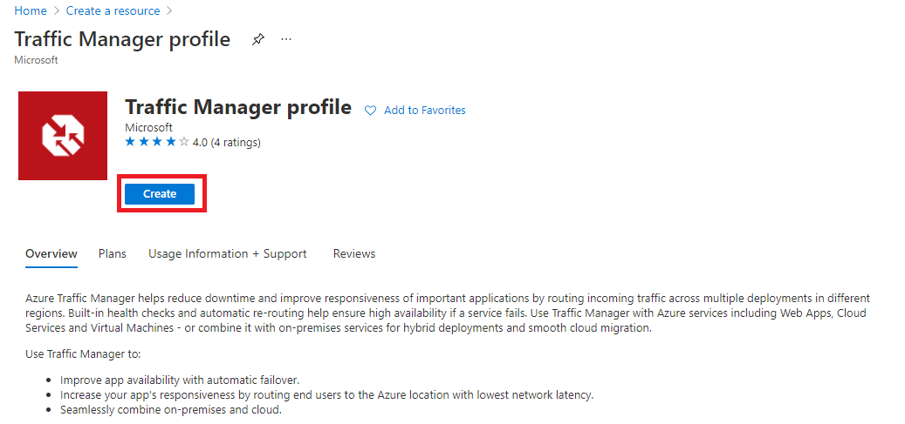

---
Exercise:
  title: 'M04: Unidad 6 Creación de un perfil de Traffic Manager mediante Azure Portal'
  module: Module 04 - Load balancing non-HTTP(S) traffic in Azure
---

# M04: Unidad 6 Creación de un perfil de Traffic Manager mediante Azure Portal

## Escenario del ejercicio

En este ejercicio, creará un perfil de Traffic Manager para ofrecer alta disponibilidad para la aplicación web ficticia de la organización Contoso Ltd.

**Nota:** Hay disponible una **[simulación de laboratorio interactiva](https://mslabs.cloudguides.com/guides/AZ-700%20Lab%20Simulation%20-%20Create%20a%20Traffic%20Manager%20profile%20using%20the%20Azure%20portal)** que le permite realizar sus propias selecciones a su entera discreción. Es posible que encuentre pequeñas diferencias entre la simulación interactiva y el laboratorio hospedado, pero las ideas y los conceptos básicos que se muestran son los mismos.

### Tiempo estimado: 35 minutos

Creará dos instancias de una aplicación web implementada en dos regiones diferentes (Este de EE. UU. y Oeste de Europa). La región Este de EE. UU. actuará como punto de conexión principal para Traffic Manager y la región Oeste de Europa actuará como punto de conexión de conmutación por error.

A continuación, creará un perfil de Traffic Manager según la prioridad del punto de conexión. El perfil dirige el tráfico de usuario al sitio principal que ejecuta la aplicación web. Traffic Manager supervisará continuamente la aplicación web y, si el sitio primario del Este de EE. UU. no está disponible, proporcionará la conmutación automática por error al sitio de copia de seguridad en el Oeste de Europa.

En el diagrama siguiente se muestra el entorno aproximado que se va a implementar en este ejercicio.

 

 En este ejercicio, aprenderá a:

+ Tarea 1: Creación de las aplicaciones web
+ Tarea 2: Creación de un perfil de Traffic Manager
+ Tarea 3: Adición de puntos de conexión de Traffic Manager
+ Tarea 4: Prueba del perfil de Traffic Manager
+ Tarea 5: Limpieza de recursos

## Tarea 1: Creación de las aplicaciones web

En esta sección, creará dos instancias de una aplicación web implementada en las dos regiones de Azure diferentes.

1. En la página principal de Azure Portal, seleccione **Crear un recurso** y luego seleccione **Aplicación web** (si este tipo de recurso no aparece en la página, use el cuadro de búsqueda de la parte superior de la página para buscarlo y selecciónelo).

1. En la página **Crear aplicación web**, en la pestaña **Aspectos básicos**, use la información de la tabla siguiente para crear la primera aplicación web.

   | **Configuración**      | **Valor**                                                    |
   | ---------------- | ------------------------------------------------------------ |
   | Suscripción     | Seleccione la suscripción.                                     |
   | Resource group   | Seleccione **Crear nuevo**  Nombre: **Contoso-RG-TM1**             |
   | Nombre             | **ContosoWebAppEastUSxx** (donde xx son las iniciales para que el nombre sea único) |
   | Publicar          | **Código**                                                     |
   | Pila en tiempo de ejecución    | **ASP.NET V4.8**                                             |
   | Sistema operativo | **Windows**                                                  |
   | Region           | **Este de EE. UU.**                                                  |
   | Plan de Windows     | Seleccione **Crear nuevo**  Nombre: **ContosoAppServicePlanEastUS** |
   | Plan de precios     | **Estándar S1, 100 de total de ACU, 1,75 GB de memoria**               |

1. Selecciona la pestaña **Supervisión**.

1. En la pestaña **Supervisión**, seleccione la opción **No** para **Habilitar Application Insights**.

1. Seleccione **Revisar + crear**.

   

1. Seleccione **Crear**. Cuando la aplicación web se implementa correctamente, crea un sitio web predeterminado.

1. Repita los pasos 1 a 6 anteriores para crear una segunda aplicación web. Use la misma configuración que antes, excepto la información de la tabla siguiente.

   | **Configuración**    | **Valor**                                                    |
   | -------------- | ------------------------------------------------------------ |
   | Resource group | Seleccione **Crear nuevo**  Nombre: **Contoso-RG-TM2**             |
   | Nombre           | **ContosoWebAppWestEuropexx** (donde xx son las iniciales para que el nombre sea único)  |
   | Region         | **Oeste de Europa**                                              |
   | Plan de Windows   | Seleccione **Crear nuevo**  Nombre: **ContosoAppServicePlanWestEurope** |

1. En la página principal de Azure, seleccione **Todos los servicios**, en el menú de navegación izquierdo, seleccione **Web** y, a continuación, seleccione **App Services**.

1. Debe ver las dos nuevas aplicaciones web en la lista.

   

## Tarea 2: Creación de un perfil de Traffic Manager

Ahora creará un perfil de Traffic Manager que dirija el tráfico de los usuarios según la prioridad del punto de conexión.

1. En la página principal de Azure Portal, seleccione **Crear un recurso**.

1. En el cuadro de búsqueda de la parte superior de la página, escribe **Perfil de Traffic Manager** y selecciónalo en la lista emergente.

   

1. Seleccione **Crear**.

1. En la página **Crear perfil de Traffic Manager perfil**, use la información de la tabla siguiente para crear el perfil de Traffic Manager.

   | **Configuración**             | **Valor**                |
   | ----------------------- | ------------------------ |
   | Nombre                    | **Contoso-TMProfilexx** (donde xx son las iniciales para que el nombre sea único) |
   | Método de enrutamiento          | **Prioridad**             |
   | Suscripción            | Seleccione la suscripción. |
   | Resource group          | **Contoso-RG-TM1**       |
   | Ubicación del grupo de recursos | **Este de EE. UU.**              |

1. Seleccione **Crear**.

## Tarea 3: Adición de puntos de conexión de Traffic Manager

En esta sección, agregará el sitio web en el Este de EE. UU. como punto de conexión principal para enrutar todo el tráfico de usuarios. A continuación, agregará el sitio web en el Oeste de Europa como punto de conexión de conmutación por error. Si el punto de conexión principal deja de estar disponible, el tráfico se enrutará automáticamente al punto de conexión de conmutación por error.

1. En la página principal de Azure Portal, seleccione **Todos los recursos** y después **Contoso-TMProfile** en la lista de recursos.

1. En **Configuración**, seleccione **Puntos de conexión** y, a continuación, seleccione **Agregar**.

   

1. En la página **Agregar punto de conexión**, escriba la información de la tabla siguiente.

   | **Configuración**          | **Valor**                         |
   | -------------------- | --------------------------------- |
   | Tipo                 | **Punto de conexión de Azure**                |
   | Nombre                 | **myPrimaryEndpoint**             |
   | Tipo de recurso de destino | **App Service**                   |
   | Recurso de destino      | **ContosoWebAppEastUS (Este de EE. UU.)** |
   | Prioridad             | **1**                             |

1. Seleccione **Agregar**.

1. Repita los pasos 2 a 4 anteriores para crear el punto de conexión de conmutación por error. Use la misma configuración que antes, excepto la información de la tabla siguiente.

   | **Configuración**     | **Valor**                                 |
   | --------------- | ----------------------------------------- |
   | Nombre            | **myFailoverEndpoint**                    |
   | Recurso de destino | **ContosoWebAppWestEurope (Oeste de Europa)** |
   | Prioridad        | **2**                                     |

1. Establecer una prioridad de 2 significa que el tráfico se enrutará a este punto de conexión de conmutación por error si el punto de conexión principal configurado se vuelve incorrecto.

1. En **Ajustes**, selecciona **Configuración** y luego actualiza la configuración del monitor de punto de conexión **Protocolo** a HTTPS y **Puerto** a 443 y selecciona **Guardar**.

1. Los dos nuevos puntos de conexión se muestran en el perfil de Traffic Manager. Observe que, transcurridos unos minutos, el **Supervisando el estado** debe cambiar a **En línea**.

   

## Tarea 4: Prueba del perfil de Traffic Manager

En esta sección, comprobará el nombre DNS del perfil de Traffic Manager y, a continuación, configurará el punto de conexión principal para que no esté disponible. A continuación, comprobará que la aplicación web sigue estando disponible para probar que el perfil de Traffic Manager envía correctamente el tráfico al punto de conexión de conmutación por error.

1. En la página **Contoso-TMProfile**, seleccione **Información general**.

1. En la pantalla **Información general**, copie la entrada de **Nombre DNS** en el Portapapeles (o anótela en algún lugar).

   

1. Abra una pestaña del explorador web y pegue (o escriba) la entrada de **Nombre DNS** (contoso-tmprofile.trafficmanager.net) en la barra de direcciones y presione Entrar.

1. Se debe mostrar el sitio web predeterminado de la aplicación web. Si recibes el mensaje **404 Sitio web no encontrado**, **Deshabilita el  perfil** de la información general del perfil de Traffic Manager de **Contoso-TMProfilexx** y **Habilita el perfil**. Luego actualiza la página web.

   

1. Actualmente, todo el tráfico se envía al punto de conexión principal, ya que estableció su **Prioridad** en **1**.

1. Para probar que el punto de conexión de conmutación por error funciona correctamente, debe deshabilitar el sitio primario.

1. En la página **Contoso-TMProfile**, en la pantalla de información general, seleccione **myPrimaryEndpoint**.

1. En la página **myPrimaryEndpoint**, en **Estado**, seleccione **Deshabilitado** y, a continuación, seleccione **Guardar**.

   

1. Cierre la página **myPrimaryEndpoint** (seleccione la **X** de la esquina superior derecha de la página).

1. En la página **Contoso-TMProfile**, el valor de la **Supervisión del estado** para **myPrimaryEndpoint** ahora debe ser **Deshabilitado**.

1. Abra una sesión nueva del explorador web y pegue (o escriba) la entrada de **Nombre DNS** (contoso-tmprofile.trafficmanager.net) en la barra de direcciones y presione Entrar.

1. Compruebe que la aplicación web sigue respondiendo. Como el punto de conexión principal no estaba disponible, el tráfico se enrutó en su lugar al punto de conexión de conmutación por error para permitir que el sitio web siguiese funcionando.

## Tarea 5: Limpieza de recursos

   >**Nota**: No olvide quitar los recursos de Azure recién creados que ya no use. La eliminación de los recursos sin usar garantiza que no verá cargos inesperados.

1. En Azure Portal, abre la sesión de **PowerShell** en el panel **Cloud Shell**.

1. Ejecute el comando siguiente para eliminar todos los grupos de recursos que ha creado en los laboratorios de este módulo:

   ```powershell

   Remove-AzResourceGroup -Name 'Contoso-RG-TM1' -Force -AsJob
   Remove-AzResourceGroup -Name 'Contoso-RG-TM2' -Force -AsJob

   ```

    >**Nota**: El comando se ejecuta de forma asincrónica (según determina el parámetro -AsJob). Aunque podrá ejecutar otro comando de PowerShell inmediatamente después en la misma sesión de PowerShell, los grupos de recursos tardarán unos minutos en eliminarse.
