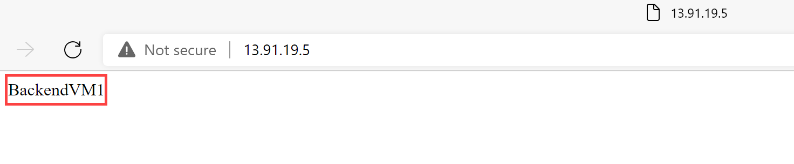

---
Exercise:
  title: 'M05: Unidad 4 Implementación de una puerta de enlace de aplicación de Azure.'
  module: Module 05 - Load balancing HTTP(S) traffic in Azure
---

# M05: Unidad 4 Implementación de una puerta de enlace de aplicación de Azure.

## Escenario del ejercicio

En este ejercicio, usará Azure Portal para crear una puerta de enlace de aplicación. Luego, lo probará para asegurarse de que funciona correctamente.


### Tiempo estimado: 25 minutos

La puerta de enlace de aplicaciones dirige el tráfico web de la aplicación a recursos específicos de un grupo de back-end. Se asignan escuchas a los puertos, se crean reglas y se agregan recursos a un grupo de back-end. Para simplificar, en este artículo se usa una configuración sencilla con una dirección IP de front-end pública, una escucha básica que hospede un único sitio en la puerta de enlace de aplicaciones, una regla de enrutamiento de solicitudes básica y dos máquinas virtuales que se usan con el grupo de back-end.

Para que Azure se comunique entre los recursos que se crean, se necesita una red virtual. Puede crear una red virtual o usar una existente. En este ejemplo, creará una red virtual a la vez que crea la puerta de enlace de aplicación. Se crean instancias de Application Gateway en subredes independientes. En este ejemplo se crean dos subredes: una para la puerta de enlace de aplicaciones y la otra para los servidores back-end.

### Aptitudes de trabajo

En este ejercicio, aprenderás a:

+ Tarea 1: Crear una puerta de enlace de aplicación
+ Tarea 2: Creación de máquinas virtuales
+ Tarea 3: Agregar servidores backend al grupo de back-end
+ Tarea 4: Probar la puerta de enlace de aplicación

## Tarea 1: Crear una puerta de enlace de aplicación

1. Inicie sesión en [Azure Portal](https://portal.azure.com/) con su cuenta de Azure.

1. En cualquier página de Azure Portal, en **Buscar recursos, servicios y documentos (G+/)**, escribe “puerta de enlace de aplicación” y después selecciona **Puertas de enlace de aplicaciones** en los resultados.
    

1. En la página Puertas de enlace de aplicaciones, seleccione **+ Crear**.

1. En la pestaña **Aspectos básicos** de Crear puerta de enlace de aplicaciones, escriba o seleccione la siguiente información:

   | **Configuración**         | **Valor**                                    |
   | ------------------- | -------------------------------------------- |
   | Suscripción        | Seleccione su suscripción.                    |
   | Resource group      | Seleccione Crear nuevo ContosoResourceGroup.       |
   | Application Gateway | ContosoAppGateway                            |
   | Region              | Seleccione **Este de EE. UU**.                           |
   | Virtual Network     | Seleccione **Crear nuevo**.                        |

1. En Crear red virtual, escriba o seleccione la siguiente información:

   | **Configuración**       | **Valor**                          |
   | ----------------- | ---------------------------------- |
   | Nombre              | ContosoVNet                        |
   | **ESPACIO DE DIRECCIONES** |                                    |
   | Intervalo de direcciones     | 10.0.0.0/16                        |
   | **SUBREDES**       |                                    |
   | Nombre de subred       | Cambie el **valor predeterminado** a **AGSubnet**. |
   | Intervalo de direcciones     | 10.0.0.0/24                        |


1. Seleccione **Aceptar** para volver a la pestaña Aspectos básicos de Crear puerta de enlace de aplicaciones.

1. Acepte los valores predeterminados para las demás opciones y seleccione **Siguiente: Front-end**.

1. En la pestaña **Front-end**, compruebe que **Tipo de dirección IP de front-end** esté establecido en **Pública**.

1. Seleccione **Agregar nuevo** para **Dirección IP pública** y escriba AGPublicIPAddress como nombre de la dirección IP pública y, a continuación, seleccione **Aceptar**.

1. Seleccione **Siguiente: Back-end**.

1. En la pestaña **Back-end**, seleccione **Agregar un grupo de back-end**.

1. En la ventana **Agregar un grupo de back-end**, escribe los valores siguientes para crear un grupo de back-end vacío:

    | **Configuración**                      | **Valor**   |
    | -------------------------------- | ----------- |
    | Nombre                             | BackendPool |
    | Adición de un grupo de back-end sin destinos | Sí         |

1. En la ventana **Agregar un grupo de back-end**, selecciona **Agregar** para guardar la configuración del grupo de back-end y vuelve a la pestaña **Backends**.

1. En la pestaña **Back-end**, seleccione **Siguiente: Configuración**.

1. En la pestaña **Configuración**, conecte el grupo de front-end y back-end que ha creado con una regla de enrutamiento.

1. En la columna **Reglas de enrutamiento**, selecciona **Agregar una regla de enrutamiento**.

1. En el cuadro **Nombre de regla**, escribe **RoutingRule**.

1. En **Prioridad**, escribe **100**. 

1. En la pestaña **Cliente de escucha**, escriba o seleccione la siguiente información:

    | **Configuración**   | **Valor**         |
    | ------------- | ----------------- |
    | Nombre del cliente de escucha | Agente de escucha          |
    | Dirección IP de front-end   | Selecciona **IPv4 público** |

1. Acepte los valores predeterminados de las demás opciones en la pestaña **Agente de escucha**.

    

1. Seleccione la pestaña **Destinos de back-end** para configurar el resto de la regla de enrutamiento.

1. En la pestaña **Destinos de back-end**, escriba o seleccione la siguiente información:

    | **Configuración**      | **Valor**      |
    | -------------    | -------------- |
    | Tipo de destino      | Grupo de back-end   |
    | Configuración de back-end | **Agregar nueva** |

1. En **Agregar una configuración de back-end**, escribe o selecciona la siguiente información:

    | **Configuración**          | **Valor**   |
    | ------------------   | ----------- |
    | Nombre de la configuración de back-end | HTTPSetting |
    | Puerto back-end         | 80          |

1. Acepta los valores predeterminados de las demás opciones en la ventana **Agregar una configuración de backend** y luego selecciona **Agregar** para volver a **Agregar una regla de enrutamiento**.

1. Seleccione **Agregar** para guardar la regla de enrutamiento y volver a la pestaña **Configuración**.

1. Seleccione **Siguiente: Etiquetas** y, a continuación, **Siguiente: Review + create** (Revisar y crear).

1. Revise la configuración en la pestaña **Revisar y crear**.

1. Selecciona **Crear** para crear la red virtual, la dirección IP pública y la puerta de enlace de aplicación.

1. Azure puede tardar varios minutos en crear la puerta de enlace de aplicación. Espera hasta que la implementación finalice correctamente.

### Incorporación de una subred para servidores backend

1. Busca y selecciona la **ContosoVNet**. Comprueba que se ha creado la **AGSubnet**. 

1. Para crear la **BackendSubnet**, selecciona **Configuracion** y **Subredes**. Asegúrate de **agregar** la subred al finalizar.
   
   | **Configuración**       | **Valor**                          |
   | ----------------- | ---------------------------------- |
   | Nombre de subred       | BackendSubnet                      |
   | Intervalo de direcciones     | 10.0.1.0/24                        |

## Tarea 2: Creación de máquinas virtuales

1. En Azure Portal, selecciona el icono Cloud Shell (parte superior derecha). Si es necesario, configura el shell.  
    + Selecciona **PowerShell**.
    + Selecciona **No se requiere cuenta de almacenamiento** y tu **Suscripción**, después, selecciona **Aplicar**.
    + Espera a que se cree el terminal y se muestre una solicitud.
      
1. En la barra de herramientas del panel Cloud Shell, selecciona **Administrar archivos** y después **Cargar**. Carga los siguientes archivos: **backend.json**, **backend.parameters.json**, y **install-iis.ps1**.

    >**Nota:** Si estás trabajando en tu propia suscripción los [archivos de plantilla](https://github.com/MicrosoftLearning/AZ-700-Designing-and-Implementing-Microsoft-Azure-Networking-Solutions/tree/master/Allfiles/Exercises) están disponibles en el repositorio de laboratorio de GitHub.

1. Implementa las plantillas de ARM siguientes a fin de crear las máquinas virtuales necesarias para este ejercicio:

   >**Nota**: se te pedirá que proporciones una contraseña de administrador. 

   ```powershell
   $RGName = "ContosoResourceGroup"
   
   New-AzResourceGroupDeployment -ResourceGroupName $RGName -TemplateFile backend.json -TemplateParameterFile backend.parameters.json
   ```
   >**Nota**: Dedica tiempo a revisar el archivo **backend.json**. Hay dos máquinas virtuales que se implementan. Esta operación puede tardar unos minutos. 

1. El comando debe completarse correctamente y enumerar **BackendVM1** y **BackendVM2**.

### Instalación de IIS en una máquina virtual

1. Cada servidor backend necesita que IIS esté instalado.

1. Continúa en el símbolo del sistema de PowerShell y usa el script que se proporciona para instalar IIS en **BackendVM1**.

   ```powershell
   Invoke-AzVMRunCommand -ResourceGroupName 'ContosoResourceGroup' -Name 'BackendVM1' -CommandId 'RunPowerShellScript' -ScriptPath 'install-iis.ps1'
   ```

   >**Nota**: mientras esperas, revisa el script de PowerShell. Ten en cuenta que la página principal de IIS se está personalizando para proporcionar el nombre de la máquina virtual.

1. Vuelve a ejecutar el comando, esta vez para **BackendVM2**.

   ```powershell
   Invoke-AzVMRunCommand -ResourceGroupName 'ContosoResourceGroup' -Name 'BackendVM2' -CommandId 'RunPowerShellScript' -ScriptPath 'install-iis.ps1'
   ```
   >**Nota:** el comando tardará un par de minutos en completarse.

## Tarea 3: Agregar servidores backend al grupo de back-end

1. En el menú de Azure Portal, selecciona **Todos los recursos** o busca y selecciona Todos los recursos. Después, selecciona **ContosoAppGateway**.

1. En **Configuración**, selecciona **Grupos de backend**.

1. Selecciona **BackendPool**.

1. En la página Editar un grupo de backend, en **Destinos de backend**, en **Tipo de destino**, selecciona **Máquina virtual**.

1. En **Destino**, selecciona **BackendVM1-nic**.

1. En **Tipo de destino**, selecciona **Máquina virtual**.

1. En **Destino**, selecciona **BackendVM2-nic**.

   

1. Selecciona **Guardar** y espera a que se agreguen los destinos. 

1. Comprueba que los servidores back-end están en buen estado. Selecciona **Supervisión** y, después, **Supervisión**. Ambos destinos deben ser correctos. 

   

## Tarea 4: Probar la puerta de enlace de aplicación

No es necesario instalar IIS para crear la puerta de enlace de aplicaciones, pero se instaló en este ejercicio para comprobar si Azure creó correctamente la puerta de enlace de aplicación.

### Use IIS para probar la puerta de enlace de aplicaciones

1. Busque la dirección IP pública de la puerta de enlace de aplicaciones en la página de **información general**.

   

1. Copie la dirección IP pública y, luego, péguela en la barra de direcciones del explorador para ir a esa dirección IP.

1. Compruebe la respuesta. Una respuesta válida corrobora que la puerta de enlace de aplicaciones se ha creado correctamente y puede conectarse correctamente con el back-end.

   

1. Actualice el explorador varias veces y, después, debería ver las conexiones a BackendVM1 y BackendVM2.

## Limpieza de recursos

   >**Nota**: No olvide quitar los recursos de Azure recién creados que ya no use. La eliminación de los recursos sin usar garantiza que no verás cargos inesperados.

1. En Azure Portal, abre la sesión de **PowerShell** en el panel **Cloud Shell**.

1. Ejecute el comando siguiente para eliminar todos los grupos de recursos que ha creado en los laboratorios de este módulo:

   ```powershell
   Remove-AzResourceGroup -Name 'IntLB-RG' -Force -AsJob
   ```

>**Nota**: el comando se ejecuta de forma asincrónica (según determina el parámetro -AsJob). Aunque podrás ejecutar otro comando de PowerShell inmediatamente después en la misma sesión de PowerShell, los grupos de recursos tardarán unos minutos en eliminarse.

## Ampliar el aprendizaje con Copilot

Copilot puede ayudarte a aprender a usar las herramientas de scripting de Azure. Copilot también puede ayudar en áreas no cubiertas en el laboratorio o donde necesitas más información. Abre un explorador Edge y elige Copilot (superior derecha) o ve a *copilot.microsoft.com*. Dedica unos minutos a probar estas indicaciones.
+ ¿Cómo enruta Azure Application Gateway las solicitudes?
+ ¿Qué características de seguridad incluye Azure Application Gateway?
+ Compara Azure Application Gateway con Azure Load Balancer. Proporciona ejemplos de cuándo usar cada producto.


## Más información con el aprendizaje autodirigido

+ [Introducción a Azure Application Gateway](https://learn.microsoft.com/training/modules/intro-to-azure-application-gateway/). En este módulo se explica qué hace Azure Application Gateway, cómo funciona y cuándo debe usar Application Gateway como solución para satisfacer las necesidades de su organización.
+ [Equilibrio de carga del tráfico de servicio web con Application Gateway](https://learn.microsoft.com/training/modules/load-balancing-https-traffic-azure/). En este módulo, aprenderás a crear y configurar una puerta de enlace de aplicación con enrutamiento basado en ruta de acceso de dirección URL.
+ [Equilibrar la carga del tráfico HTTP(S) en Azure](https://learn.microsoft.com/training/modules/load-balancing-https-traffic-azure/). En este módulo, aprenderás cómo diseñar e implementar Azure Application Gateway.

## Puntos clave

Enhorabuena por completar el laboratorio. Estas son las principales conclusiones del laboratorio. 
+ Azure Application Gateway es un equilibrador de carga del tráfico web (OSI capa 7) que permite administrar el tráfico que se dirige a las aplicaciones web.
+ Application Gateway puede tomar decisiones de enrutamiento basadas en atributos adicionales de una solicitud HTTP, por ejemplo los encabezados de host o la ruta de acceso del URI.
+ Usa Application Gateway para la aplicación hospedada en una sola región y cuando necesites enrutamiento basado en dirección URL. 
