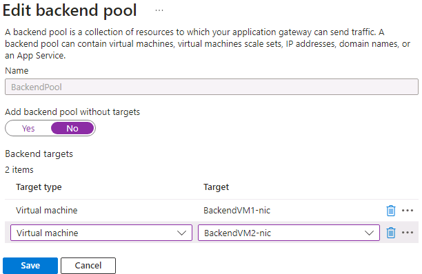

---
Exercise:
  title: 'M05: Unidad 4 Implementación de una puerta de enlace de aplicación de Azure.'
  module: Module 05 - Load balancing HTTP(S) traffic in Azure
---

# M05: Unidad 4 Implementación de una puerta de enlace de aplicación de Azure.

## Escenario del ejercicio

En este ejercicio, usará Azure Portal para crear una puerta de enlace de aplicación. Luego, lo probará para asegurarse de que funciona correctamente.


>**Nota:** Hay disponible una **[simulación de laboratorio interactiva](https://mslabs.cloudguides.com/guides/AZ-700%20Lab%20Simulation%20-%20Deploy%20Azure%20Application%20Gateway)** que le permite realizar sus propias selecciones a su entera discreción. Es posible que encuentre pequeñas diferencias entre la simulación interactiva y el laboratorio hospedado, pero las ideas y los conceptos básicos que se muestran son los mismos.

### Tiempo estimado: 25 minutos

La puerta de enlace de aplicaciones dirige el tráfico web de la aplicación a recursos específicos de un grupo de back-end. Se asignan escuchas a los puertos, se crean reglas y se agregan recursos a un grupo de back-end. Para simplificar, en este artículo se usa una configuración sencilla con una dirección IP de front-end pública, una escucha básica que hospede un único sitio en la puerta de enlace de aplicaciones, una regla de enrutamiento de solicitudes básica y dos máquinas virtuales que se usan con el grupo de back-end.

Para que Azure se comunique entre los recursos que se crean, se necesita una red virtual. Puede crear una red virtual o usar una existente. En este ejemplo, creará una red virtual a la vez que crea la puerta de enlace de aplicación. Se crean instancias de Application Gateway en subredes independientes. En este ejemplo se crean dos subredes: una para la puerta de enlace de aplicaciones y la otra para los servidores back-end.

En este ejercicio, aprenderá a:

+ Tarea 1: Crear una puerta de enlace de aplicación
+ Tarea 2: Creación de máquinas virtuales
+ Tarea 3: Agregar servidores backend al grupo de back-end
+ Tarea 4: Probar la puerta de enlace de aplicación

## Tarea 1: Crear una puerta de enlace de aplicación

1. Inicie sesión en [Azure Portal](https://portal.azure.com/) con su cuenta de Azure.

1. En cualquier página de Azure Portal, en **Buscar recursos, servicios y documentos (G+/)**, escribe “puerta de enlace de aplicación” y después selecciona **Puertas de enlace de aplicaciones** en los resultados.
    

1. En la página Puertas de enlace de aplicaciones, seleccione **+ Crear**.

1. En la pestaña **Aspectos básicos** de Crear puerta de enlace de aplicaciones, escriba o seleccione la siguiente información:

   | **Configuración**         | **Valor**                                    |
   | ------------------- | -------------------------------------------- |
   | Suscripción        | Seleccione su suscripción.                    |
   | Resource group      | Seleccione Crear nuevo ContosoResourceGroup.       |
   | Application Gateway | ContosoAppGateway                            |
   | Region              | Seleccione **Este de EE. UU**.                           |
   | Virtual Network     | Seleccione **Crear nuevo**.                        |

1. En Crear red virtual, escriba o seleccione la siguiente información:

   | **Configuración**       | **Valor**                          |
   | ----------------- | ---------------------------------- |
   | Nombre              | ContosoVNet                        |
   | **ESPACIO DE DIRECCIONES** |                                    |
   | Intervalo de direcciones     | 10.0.0.0/16                        |
   | **SUBREDES**       |                                    |
   | Nombre de subred       | Cambie el **valor predeterminado** a **AGSubnet**. |
   | Intervalo de direcciones     | 10.0.0.0/24                        |
   | Nombre de subred       | BackendSubnet                      |
   | Intervalo de direcciones     | 10.0.1.0/24                        |


>**Nota**: Si la interfaz de usuario no tiene la opción de agregar subredes adicionales, completa los pasos y agrega la subred de back-end después de crear la puerta de enlace. 

1. Seleccione **Aceptar** para volver a la pestaña Aspectos básicos de Crear puerta de enlace de aplicaciones.

1. Acepte los valores predeterminados para las demás opciones y seleccione **Siguiente: Front-end**.

1. En la pestaña **Front-end**, compruebe que **Tipo de dirección IP de front-end** esté establecido en **Pública**.

1. Seleccione **Agregar nuevo** para **Dirección IP pública** y escriba AGPublicIPAddress como nombre de la dirección IP pública y, a continuación, seleccione **Aceptar**.

1. Seleccione **Siguiente: Back-end**.

1. En la pestaña **Back-end**, seleccione **Agregar un grupo de back-end**.

1. En la ventana **Agregar un grupo de back-end**, escribe los valores siguientes para crear un grupo de back-end vacío:

    | **Configuración**                      | **Valor**   |
    | -------------------------------- | ----------- |
    | Nombre                             | BackendPool |
    | Adición de un grupo de back-end sin destinos | Sí         |

1. En la ventana **Agregar un grupo de back-end**, selecciona **Agregar** para guardar la configuración del grupo de back-end y vuelve a la pestaña **Backends**.

1. En la pestaña **Back-end**, seleccione **Siguiente: Configuración**.

1. En la pestaña **Configuración**, conecte el grupo de front-end y back-end que ha creado con una regla de enrutamiento.

1. En la columna **Reglas de enrutamiento**, selecciona **Agregar una regla de enrutamiento**.

1. En el cuadro **Nombre de regla**, escribe **RoutingRule**.

1. En la pestaña **Cliente de escucha**, escriba o seleccione la siguiente información:

    | **Configuración**   | **Valor**         |
    | ------------- | ----------------- |
    | Nombre del cliente de escucha | Agente de escucha          |
    | Prioridad      | **100**           |
    | Dirección IP de front-end   | Seleccione **Público**. |

1. Acepte los valores predeterminados de las demás opciones en la pestaña **Agente de escucha**.

    

1. Seleccione la pestaña **Destinos de back-end** para configurar el resto de la regla de enrutamiento.

1. En la pestaña **Destinos de back-end**, escriba o seleccione la siguiente información:

    | **Configuración**      | **Valor**      |
    | -------------    | -------------- |
    | Tipo de destino      | Grupo de back-end   |
    | Configuración de back-end | **Agregar nueva** |

1. En **Agregar una configuración de back-end**, escribe o selecciona la siguiente información:

    | **Configuración**          | **Valor**   |
    | ------------------   | ----------- |
    | Nombre de la configuración de back-end | HTTPSetting |
    | Puerto back-end         | 80          |

1. Acepta los valores predeterminados de las demás opciones en la ventana **Agregar una configuración de backend** y luego selecciona **Agregar** para volver a **Agregar una regla de enrutamiento**.

1. Seleccione **Agregar** para guardar la regla de enrutamiento y volver a la pestaña **Configuración**.

1. Seleccione **Siguiente: Etiquetas** y, a continuación, **Siguiente: Review + create** (Revisar y crear).

1. Revise la configuración en la pestaña **Revisar y crear**.

1. Seleccione **Crear** para crear la red virtual, la dirección IP pública y la puerta de enlace de aplicación.

Azure puede tardar varios minutos en crear la puerta de enlace de aplicaciones. Espere hasta que finalice la implementación correctamente antes de continuar con la siguiente sección.

## Tarea 2: Creación de máquinas virtuales

1. En Azure Portal, selecciona el icono Cloud Shell (parte superior derecha). Si es necesario, configura el shell.  
    + Seleccione **PowerShell**.
    + Selecciona **No se requiere cuenta de almacenamiento** y tu **Suscripción**, después, selecciona **Aplicar**.
    + Espera a que se cree el terminal y se muestre una solicitud.
      
1. En la barra de herramientas del panel de Cloud Shell, selecciona el icono **Cargar/Descargar archivos**; en el menú desplegable, selecciona **Cargar** y carga los siguientes archivos **backend.json** y **backend.parameters.json** en el directorio principal de Cloud Shell desde la carpeta de origen **F:\Allfiles\Exercises\M05**.

1. Implemente las plantillas de ARM siguientes a fin de crear las máquinas virtuales necesarias para este ejercicio:

>**Nota**: Se le pedirá que proporcione una contraseña de administrador.

   ```powershell
   $RGName = "ContosoResourceGroup"
   
   New-AzResourceGroupDeployment -ResourceGroupName $RGName -TemplateFile backend.json -TemplateParameterFile backend.parameters.json
   ```
  
1. Cuando la implementación esté completa, vaya a la página principal de Azure Portal y, luego, seleccione **Máquinas virtuales**.

1. Compruebe que se han creado ambas máquinas virtuales.

## Tarea 3: Agregar servidores backend al grupo de back-end

1. En el menú de Azure Portal, seleccione **Todos los recursos** o busque y seleccione Todos los recursos. Después, seleccione **ContosoAppGateway**.

1. En **Configuración**, seleccione **Grupos de back-end**.

1. Seleccione **BackendPool**.

1. En la página Editar un grupo de back-end, en **Destinos de back-end**, en **Tipo de destino**, seleccione **Máquina virtual**.

1. En **Destino**, seleccione **BackendVM1**.

1. En **Tipo de destino**, selecciona **Máquina virtual**.

1. En **Destino**, seleccione **BackendVM2**.

   

1. Seleccione **Guardar**.

Espere a que la implementación se complete antes de continuar con el paso siguiente.

## Tarea 4: Probar la puerta de enlace de aplicación

No es necesario instalar IIS para crear la puerta de enlace de aplicaciones, pero se instaló en este ejercicio para comprobar si Azure creó correctamente la puerta de enlace de aplicación.

### Use IIS para probar la puerta de enlace de aplicaciones

1. Busque la dirección IP pública de la puerta de enlace de aplicaciones en la página de **información general**.

   

1. Copie la dirección IP pública y, luego, péguela en la barra de direcciones del explorador para ir a esa dirección IP.

1. Compruebe la respuesta. Una respuesta válida corrobora que la puerta de enlace de aplicaciones se ha creado correctamente y puede conectarse correctamente con el back-end.

   

1. Actualice el explorador varias veces y, después, debería ver las conexiones a BackendVM1 y BackendVM2.

Felicidades. Ha configurado y probado una instancia de Azure Application Gateway.
