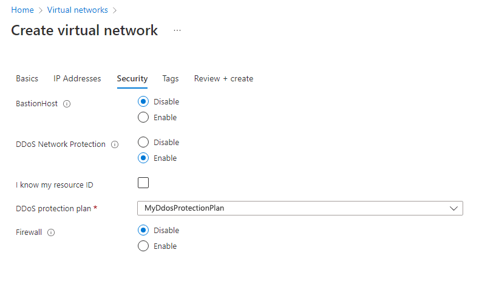

---
Exercise:
  title: "M06: Unidad 4 Configuración de protección de DDoS en una red virtual mediante Azure\_Portal"
  module: Module 06 - Design and implement network security
---

# M06: Unidad 4 Configuración de protección de DDoS en una red virtual mediante Azure Portal

## Escenario del ejercicio

Como responsable del equipo de seguridad de red de Contoso, va a ejecutar un ataque DDoS ficticio en la red virtual. Los pasos siguientes lo ayudarán a crear una red virtual, configurar DDoS Protection y crear un ataque que puede observar y supervisar con datos de telemetría y métricas.


### Aptitudes de trabajo

En este ejercicio, aprenderás a:

+ Tarea 1: Creación de un grupo de recursos
+ Tarea 2: Crear un plan de protección contra DDoS
+ Tarea 3: Habilitar DDoS Protection en una red virtual nueva
+ Tarea 4: Configurar la telemetría de DDoS
+ Tarea 5: Configurar registros de diagnóstico de DDoS
+ Tarea 6: Configurar alertas de DDoS
+ Tarea 7: Prueba con asociados de simulación
  
### Tiempo estimado: 40 minutos.

## Tarea 1: Creación de un grupo de recursos

1. Inicio de sesión en la cuenta de Azure

1. En la página principal de Azure Portal, seleccione **Grupos de recursos**.

1. Seleccione **Crear**.

1. En la pestaña **Aspectos básicos**, en **Grupo de recursos**, escriba **MyResourceGroup**.

1. En **Región**, selecciona Este de los EE. UU.

1. Seleccione **Revisar + crear**.

1. Seleccione **Crear**.

## Tarea 2: Crear un plan de protección contra DDoS

1. En la página principal de Azure Portal, en el cuadro de búsqueda, escribe **DDoS** y selecciona **Plan de protección contra DDoS** cuando aparezca.

1. Seleccione **+ Create** (+ Crear).

1. En la pestaña **Aspectos básicos**, en la lista **Grupo de recursos**, seleccione el grupo de recursos que acaba de crear.

1. En el cuadro **Nombre de la instancia**, escribe **MyDdoSProtectionPlan** y luego selecciona **Revisar+ crear**.

1. Seleccione **Crear**.

## Tarea 3: Habilitar DDoS Protection en una red virtual nueva

Aquí habilitará DDoS en una red virtual nueva en lugar de hacerlo en una existente, por lo que primero debe crear la red virtual y, a continuación, habilitar la protección contra DDoS en ella con el plan que creó anteriormente.

1. En la página principal de Azure Portal, selecciona **Crear un recurso** y luego, en el cuadro de búsqueda, escribe **Red virtual** y selecciona **Red virtual** cuando aparezca.

1. En la página **Red virtual**, seleccione **Crear**.

1. En la pestaña **Aspectos básicos**, seleccione el grupo de recursos que creó anteriormente.

1. En el cuadro **Nombre**, escribe **MyVirtualNetwork** y selecciona la pestaña **Seguridad**.

1. En la pestaña **Seguridad**, junto a **Protección de red contra DDoS**, selecciona **Habilitar**.

1. En la lista desplegable **Plan de protección contra DDoS**, selecciona **MyDdosProtectionPlan**.

   

1. Seleccione **Revisar + crear**.

1. Seleccione **Crear**.

## Tarea 4: Configurar la telemetría de DDoS

Cree una IP pública y, luego, configure la telemetría en los pasos siguientes.

1. En la página principal de Azure Portal, seleccione **Crear un recurso** y, luego, en el cuadro de búsqueda, escriba **ip pública** y seleccione **IP pública** cuando aparezca.

1. En la página **IP pública**, seleccione **Crear**.

1. En la página **Crear dirección IP pública**, en **SKU**, selecciona **Estándar**.

1. En el cuadro **Nombre**, escribe **MyPublicIPAddress**.

1. En **Asignación de direcciones IP**, seleccione **Estática**.

1. En **Etiqueta de nombre de DNS**, escribe **mypublicdnsxx** (donde xx son tus iniciales para que sea única).

1. Seleccione **Crear**.

1. Para configurar la telemetría, ve a la página principal de Azure y selecciona **Todos los recursos**.

1. En la lista de recursos, selecciona **MyDdosProtectionPlan**.

1. En **Supervisión**, seleccione **Métricas**.

1. Seleccione el cuadro **Ámbito** y, luego, active la casilla que está junto a **MyPublicIPAddress**.

    

1. Seleccione **Aplicar**.

1. En el cuadro **Métricas**, selecciona **Paquetes entrantes de DDoS descartados**.

1. En el cuadro **Agregación**, selecciona **Máx**.

    

## Tarea 5: Configurar registros de diagnóstico de DDoS

1. En la página principal de Azure, seleccione **Todos los recursos**.

1. En la lista de los recursos, selecciona **MyPublicIPAddress**.

1. En **Supervisión**, seleccione **Configuración de diagnóstico**.

1. Seleccione **Agregar configuración de diagnóstico**.

1. En la página **Configuración de diagnóstico**, en el cuadro **Nombre de la configuración de diagnóstico**, escriba **MyDiagnosticSetting**.

1. En **Detalles de la categoría**, active las tres casillas que se encuentran en **log** (registro) y la casilla **AllMetrics**.

1. En **Detalles del destino**, active la casilla **Enviar al área de trabajo de Log Analytics**. Aquí puede seleccionar un área de trabajo de Log Analytics preexistente, pero como todavía no configura un destino para los registros de diagnóstico, solo tendrá que especificar la configuración y descartarla en el paso siguiente de este ejercicio.

   

1. Por lo general, ahora seleccionaría **Guardar** para guardar la configuración de diagnóstico. pero observe que esta opción aparece atenuada porque todavía no se puede completar la configuración.

1. Seleccione **Descartar** y, después, **Sí**.

## Tarea 6: Configurar alertas de DDoS

En este paso creará una máquina virtual, le asignará una IP pública y, luego, configurará alertas de DDoS.

### Creación de la máquina virtual

1. En la página principal de Azure Portal, selecciona **Crear un recurso** y luego, en el cuadro de búsqueda, escribe **máquina virtual** y selecciona **Máquina virtual** cuando aparezca.

1. En la página **Máquina virtual**, seleccione **Crear**.

1. En la pestaña **Aspectos básicos**, cree una máquina virtual con la información de la tabla que aparece a continuación.

   | **Configuración**           | **Valor**                                                    |
   | --------------------- | ------------------------------------------------------------ |
   | Suscripción          | Selecciona la suscripción                                     |
   | Resource group        | **MyResourceGroup**                                          |
   | Nombre de la máquina virtual  | **MyVirtualMachine**                                         |
   | Region                | Su región                                                  |
   | Opciones de disponibilidad  | **No se requiere redundancia de la infraestructura**                   |
   | Imagen                 | **Ubuntu Server 20.04 LTS -  Gen 2** (selecciona el vínculo Configurar la generación de máquina virtual si es necesario) |
   | Size                  | Selecciona **Ver todos los tamaños**, luego elige **B1ls** en la lista y luego, **Seleccionar****(Standard_B1ls - 1 vCPU, 0,5 GiB de memoria**) |
   | Tipo de autenticación   | **Clave pública SSH.**                                           |
   | Nombre de usuario              | **azureuser**                                                |
   | Origen de la clave pública SSH | **Generar par de claves nuevo**                                    |
   | Nombre del par de claves         | **myvirtualmachine-ssh-key**                                 |
   | Puertos de entrada públicos  | Seleccione Ninguno.                                                  |

1. Seleccione **Revisar + crear**.

1. Seleccione **Crear**.

1. En el cuadro de diálogo **Generar nuevo par de claves**, selecciona **Descargar la clave privada y crear el recurso**.

1. Guarde la clave privada.

1. Una vez finalizada la implementación, seleccione **Ir al recurso**.

### Asignación de la IP pública

1. En la página **Información general** de la máquina virtual, en **Configuración**, seleccione **Redes**.

1. Junto a **Interfaz de red**, selecciona **myvirtualmachine-nic**. El nombre de la nic puede diferir.

1. En **Configuración**, seleccione **Configuraciones IP**.

1. Seleccione **ipconfig1**.

1. En la lista **Dirección IP pública**, selecciona **MyPublicIPAddress**.

1. Seleccione **Guardar**.

   

### Configuración de las alertas de DDoS

1. En la página principal de Azure, seleccione **Todos los recursos**.

1. En la lista de los recursos, selecciona **MyPublicIPAddress**.

1. En **Supervisión**, seleccione **Alertas**.

1. Seleccione **Crear regla de alertas**.

1. En la página **Crear regla de alerta**, en **Ámbito**, seleccione **Editar recurso**.

1. Selecciona **Bajo ataque DDoS o no** para el nombre de señal.

1. En Lógica de alerta, busca el valor de **Operador** y selecciona **Mayor o igual que**.

1. En **Valor de umbral**, escribe **1** (que significa “bajo ataque”).

1. Ve a la pestaña de detalles y selecciona **Nombre de regla de alerta**, escribe **MyDdosAlert**.

    

1. Seleccione **Crear regla de alertas**.

## Tarea 7: Prueba con asociados de simulación

1. Revisa la página [Directiva de pruebas de simulación de Azure DDoS](https://learn.microsoft.com/en-us/azure/ddos-protection/test-through-simulations#configure-a-ddos-attack-simulation). 

1. Observa que hay varios asociados de prueba. Como tienes tiempo, configura una simulación de ataque DDoS. Para BreakingPoint Cloud, primero debe crear una cuenta de BreakingPoint Cloud.

## Limpieza de recursos

   >**Nota**: No olvide quitar los recursos de Azure recién creados que ya no use. La eliminación de los recursos sin usar garantiza que no verás cargos inesperados.

1. En Azure Portal, abre la sesión de **PowerShell** en el panel **Cloud Shell**.

1. Ejecute el comando siguiente para eliminar todos los grupos de recursos que ha creado en los laboratorios de este módulo:

   ```powershell
   Remove-AzResourceGroup -Name 'MyResourceGroup' -Force -AsJob
   ```

   >**Nota**: el comando se ejecuta de forma asincrónica (según determina el parámetro -AsJob). Aunque podrás ejecutar otro comando de PowerShell inmediatamente después en la misma sesión de PowerShell, los grupos de recursos tardarán unos minutos en eliminarse.

## Ampliar el aprendizaje con Copilot

Copilot puede ayudarte a aprender a usar las herramientas de scripting de Azure. Copilot también puede ayudar en áreas no cubiertas en el laboratorio o donde necesitas más información. Abre un explorador Edge y elige Copilot (superior derecha) o ve a *copilot.microsoft.com*. Dedica unos minutos a probar estas indicaciones.
+ ¿Qué son los ataques DDoS? ¿Cómo se clasifican los ataques DDoS y hay estrategias de mitigación?
+ Proporciona una tabla que resuma los dos niveles diferentes de Azure DDoS Protection.
+ ¿Qué recursos de Azure se pueden proteger mediante protección contra DDoS?


## Más información con el aprendizaje autodirigido

+ [Introducción a Azure DDoS Protection](https://learn.microsoft.com/training/modules/introduction-azure-ddos-protection/). En este módulo, evaluarás Azure DDoS Protection, sus características y las opciones de arquitectura.
+ [Diseño e implementación de la seguridad de red](https://learn.microsoft.com/training/modules/design-implement-network-security-monitoring/). En este módulo, obtendrás información sobre Azure DDoS Protection y la implementarás.

  
## Puntos clave

Enhorabuena por completar el laboratorio. Estas son las principales conclusiones del laboratorio. 
+ Un ataque DDoS es un intento malicioso de sobrecargar los recursos de una aplicación haciendo que esta no esté disponible para los usuarios legítimos. 
+ Azure DDoS Protection defiende contra ataques DDoS. Se ajusta automáticamente para proteger los recursos específicos de Azure de una red virtual. 
+ Las características de Azure DDoS Protection incluyen: supervisión del tráfico Always On, ajuste adaptable en tiempo real y telemetría y alertas.  
+ Azure DDoS Protection admite dos tipos de niveles de servicio: Protección de IP contra DDoS y Protección de red contra DDoS.
