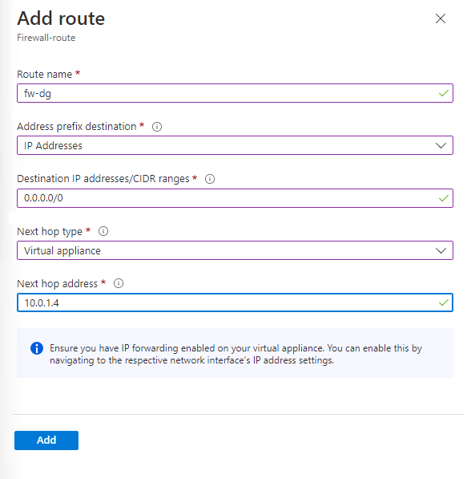
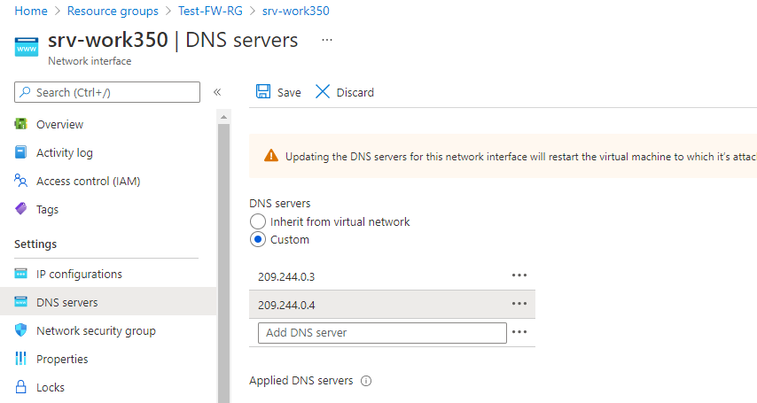

---
Exercise:
  title: 'M06: Unidad 7 Implementación y configuración de Azure Firewall mediante Azure Portal'
  module: 'Module 06 - Design and implement network security '
---

# M06: Unidad 7 Implementación y configuración de Azure Firewall mediante Azure Portal

## Escenario del ejercicio

Al formar parte del equipo de seguridad de red de Contoso, la tarea siguiente consiste en crear reglas de firewall para permitir o denegar el acceso a determinados sitios web. Los pasos siguientes lo ayudarán a crear un grupo de recursos, una red virtual y subredes, y una máquina virtual como tareas de preparación del entorno y, luego, a implementar un firewall y una directiva de firewall, configurar rutas predeterminadas y reglas de aplicación, red y DNAT. Por último, podrá probar el firewall.


### Aptitudes de trabajo

En este ejercicio, aprenderás a:

+ Tarea 1: Creación de un grupo de recursos
+ Tarea 2: Crear una red virtual y subredes
+ Tarea 3: Crear una máquina virtual
+ Tarea 4: Implementar el firewall y la directiva de firewall
+ Tarea 5: Crear una ruta predeterminada
+ Tarea 6: Configurar una regla de aplicación
+ Tarea 7: Configurar una regla de red
+ Tarea 8: Configurar una regla de NAT de destino (DNAT)
+ Tarea 9: Cambiar la dirección DNS primaria y secundaria para la interfaz de red del servidor
+ Tarea 10: Probar el firewall

### Simulaciones de laboratorio interactivas

>**Nota**: las simulaciones de laboratorio proporcionadas anteriormente se han retirado.

### Tiempo estimado: 60 minutos.

## Tarea 1: Creación de un grupo de recursos

En esta tarea, creará un grupo de recursos nuevo.

1. Inicio de sesión en la cuenta de Azure

1. En la página principal de Azure Portal, seleccione **Grupos de recursos**.

1. Seleccione **Crear**.

1. En la pestaña **Aspectos básicos**, en **Grupo de recursos**, escriba **Test-FW-RG**.

1. En **Región**, selecciona tu región en la lista.

   

1. Seleccione **Revisar + crear**.

1. Seleccione **Crear**.

## Tarea 2: Crear una red virtual y subredes

En esta tarea, creará una red virtual única con dos subredes.

1. En la página de inicio de Azure Portal, en el cuadro de búsqueda, escribe **red virtual** y selecciona **Red virtual**cuando aparezca.

1. Seleccione **Crear**.

1. Seleccione el grupo de recursos **Test-FW-RG** que creó anteriormente.

1. En el cuadro **Nombre**, escriba **Test-FW-VN**.

   

1. Seleccione **Siguiente: Direcciones IP**. Escribe el espacio de direcciones IPv4 10.0.0.0/16 si aún no existe de forma predeterminada.

1. En **Nombre de subred**, seleccione la palabra **predeterminada**.

1. En el cuadro de diálogo **Editar subred**, cambie el nombre a **AzureFirewallSubnet**.

1. Cambie el **Intervalo de direcciones de subred** a **10.0.1.0/26**.

1. Seleccione **Guardar**.

1. Seleccione **Agregar subred** para crear otra subred, que hospedará el servidor de carga de trabajo que creará en breve.

    

1. En el cuadro de diálogo **Editar subred**, cambie el nombre a **Workload-SN**.

1. Cambie el **Intervalo de direcciones de subred** a **10.0.2.0/24**.

1. Seleccione **Agregar**.

1. Seleccione **Revisar + crear**.

1. Seleccione **Crear**.

## Tarea 3: Crear una máquina virtual

En esta tarea, creará la máquina virtual de carga de trabajo y la colocará en la subred Workload-SN que creó anteriormente.

1. En Azure Portal, selecciona el icono Cloud Shell (parte superior derecha). Si es necesario, configura el shell.  
    + Selecciona **PowerShell**.
    + Selecciona **No se requiere cuenta de almacenamiento** y tu **Suscripción**, después, selecciona **Aplicar**.
    + Espera a que se cree el terminal y se muestre una solicitud. 

1. En la barra de herramientas del panel de Cloud Shell, selecciona el icono **Administrar archivos**, en el menú desplegable, selecciona **Cargar** y carga los siguientes archivos **firewall.json** y **firewall.parameters.json** en el directorio principal de Cloud Shell.

    > **Nota:** Si estás trabajando en tu propia suscripción los [archivos de plantilla](https://github.com/MicrosoftLearning/AZ-700-Designing-and-Implementing-Microsoft-Azure-Networking-Solutions/tree/master/Allfiles/Exercises) están disponibles en el repositorio de laboratorio de GitHub.

1. Implemente las plantillas de ARM siguientes a fin de crear la máquina virtual necesaria para este ejercicio:

   >**Nota**: Se le pedirá que proporcione una contraseña de administrador.

   ```powershell
   $RGName = "Test-FW-RG"
   
   New-AzResourceGroupDeployment -ResourceGroupName $RGName -TemplateFile firewall.json -TemplateParameterFile firewall.parameters.json
   ```
  
1. Cuando la implementación esté completa, ve a la página principal de Azure Portal y, luego, selecciona **Máquinas virtuales**.

1. Comprueba que se ha creado la máquina virtual.

1. En la página **Información general** de **Srv-Work**, a la derecha de la página, en **Redes**, anote la **Dirección IP privada** de esta VM (por ejemplo, **10.0.2.4**).

## Tarea 4: Implementar el firewall y la directiva de firewall

En esta tarea, implementará el firewall en la red virtual con una directiva de firewall configurada.

1. En la página principal de Azure Portal, seleccione **Crear un recurso** y, luego, en el cuadro de búsqueda, escriba **firewall** y seleccione **Firewall** cuando aparezca.

1. En la página **Firewall**, seleccione **Crear**.

1. En la pestaña **Aspectos básicos**, cree un firewall con la información de la tabla que aparece a continuación.

   | **Configuración**          | **Valor**                                                    |
   | -------------------- | ------------------------------------------------------------ |
   | Suscripción         | Selecciona la suscripción                                     |
   | Resource group       | **Test-FW-RG**                                               |
   | Nombre del firewall        | **Test-FW01**                                                |
   | Region               | Su región                                                  |
   | SKU del firewall        | **Estándar**                                                 |
   | Administración del firewall  | **Uso de una directiva de firewall para administrar este firewall**            |
   | Directiva de firewall      | Seleccione **Agregar nuevo**.<br />Nombre: **fw-test-pol**<br />Región: **su región** |

   

   | Elegir una red virtual | **Utilizar existente**                         |
   | ------------------------ | ---------------------------------------- |
   | Red virtual          | **Test-FW-VN**                           |
   | Dirección IP pública        | Seleccione **Agregar nuevo**.<br />Nombre: **fw-pip** |

   

1. No vamos a usar el Firewall Manager así que desactiva la casilla de **Habilitar NIC de administración de firewall**. 

1. Revise la configuración. 

   

1. Procede a **Revisar + crear** y después a **Crear**.

1. Espera a que la implementación del firewall se complete.

1. Cuando finalice la implementación del firewall, seleccione **Ir al recurso**.

1. En la página **Información general** de **Test-FW01**, a la derecha de la página, anote la **IP privada de firewall** de este firewall (por ejemplo, **10.0.1.4**).

1. En el menú de la izquierda, en **Configuración**, seleccione **Configuración de IP pública**.

1. Anote la dirección que aparece en **Dirección IP** de la configuración de IP pública **fw-pip** (por ejemplo, **20.90.136.51**).

## Tarea 5: Crear una ruta predeterminada

En esta tarea, en la subred Workload-SN, configurará la ruta predeterminada de salida que pase por el firewall.

1. En la página principal de Azure Portal, seleccione **Crear un recurso** y, luego, en el cuadro de búsqueda, escriba **ruta** y seleccione **Tabla de enrutamiento** cuando aparezca.

1. En la página **Tabla de enrutamiento**, seleccione **Crear**.

1. En la pestaña **Aspectos básicos**, cree una tabla de rutas con la información de la tabla que aparece a continuación.

   | **Configuración**              | **Valor**                |
   | ------------------------ | ------------------------ |
   | Suscripción             | Selecciona la suscripción |
   | Resource group           | **Test-FW-RG**           |
   | Region                   | Su región              |
   | Nombre                     | **Firewall-route**       |
   | Propagar las rutas de la puerta de enlace | **Sí**                  |

1. Seleccione **Revisar + crear**.

1. Seleccione **Crear**.

   

1. Una vez finalizada la implementación, seleccione **Ir al recurso**.

1. En la página **Firewall-route**, en **Configuración**, seleccione **Subredes** y, luego, elija **Asociar**.

1. En **Red virtual**, selecciona **Test-FW-VN**.

1. En **Subred**, selecciona **Workload-SN**. Asegúrese de seleccionar únicamente la subred Workload-SN para esta ruta o el firewall no funcionará correctamente.

1. Seleccione **Aceptar**.

1. En **Configuración**, seleccione **Rutas** y, luego, elija **Agregar**.

1. En **Nombre de la ruta**, escribe **fw-dg**.

1. En **Destino del prefijo de dirección**, escribe **0.0.0.0/0**.

1. En **Tipo del próximo salto**, selecciona **Aplicación virtual**.

1. En **Dirección de próximo salto**, escribe la dirección IP privada del servidor de seguridad que has anotado anteriormente (por ejemplo, **10.0.1.4**).

1. Seleccione **Agregar**.

    

## Tarea 6: Configurar una regla de aplicación

En esta tarea, agregará una regla de aplicación que permita el acceso saliente a <www.google.com>.

1. En la página principal de Azure Portal, seleccione **Todos los recursos**.

1. En la lista de recursos, seleccione la directiva de firewall, **fw-test-pol**.

1. En **Reglas**, selecciona **Reglas de aplicación**.

1. Seleccione **Agregar una colección de reglas**.

1. En la página **Agregar una colección de reglas**, cree una regla de aplicación con la información de la tabla que aparece a continuación.

   | **Configuración**            | **Valor**                                 |
   | ---------------------- | ----------------------------------------- |
   | Nombre                   | **App-Coll01**                            |
   | Tipo de colección de reglas   | **Aplicación**                           |
   | Prioridad               | **200**                                   |
   | Acción de colección de reglas | **Permitir**                                 |
   | Grupo de colección de reglas  | **DefaultApplicationRuleCollectionGroup** |
   | **Sección Reglas**      |                                           |
   | Nombre                   | **Allow-Google**                          |
   | Tipo de origen            | **Dirección IP**                            |
   | Source                 | **10.0.2.0/24**                           |
   | Protocolo               | **http,https**                            |
   | Tipo de destino       | **FQDN**                                  |
   | Destino            | **<www.google.com>**                        |

   

1. Seleccione **Agregar**.

## Tarea 7: Configurar una regla de red

En esta tarea, agregará una regla de red que permita el acceso saliente a dos direcciones IP en el puerto 53 (DNS).

1. En la página **fw-test-pol**, en **Reglas**, selecciona **Reglas de red**.

1. Seleccione **Agregar una colección de reglas**.

1. En la página **Agregar una colección de reglas**, cree una regla de red con la información de la tabla que aparece a continuación.

   | **Configuración**            | **Valor**                                                    |
   | ---------------------- | ------------------------------------------------------------ |
   | Nombre                   | **Net-Coll01**                                               |
   | Tipo de colección de reglas   | **Network**                                                  |
   | Prioridad               | **200**                                                      |
   | Acción de colección de reglas | **Permitir**                                                    |
   | Grupo de colección de reglas  | **DefaultNetworkRuleCollectionGroup**                        |
   | **Sección Reglas**      |                                                              |
   | Nombre                   | **Allow-DNS**                                                |
   | Tipo de origen            | **Dirección IP**                                               |
   | Source                 | **10.0.2.0/24**                                              |
   | Protocolo               | **UDP**                                                      |
   | Puertos de destino      | **53**                                                       |
   | Tipo de destino       | **Dirección IP**                                               |
   | Destino            | **209.244.0.3, 209.244.0.4**<br />Estos son servidores DNS públicos ofrecidos por Century Link |

    

1. Seleccione **Agregar**.

## Tarea 8: Configurar una regla de NAT de destino (DNAT)

En esta tarea, agregará una regla DNAT que le permita conectar un escritorio remoto a la máquina virtual Srv-Work a través del firewall.

1. En la página **fw-test-pol**, en **Reglas**, selecciona **Reglas DNAT**.

1. Seleccione **Agregar una colección de reglas**.

1. En la página **Agregar una colección de reglas**, cree una regla de red DNAT con la información de la tabla que aparece a continuación.

   | **Configuración**           | **Valor**                                                    |
   | --------------------- | ------------------------------------------------------------ |
   | Nombre                  | **rdp**                                                      |
   | Tipo de colección de reglas  | **DNAT**                                                     |
   | Prioridad              | **200**                                                      |
   | Grupo de colección de reglas | **DefaultDnatRuleCollectionGroup**                           |
   | **Sección Reglas**     |                                                              |
   | Nombre                  | **rdp-nat**                                                  |
   | Tipo de origen           | **Dirección IP**                                               |
   | Origen                | *                                                            |
   | Protocolo              | **TCP**                                                      |
   | Puertos de destino     | **3389**                                                     |
   | Tipo de destino      | **Dirección IP**                                               |
   | Destino           | Escriba la IP pública del firewall de **fw-pip** que anotó anteriormente.<br />**Por ejemplo, 20.90.136.51** |
   | Dirección traducida    | Escriba la dirección IP privada de **Srv-Work** que anotó anteriormente.<br />**Por ejemplo, 10.0.2.4** |
   | Puerto traducido       | **3389**                                                     |

  

1. Seleccione **Agregar**.

## Tarea 9: Cambiar la dirección DNS primaria y secundaria para la interfaz de red del servidor

Con fines de prueba en este ejercicio, en esta tarea configurará las direcciones DNS primaria y secundaria del servidor Srv-Work. Sin embargo, esto no es un requisito general de Azure Firewall.

1. En la página principal de Azure Portal, seleccione **Grupos de recursos**.

1. En la lista de grupos de recursos, seleccione el suyo, **Test-FW-RG**.

1. En la lista de recursos de este grupo de recursos, seleccione la interfaz de red para la máquina virtual **Srv-Work** (por ejemplo, **srv-work350**).

   

1. En **Configuración**, seleccione **Servidores DNS**.

1. En **Servidores DNS**, seleccione **Personalizado**.

1. escribe **209.244.0.3** en el cuadro de texto **Agregar servidor DNS** y **209.244.0.4** en el siguiente cuadro de texto.

1. Seleccione **Guardar**.

   

1. Reinicie la máquina virtual **Srv-Work**.

## Tarea 10: Probar el firewall

En esta tarea final, probará el firewall para comprobar que las reglas están configuradas correctamente y funcionan según lo previsto. Esta configuración le permitirá establecer una conexión a Escritorio remoto con la máquina virtual Srv-Work a través del firewall mediante la IP pública del firewall.

1. Abra **Conexión a Escritorio remoto** en el equipo.

1. En el cuadro **Equipo**, escribe la dirección IP pública del firewall (por ejemplo, **20.90.136.51**) seguida de **:3389** (por ejemplo, **20.90.136.51:3389**).

1. En el cuadro **Nombre de usuario**, escribe **TestUser**.

1. Seleccione **Conectar**.

   

1. En el cuadro de diálogo **Escribe las credenciales**, inicia sesión en la máquina virtual de servidor **Srv-Work** con la contraseña proporcionada durante la implementación.

1. Seleccione **Aceptar**.

1. Seleccione **Sí** en el mensaje de certificado.

1. Abra Internet Explorer y vaya a **<https://www.google.com>**.

1. En el cuadro de diálogo **Alerta de seguridad**, selecciona **Aceptar**.

1. Seleccione **Cerrar** en las alertas de seguridad de Internet Explorer que puedan haber aparecido.

1. Debería ver la página principal de Google.

    

1. Vaya a **<https://www.microsoft.com>**.

1. El firewall debería bloquearle.

    

## Limpieza de recursos

   >**Nota**: No olvide quitar los recursos de Azure recién creados que ya no use. La eliminación de los recursos sin usar garantiza que no verás cargos inesperados.

1. En Azure Portal, abre la sesión de **PowerShell** en el panel **Cloud Shell**.

1. Ejecute el comando siguiente para eliminar todos los grupos de recursos que ha creado en los laboratorios de este módulo:

   ```powershell
   Remove-AzResourceGroup -Name 'Test-FW-RG' -Force -AsJob
   ```

   >**Nota**: el comando se ejecuta de forma asincrónica (según determina el parámetro -AsJob). Aunque podrás ejecutar otro comando de PowerShell inmediatamente después en la misma sesión de PowerShell, los grupos de recursos tardarán unos minutos en eliminarse.

## Ampliar el aprendizaje con Copilot

Copilot puede ayudarte a aprender a usar las herramientas de scripting de Azure. Copilot también puede ayudar en áreas no cubiertas en el laboratorio o donde necesitas más información. Abre un explorador Edge y elige Copilot (superior derecha) o ve a *copilot.microsoft.com*. Dedica unos minutos a probar estas indicaciones.
+ Proporciona tres escenarios de uso comunes para firewalls. 
+ Proporciona una tabla que compare las características de las SKU de Azure Firewall.
+ Describe los tres tipos de reglas que puedes crear para una instancia de Azure Firewall.

## Obtén más información con el aprendizaje autodirigido

+ [Introducción a Azure Firewall](https://learn.microsoft.com/training/modules/introduction-azure-firewall/). En este módulo, aprenderás cómo Azure Firewall protege los recursos de red virtual de Azure, incluidas las características, las reglas y las opciones de implementación.
+ [Introducción a Azure Firewall Manager](https://learn.microsoft.com/training/modules/intro-to-azure-firewall-manager/). En este módulo, aprenderás cómo Azure Firewall Manager proporciona una directiva de seguridad central y administración de rutas para perímetros de seguridad basados en la nube

## Puntos clave

Enhorabuena por completar el laboratorio. Estas son las principales conclusiones del laboratorio. 
+ Un firewall es una característica de seguridad de red que se sitúa entre una red de confianza y otra que no es de confianza, como Internet. El trabajo del firewall consiste en analizar y, a continuación, permitir o denegar el tráfico de red.
+ Azure Firewall es un servicio de firewall basado en la nube. En la mayoría de las configuraciones, Azure Firewall se aprovisiona dentro de una red virtual de concentrador. El tráfico hacia y desde las redes virtuales de radio y la red local se dirige al firewall.
+ Las reglas de firewall evalúan el tráfico de red. Azure Firewall tiene tres tipos de reglas: aplicación, red y NAT. 
+ Azure Firewall se ofrece en tres SKU: Estándar, Prémium y Básico.
