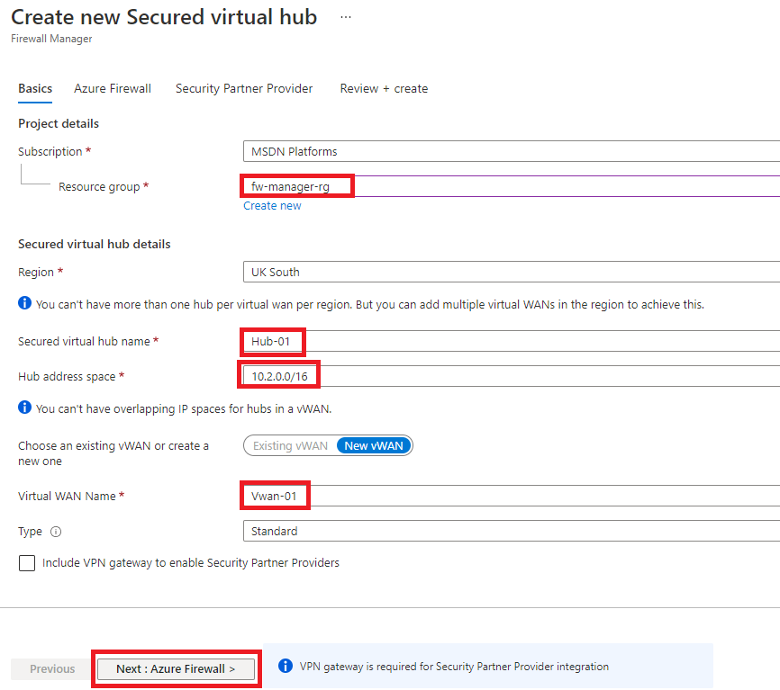

---
Exercise:
  title: 'M06: Unidad 9 Protección de un centro virtual mediante Azure Firewall Manager'
  module: Module 06 - Design and implement network security
---


# M06: Unidad 9 Protección de un centro virtual mediante Azure Firewall Manager

## Escenario del ejercicio

En este ejercicio, creará la red virtual de radio y un centro virtual protegido. A continuación, conectará las redes virtuales en estrella tipo hub-and-spoke y enrutará el tráfico al centro de conectividad. Luego, implementará los servidores de carga de trabajo, creará una directiva de firewall y protegerá el centro de conectividad. Por último, probará el firewall.


   >**Nota:** Hay disponible una **[simulación de laboratorio interactiva](https://mslabs.cloudguides.com/guides/AZ-700%20Lab%20Simulation%20-%20Secure%20your%20virtual%20hub%20using%20Azure%20Firewall%20Manager)** que le permite realizar sus propias selecciones a su entera discreción. Es posible que encuentre pequeñas diferencias entre la simulación interactiva y el laboratorio hospedado, pero las ideas y los conceptos básicos que se muestran son los mismos.

## Creación de una arquitectura en estrella tipo hub-and-spoke

En esta parte del ejercicio, creará las redes virtuales de radio y las subredes en las que colocará los servidores de carga de trabajo. A continuación, creará el centro virtual protegido y conectará el centro y las redes virtuales de radio.

En este ejercicio, aprenderá a:

+ Tarea 1: Crear dos redes virtuales de radio y subredes
+ Tarea 2: Crear el centro virtual protegido
+ Tarea 3: Conectar las redes virtuales en estrella tipo hub-and-spoke
+ Tarea 4: Implementar los servidores
+ Tarea 5: Crear una directiva de firewall y proteger el centro de conectividad
+ Tarea 6: Asociar la directiva de firewall
+ Tarea 7: Enrutar el tráfico al centro de conectividad
+ Tarea 8: Probar la regla de aplicación
+ Tarea 9: Probar la regla de red
+ Tarea 10: Limpiar los recursos

### Tiempo estimado: 35 minutos

## Tarea 1: Crear dos redes virtuales de radio y subredes

En esta tarea, creará las dos redes virtuales de radio, cada una de las cuales con una subred que hospedará los servidores de carga de trabajo.

1. En la página de inicio de Azure Portal, en el cuadro de búsqueda, escribe **red virtual** y selecciona **Red virtual**cuando aparezca.

1. Seleccione **Crear**.

1. En **Grupo de recursos**, seleccione **Crear nuevo**, escriba **fw-manager-rg** como el nombre y seleccione **Aceptar**.

1. En **Nombre**, escriba **Spoke-01**.

1. En **Región**, seleccione su región.

1. Seleccione **Siguiente: Direcciones IP**.

1. En **Espacio de direcciones IPv4**, escriba **10.0.0.0/16**.

1. **Elimine** cualquier otro espacio de direcciones que aparezca aquí, como **10.1.0.0/16**.

1. En **Nombre de subred**, seleccione la palabra **predeterminada**.

1. En el cuadro de diálogo **Editar subred**, cambie el nombre a **Workload-01-SN**.

1. Cambie el **Intervalo de direcciones de subred** a **10.0.1.0/24**.

1. Seleccione **Guardar**.

1. Seleccione **Revisar + crear**.

1. Seleccione **Crear**.

Repita los pasos 1 a 14 anteriores para crear otra red virtual y subred similares con la información siguiente:

+ Grupo de recursos: **fw-manager-rg** (seleccione el existente)
+ Nombre: **Spoke-02**
+ Espacio de direcciones: **10.1.0.0/16** (elimine cualquier otro espacio de direcciones que aparezcan)
+ Nombre de subred: **Workload-02-SN**
+ Intervalo de direcciones de subred: **10.1.1.0/24**

## Tarea 2: Crear el centro virtual protegido

En esta tarea, creará el centro virtual protegido con Firewall Manager.

1. En la página principal de Azure Portal, seleccione **Todos los servicios**.

1. En el cuadro de búsqueda, escriba **firewall manager** y seleccione **Firewall Manager** cuando aparezca.

1. En la página **Firewall Manager**, selecciona **Ver los concentradores virtuales protegidos**.

1. En la página **Centros virtuales**, seleccione **Crear un nuevo centro virtual protegido**.

1. En **Grupo de recursos**, seleccione **fw-manager-rg**.

1. En **Región**, seleccione su región.

1. Para el **nombre del centro virtual protegido**, escribe **Hub-01**.

1. En **Espacio de direcciones del centro**, escriba **10.2.0.0/16**.

1. Elija **Nueva vWAN**.

1. En **Nombre de la instancia de Virtual WAN**, escriba **Vwan-01**.

1. Seleccione **Siguiente: Azure Firewall**.
    

1. Seleccione **Siguiente: Proveedores de seguridad asociados**.

1. Seleccione **Siguiente: Review + create** (Revisar y crear).

1. Seleccione **Crear**.

    > **[!NOTE]**
    >
    > Esta implementación puede tardar hasta 30 minutos en completarse.

    

    

1. Una vez que se complete la implementación, seleccione **Todos los servicios** de la página principal de Azure Portal.

1. En el cuadro de búsqueda, escriba **firewall manager** y seleccione **Firewall Manager** cuando aparezca.

1. En la página **Firewall Manager**, seleccione **Centros virtuales**.

1. Seleccione **Hub-01**.

1. Seleccione **Configuración de IP pública**.

1. Anota la dirección IP pública (por ejemplo, **51.143.226.18**), que usarás más adelante.

## Tarea 3: Conectar las redes virtuales en estrella tipo hub-and-spoke

En esta tarea, conectará las redes virtuales en estrella tipo hub-and-spoke. Esto suele conocerse como "emparejamiento".

1. En la página principal de Azure Portal, seleccione **Grupos de recursos**.

1. Seleccione el grupo de recursos **fw-manager.rg** y, después, seleccione la WAN virtual **Vwan-01**.

1. En **Conectividad**, seleccione **Conexiones de red virtual**.

1. Seleccione **Agregar conexión**.

1. En **Nombre de la conexión**, escriba **hub-spoke-01**.

1. En **Centros**, seleccione **Hub-01**.

1. En **Grupo de recursos**, seleccione **fw-manager-rg**.

1. En **Red virtual**, seleccione **Spoke-01**.

1. Seleccione **Crear**.
   

1. Repita los pasos 4 a 9 anteriores para crear otra conexión similar con el nombre de conexión **hub-spoke-02** a fin de conectar la red virtual **Spoke-02**.

    

## Tarea 4: Implementar los servidores

1. En Azure Portal, selecciona el icono Cloud Shell (parte superior derecha). Si es necesario, configura el shell.  
    + Selecciona **PowerShell**.
    + Selecciona **No se requiere cuenta de almacenamiento** y tu **Suscripción**, después, selecciona **Aplicar**.
    + Espera a que se cree el terminal y se muestre una solicitud. 

1. En la barra de herramientas del panel de Cloud Shell, selecciona el icono **Administrar archivos**, en el menú desplegable, selecciona **Cargar** y carga los siguientes archivos **FirewallManager.json** y **FirewallManager.parameters.json** en el directorio principal de Cloud Shell uno a uno desde la carpeta de origen **F:\Allfiles\Exercises\M06**.

1. Implemente las plantillas de ARM siguientes a fin de crear la máquina virtual necesaria para este ejercicio:

   >**Nota**: Se le pedirá que proporcione una contraseña de administrador.

   ```powershell
   $RGName = "fw-manager-rg"
   
   New-AzResourceGroupDeployment -ResourceGroupName $RGName -TemplateFile FirewallManager.json -TemplateParameterFile FirewallManager.parameters.json
   ```
  
1. Cuando la implementación esté completa, vaya a la página principal de Azure Portal y, luego, seleccione **Máquinas virtuales**.

1. En la página **Información general** de **Srv-workload-01**, en el panel de la derecha, en la sección **Redes**, anote la **Dirección IP privada** (por ejemplo, **10.0.1.4**).

1. En la página **Información general** de **Srv-workload-02**, en el panel de la derecha, en la sección **Redes**, anote la **Dirección IP privada** (por ejemplo, **10.1.1.4**).

## Tarea 5: Crear una directiva de firewall y proteger el centro de conectividad

En esta tarea, primero creará la directiva de firewall y, a continuación, protegerá el centro de conectividad. La directiva de firewall definirá colecciones de reglas para dirigir el tráfico en uno o varios centros virtuales protegidos.

1. En la página principal de Azure Portal, seleccione **Firewall Manager**.
   + Si el icono de Firewall Manager no aparece en la página principal, seleccione **Todos los servicios**. Luego, en el cuadro de búsqueda, escriba **firewall manager** y seleccione **Firewall Manager** cuando aparezca.

1. En **Firewall Manager**, selecciona **Ver las directivas de Azure Firewall**.

1. Seleccione **Crear una directiva de Azure Firewall**.

1. En **Grupo de recursos**, selecciona **fw-manager-rg**.

5. En **Detalles de la directiva**, escriba **Policy-01** en **Nombre**.

1. En **Región**, selecciona tu región.

1. En **Nivel de directiva**, selecciona **Estándar**.

1. Seleccione **Siguiente: Configuración DNS**.

1. Seleccione **Siguiente: Inspección de TLS (versión preliminar)**.

1. Seleccione **Siguiente: Reglas**.

1. En la pestaña **Reglas**, seleccione **Agregar una colección de reglas**.

1. En la página **Agregar una colección de reglas**, en **Nombre**, escriba **App-RC-01**.

1. En **Tipo de colección de reglas**, seleccione **Aplicación**.

1. En **Prioridad**, escriba **100**.

1. Asegúrese de que el valor de **Rule collection action** (Acción de la colección de reglas) es **Permitir**.

1. En **Reglas**, en **Nombre**, escriba **Allow-msft**.

1. En el **Tipo de origen**, seleccione **Dirección IP**.

1. En **Origen**, escribe *.

1. En **Protocolo**, escriba **http,https**.

1. Asegúrese de que **Tipo de destino** es **FQDN**.

1. En **Destino**, escriba ***.microsoft.com**.

1. Seleccione **Agregar**.

    

1. Para agregar una regla DNAT que le permita conectar un escritorio remoto a la máquina virtual Srv-workload-01, seleccione **Agregar una colección de reglas**.

1. En **Nombre**, escriba **dnat-rdp**.

1. En **Tipo de colección de reglas**, seleccione **DNAT**.

1. En **Prioridad**, escriba **100**.

1. En **Reglas**, en **Nombre**, escriba **Allow-rdp**.

1. En el **Tipo de origen**, seleccione **Dirección IP**.

1. En **Origen**, escribe *.

1. En **Protocolo**, seleccione **TCP**.

1. En **Puertos de destino**, escriba **3389**.

1. En **Tipo de destino**, seleccione **Dirección IP**.

1. En **Destino**, escriba la IP pública del centro virtual de firewall que anotó anteriormente (por ejemplo, **51.143.226.18**).

1. En **Dirección traducida**, escriba la dirección IP privada de **Srv-workload-01** que anotó anteriormente (por ejemplo, **10.0.1.4**).

1. En **Puerto traducido**, escriba **3389**.

1. Seleccione **Agregar**.

1. Para agregar una regla de red de modo que pueda conectar un escritorio remoto de la VM Srv-workload-01 a la VM Srv-workload-02, seleccione **Agregar una colección de reglas**.

1. En **Nombre**, escriba **vnet-rdp**.

1. En **Tipo de colección de reglas**, seleccione **Red**.

1. En **Prioridad**, escriba **100**.

1. En **Acción de recopilación de reglas**, seleccione **Denegar**.

1. En **Reglas**, en **Nombre**, escriba **Allow-vnet**.

1. En el **Tipo de origen**, seleccione **Dirección IP**.

1. En **Origen**, escribe *.

1. En **Protocolo**, seleccione **TCP**.

1. En **Puertos de destino**, escriba **3389**.

1. En **Tipo de destino**, seleccione **Dirección IP**.

1. En **Destino**, escriba la dirección IP privada de **Srv-workload-02** que anotó anteriormente (por ejemplo, **10.1.1.4**).

1. Seleccione **Agregar**.

    

1. Ahora debería ver tres colecciones de reglas.

1. Seleccione **Revisar + crear**.

1. Seleccione **Crear**.

## Tarea 6: Asociar la directiva de firewall

En esta tarea, asociará la directiva de firewall con el centro virtual.

1. En la página principal de Azure Portal, seleccione **Firewall Manager**.
   + Si el icono de Firewall Manager no aparece en la página principal, seleccione **Todos los servicios**. Luego, en el cuadro de búsqueda, escriba **firewall manager** y seleccione **Firewall Manager** cuando aparezca.

1. En **Firewall Manager**, en **Seguridad**, selecciona **Directivas de Azure Firewall**.

1. Active la casilla correspondiente a **Policy-01**.

1. Seleccione **Administrar asociaciones&gt;Asociar centros**.

1. Active la casilla correspondiente a **Hub-01**.

1. Seleccione **Agregar**.

1. Una vez que se adjunte la directiva, seleccione **Actualizar**. Debe aparecer la asociación.


## Tarea 7: Enrutar el tráfico al centro de conectividad

En esta tarea, se asegurará de que el tráfico se enruta a través del firewall.

1. En **Firewall Manager**, selecciona **Centros virtuales**.
1. Seleccione **Hub-01**.
1. En **Ajustes**, seleccione **Configuración de seguridad**.
1. En **Tráfico de Internet**, selecciona **Azure Firewall**.
1. En **Tráfico privado**, selecciona **Enviar a través de Azure Firewall**.
1. Seleccione **Guardar**.
1. Esta operación tarda unos minutos en completarse.
1. Una vez que se complete la configuración, asegúrese de que en **TRÁFICO DE INTERNET** y **TRÁFICO PRIVADO** diga **Protegido por Azure Firewall** para ambas conexiones en estrella tipo hub-and-spoke.

## Tarea 8: Probar la regla de aplicación

En esta parte del ejercicio, conectará un escritorio remoto a la IP pública del firewall, que se traduce mediante NAT a Srv-Workload-01. Luego usará un explorador web para probar la regla de aplicación y conectar un escritorio remoto a Srv-Workload-02 para probar la regla de red.

En esta tarea, probará la regla de aplicación para confirmar que funciona según lo previsto.

1. Abra **Conexión a Escritorio remoto** en el equipo.

1. En el cuadro **Equipo**, escribe la **Dirección IP pública del firewall** (por ejemplo, **51.143.226.18**).

1. Seleccione **Mostrar opciones**.

1. En el cuadro **Nombre de usuario**, escribe **TestUser**.

1. Seleccione **Conectar**.

   

1. En el cuadro de diálogo  **Escriba sus credenciales**, inicia sesión en la máquina virtual de servidor **Srv-workload-01** con la contraseña suministrada durante la implementación.

1. Seleccione **Aceptar**.

1. Seleccione **Sí** en el mensaje de certificado.

1. Abra Internet Explorer y seleccione **Aceptar** en el cuadro de diálogo **Configurar Internet Explorer 11**.

1. Vaya a **https://** **<www.microsoft.com>**.

1. En el cuadro de diálogo **Alerta de seguridad**, selecciona **Aceptar**.

1. Seleccione **Cerrar** en las alertas de seguridad de Internet Explorer que puedan haber aparecido.

1. Debería ver la página principal de Microsoft.

    

1. Vaya a **https://** **<www.google.com>**.

1. El firewall debería bloquearle.

    

1. Por lo tanto, ha comprobado que puede conectarse al único FQDN permitido, pero que está bloqueado para todos los demás.

## Tarea 9: Probar la regla de red

En esta tarea, probará la regla de aplicación para confirmar que funciona según lo previsto.

1. Mientras esté conectado a la sesión RDP de **Srv-workload-01**, desde este equipo remoto, abra **Conexión a Escritorio remoto**.

1. En el cuadro **Equipo**, escribe la **dirección IP privada** de **Srv-workload-02** (por ejemplo, **10.1.1.4**).

1. En el cuadro de diálogo **Escriba sus credenciales**, inicia sesión en el servidor **Srv-workload-02** mediante el nombre de usuario **TestUser** y la contraseña que has proporcionado durante la implementación.

1. Seleccione **Aceptar**.

1. Seleccione **Sí** en el mensaje de certificado.

   

1. Por lo tanto, ha comprobado que la regla de red de firewall funciona, ya que conectó un escritorio remoto de un servidor a otro ubicado en otra red virtual.

1. Cierre ambas sesiones RDP para desconectarlas.

## Tarea 10: Limpiar los recursos

>**Nota**: No olvide quitar los recursos de Azure recién creados que ya no use. La eliminación de los recursos sin usar garantiza que no verás cargos inesperados.

1. En Azure Portal, abre la sesión de **PowerShell** en el panel **Cloud Shell**.

1. Ejecute el comando siguiente para eliminar todos los grupos de recursos que ha creado en los laboratorios de este módulo:

   ```powershell
   Remove-AzResourceGroup -Name 'fw-manager-rg' -Force -AsJob
   ```

   >**Nota**: el comando se ejecuta de forma asincrónica (según determina el parámetro -AsJob). Aunque podrás ejecutar otro comando de PowerShell inmediatamente después en la misma sesión de PowerShell, los grupos de recursos tardarán unos minutos en eliminarse.
