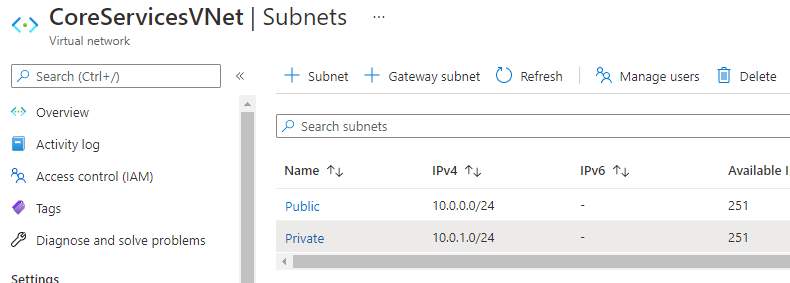
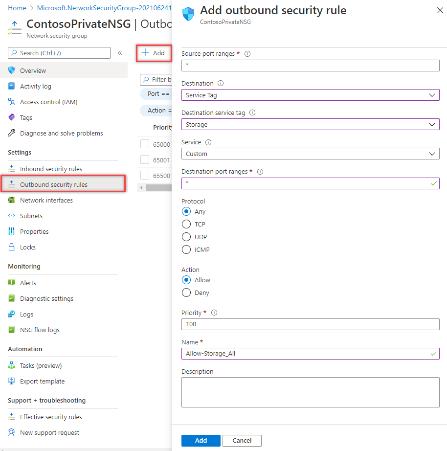
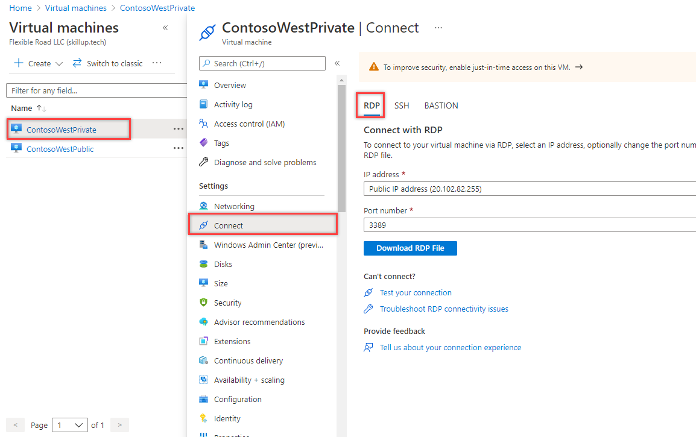

---
Exercise:
  title: 'M07: Unidad 5 Restricción del acceso a la red a los recursos de PaaS mediante puntos de conexión de servicio de red virtual'
  module: Module 07 - Design and implement private access to Azure Services
---

# M07: Unidad 5 Restricción del acceso a red a los recursos de PaaS mediante puntos de conexión de servicio de red virtual

## Escenario del ejercicio

Los puntos de conexión de servicio de red virtual permiten que el acceso de la red a algunos recursos de servicio de Azure esté restringido a una subred de la red virtual. También se puede quitar el acceso de Internet a los recursos. Los puntos de conexión de servicio proporcionan a la red virtual conexión directa con los servicios de Azure compatibles, de modo que se puede usar el espacio de direcciones privadas de la red virtual para acceder a los servicios de Azure. El tráfico destinado a los recursos de Azure a través de los puntos de conexión de servicio siempre se mantiene en la red troncal de Microsoft Azure.


En este ejercicio, aprenderá a:

+ Tarea 1: Creación de una red virtual
+ Tarea 2: Habilitación de un punto de conexión de servicio
+ Tarea 3: Restricción del acceso de la red a una subred
+ Tarea 4: Incorporación de reglas de salida adicionales
+ Tarea 5: Permiso de acceso a las conexiones RDP
+ Tarea 6: Restricción del acceso de la red a un recurso
+ Tarea 7: Creación de un recurso compartido de archivos en la cuenta de almacenamiento
+ Tarea 8: Restricción del acceso de la red a una subred
+ Tarea 9: Creación de máquinas virtuales
+ Tarea 10: Confirmación del acceso a la cuenta de almacenamiento


   >**Nota:** hay disponible una **[simulación de laboratorio interactiva](https://mslabs.cloudguides.com/guides/AZ-700%20Lab%20Simulation%20-%20Restrict%20network%20access%20to%20PaaS%20resources%20with%20virtual%20network%20service%20endpoints)** que te permite realizar tus propias selecciones a tu entera discreción. Es posible que encuentre pequeñas diferencias entre la simulación interactiva y el laboratorio hospedado, pero las ideas y los conceptos básicos que se muestran son los mismos.

### Tiempo estimado: 35 minutos

## Tarea 1: Creación de una red virtual

1. Inicie sesión en Azure Portal.

1. En la página principal de Azure Portal, busca la red virtual y selecciona **Redes virtuales** en los resultados.

1. Seleccione **+** **Crear**.

1. Escribe o selecciona la siguiente información: 

   | **Configuración**    | **Valor**                                     |
   | -------------- | --------------------------------------------- |
   | Suscripción   | Selecciona la suscripción                      |
   | Resource group | (Nuevo) myResourceGroup                         |
   | Nombre           | CoreServicesVNet                              |
   | Location       | Seleccione **Este de EE. UU**.                            |

1. Selecciona la pestaña **Direcciones IP** y escribe los valores siguientes (selecciona **valor predeterminado** para cambiar el nombre de la subred): 

   | **Configuración**          | **Valor**   |
   | -------------------- | ----------- |
   | Espacio de direcciones        | 10.0.0.0/16 |
   | Nombre de subred          | Público      |
   | Intervalo de direcciones de subred | 10.0.0.0/24 |

1. Selecciona la pestaña **Seguridad** y escribe los valores siguientes: 

   | **Configuración**             | **Valor** |
   | ----------------------- | --------- |
   | BastionHost             | Deshabilitada  |
   | Protección de red contra DDoS | Deshabilitado  |
   | Firewall                | Disabled  |

1. Seleccione **Revisar + crear**. Una vez validado el recurso, seleccione **Crear**.

## Tarea 2: Habilitación de un punto de conexión de servicio

Los punto de conexión de servicio están habilitados por servicio, por subred. Cree una subred y habilite un punto de conexión de servicio para ella.

1. En el cuadro **Buscar en recursos, servicios y documentos** en la parte superior del portal, escriba CoreServicesVNet. Cuando la opción CoreServicesVNet aparezca en los resultados de búsqueda, selecciónela.

1. Agregue una subred a la red virtual. En **Configuración**, selecciona **Subredes** y luego selecciona **+ Subred**, como se muestra en la siguiente imagen: 

1. En **Agregar subred**, seleccione o escriba la siguiente información:

   | **Configuración**                 | **Valor**                    |
   | --------------------------- | ---------------------------- |
   | Nombre                        | Privada                      |
   | Intervalo de direcciones               | 10.0.1.0/24                  |
   | Puntos de conexión de servicio: servicios | Seleccione **Microsoft.Storage** |

1. Seleccione **Guardar**.

Ahora debe tener dos subredes configuradas:



## Tarea 3: Restricción del acceso de la red a una subred

De forma predeterminada, todas las máquinas virtuales de una subred pueden comunicarse con todos los recursos. Puede limitar la comunicación hacia y desde todos los recursos de una subred mediante la creación de un grupo de seguridad de red y su asociación a la subred.

1. En el cuadro **Buscar en recursos, servicios y documentos** en la parte superior del portal, escriba **grupo de seguridad**. Cuando aparezca **Grupos de seguridad de red** en los resultados de la búsqueda, selecciónelo.

1. En Grupos de seguridad de red, seleccione **+ Crear**.

1. Escriba o seleccione la siguiente información:

   | **Configuración**    | **Valor**                                                    |
   | -------------- | ------------------------------------------------------------ |
   | Suscripción   | Selecciona la suscripción                                     |
   | Resource group | myResourceGroup                                              |
   | Nombre           | ContosoPrivateNSG                                            |
   | Location       | Seleccione **Este de EE. UU**.                                           |

1. Seleccione **Revisar y crear** y, a continuación, seleccione **Crear**:

1. Una vez creado el grupo de seguridad de red ContosoPrivateNSG, seleccione **Ir al recurso**.

1. En **Configuración**, seleccione **Reglas de seguridad de salida**.

1. Seleccione **+Agregar**.

1. Cree una regla que permita la comunicación saliente con el servicio Azure Storage. Escribe o selecciona la siguiente información: 

   | **Configuración**             | **Valor**                 |
   | ----------------------- | ------------------------- |
   | Source                  | Seleccione **Service Tag** (Etiqueta de servicio)    |
   | Etiqueta de servicio de origen      | Seleccione **VirtualNetwork** |
   | Source port ranges      | *                         |
   | Destination             | Seleccione **Service Tag** (Etiqueta de servicio)    |
   | Etiqueta de servicio de destino | Seleccione **Storage** (Almacenamiento)        |
   | Servicio                 | Personalizado                    |
   | Intervalos de puertos de destino | *                         |
   | Protocolo                | Cualquiera                       |
   | Acción                  | Permitir                     |
   | Prioridad                | 100                       |
   | Nombre                    | Allow-Storage-All (Permitir-almacenar-todo)         |

1. Seleccione **Agregar**:

## Tarea 4: Incorporación de reglas de salida adicionales

Cree otra regla de seguridad de salida que deniegue la comunicación a Internet. Esta regla invalida una regla predeterminada en todos los grupos de seguridad de red que permite la comunicación saliente de Internet.

1. Seleccione **+Agregar** en **Reglas de seguridad de salida**.

1. Escribe o selecciona la siguiente información: 

   | **Configuración**             | **Valor**                 |
   | ----------------------- | ------------------------- |
   | Source                  | Seleccione **Service Tag** (Etiqueta de servicio)    |
   | Etiqueta de servicio de origen      | Seleccione **VirtualNetwork** |
   | Source port ranges      | *                         |
   | Destination             | Seleccione **Service Tag** (Etiqueta de servicio)    |
   | Etiqueta de servicio de destino | Seleccione **Internet**       |
   | Servicio                 | Personalizado                    |
   | Intervalos de puertos de destino | *                         |
   | Protocolo                | Cualquiera                       |
   | Acción                  | Deny                      |
   | Priority                | 110                       |
   | Nombre                    | Deny-Internet-All         |

1. Seleccione **Agregar**.

## Tarea 5: Permiso de acceso a las conexiones RDP

Cree una regla de seguridad de entrada que permita que el tráfico de Protocolo de escritorio remoto (RDP) a la subred desde cualquier lugar. La regla invalidará cualquier regla de seguridad predeterminada que deniegue todo el tráfico de entrada procedente de Internet. Las conexiones entre Escritorio remoto y la subred están permitidas, por lo que dicha conectividad podrá probarse en un paso posterior.

1. En ContosoPrivateNSG | Reglas de seguridad de salida, en **Configuración**, seleccione **Reglas de seguridad de entrada**.

1. Seleccione **+Agregar**.

1. En Agregación de la regla de seguridad de entrada, escribe los valores siguientes: 

   | **Configuración**             | **Valor**                 |
   | ----------------------- | ------------------------- |
   | Origen                  | Cualquiera                       |
   | Intervalos de puertos de origen      | *                         |
   | Destination             | Seleccione **VirtualNetwork** |
   | Servicio                 | Personalizado                    |
   | Intervalos de puertos de destino | 3389                      |
   | Protocolo                | Cualquiera                       |
   | Acción                  | Permitir                     |
   | Priority                | 120                       |
   | Nombre                    | Allow-RDP-All (Permitir-RDP-Todo)             |

1. Después, seleccione **Agregar**.

> **Advertencia**: el puerto 3389 de RDP se expone en Internet. Este puerto solo se recomienda para realizar pruebas. En Entornos de producción, se recomienda usar una red privada virtual o una conexión privada.

1. En **Configuración**, seleccione **Subredes**.

1. Seleccione **+ Asociar.**

1. En **Asociar subred**, seleccione **Red virtual** y, a continuación, seleccione **CoreServicesVNet** en **Elegir una red virtual**.

1. En **Elegir subred**, seleccione **Privada** y después **Aceptar**.

## Tarea 6: Restricción del acceso de la red a un recurso

Los pasos que deben seguirse para restringir el acceso de la red a los recursos creados con servicios de Azure habilitados para puntos de conexión de servicio varían en función del servicio. Consulte en la documentación de cada servicio concreto los pasos necesarios para dicho servicio. Como ejemplo, de aquí en adelante se explican los pasos necesarios para restringir el acceso de red en una cuenta de Azure Storage.

1. En Azure Portal, selecciona Cuentas de almacenamiento.

1. Seleccione +Crear.

1. Escriba o seleccione la siguiente información y acepte los valores predeterminados restantes:

   | **Configuración**    | **Valor**                                                    |
   | -------------- | ------------------------------------------------------------ |
   | Suscripción   | Selecciona la suscripción                                     |
   | Resource group | myResourceGroup                                              |
   | Nombre           | Escribe contosostoragewestxx (donde xx son tus iniciales para que sea único). |
   | Rendimiento    | Standard StorageV2 (uso general v2)                      |
   | Location       | Seleccione Este de EE. UU.                                               |
   | Replicación    | Almacenamiento con redundancia local (LRS)                              |

1. selecciona **Revisar** y luego selecciona **Crear**.

## Tarea 7: Creación de un recurso compartido de archivos en la cuenta de almacenamiento

1. Cuando haya creado la cuenta de almacenamiento, especifique su nombre en el cuadro **Buscar recursos, servicios y documentos**, situado en la parte superior del portal. Cuando el nombre de la cuenta de almacenamiento aparezca en los resultados de búsqueda, selecciónelo.
1. Selecciona **Recursos compartidos de archivos**, como se muestra en la siguiente imagen: 
1. Seleccione **+ Recurso compartido de archivos**.
1. Escribe marketing en **Nombre** y luego selecciona **Siguiente: copia de seguridad**.
   
1. Anule la selección de **Habilitación de la copia de seguridad**, como se muestra en la siguiente imagen: 
1. Seleccione **Revisar + crear**. Una vez validado el recurso, seleccione **Crear**.

## Tarea 8: Restricción del acceso de la red a una subred

De forma predeterminada, las cuentas de almacenamiento aceptan conexiones de red procedentes de clientes de cualquier red, incluido Internet. Deniegue el acceso a la red desde Internet y a todas las demás subredes de todas las redes virtuales, excepto a la subred Private de la red virtual CoreServicesVNet.

1. En **Seguridad y redes** de la cuenta de almacenamiento, seleccione **Redes**.

1. Seleccione **Habilitado desde redes virtuales y direcciones IP seleccionadas**.

1. Seleccione **+Agregar red virtual existente**.

1. En **Agregar redes**, selecciona los valores siguientes: 

   | **Configuración**      | **Valor**                    |
   | ---------------- | ---------------------------- |
   | Suscripción     | Seleccione su suscripción.    |
   | Redes virtuales | Seleccione CoreServicesVNet **.** |
   | Subredes          | Seleccione **Private** (Privado).          |

1. Seleccione **Agregar**.

1. Seleccione **Guardar**.

1. En **Seguridad y redes** de la cuenta de almacenamiento, seleccione **Claves de acceso**.

1. Seleccione **Mostrar claves**. Anote el valor del campo **Clave**, ya que tendrá que escribirlo manualmente más adelante, cuando asigne el recurso compartido de archivos a una letra de unidad de una máquina virtual.

## Tarea 9: Creación de máquinas virtuales

Para probar el acceso de la red a una cuenta de almacenamiento, implemente una máquina virtual en cada subred.

1. En Azure Portal, selecciona el icono Cloud Shell (parte superior derecha). Si es necesario, configura el shell.  
    + Selecciona **PowerShell**.
    + Selecciona **No se requiere cuenta de almacenamiento** y tu **Suscripción**, después, selecciona **Aplicar**.
    + Espera a que se cree el terminal y se muestre una solicitud. 

1. En la barra de herramientas del panel de Cloud Shell, selecciona el icono **Administrar archivos**, en el menú desplegable, selecciona **Cargar** y carga los siguientes archivos **VMs.json** y **VMs.parameters.json** en el directorio principal de Cloud Shell uno a uno desde la carpeta de origen **F:\Allfiles\Exercises\M07**.

1. Implementa las plantillas de ARM siguientes a fin de crear las máquinas virtuales necesarias para este ejercicio:

   >**Nota**: se te pedirá que proporciones una contraseña de administrador.

   ```powershell
   $RGName = "myResourceGroup"
   
   New-AzResourceGroupDeployment -ResourceGroupName $RGName -TemplateFile VMs.json -TemplateParameterFile VMs.parameters.json
   ```
  
1. Cuando la implementación esté completa, vaya a la página principal de Azure Portal y, luego, seleccione **Máquinas virtuales**.

## Tarea 10: Confirmación del acceso a la cuenta de almacenamiento

1. Una vez que la máquina virtual ContosoWestPrivate termine de crearse, abre la hoja de la máquina virtual seleccionando Ir al recurso. Seleccione el botón Conectar y, a continuación, seleccione RDP.
   
1. Después de seleccionar el botón Conectar y RDP, seleccione el botón Descargar archivo RDP. Se crea un archivo de Protocolo de Escritorio remoto (.rdp) y se descarga en su equipo.
1. Abra el archivo .rdp descargado. Si se le pide, seleccione Conectar. Escriba el nombre de usuario y la contraseña que especificó al crear la máquina virtual. Puede que deba seleccionar More choices (Más opciones) y, luego, Use a different account (Usar una cuenta diferente), para especificar las credenciales que escribió al crear la máquina virtual.
1. Seleccione **Aceptar**.
1. Puede recibir una advertencia de certificado durante el proceso de inicio de sesión. Si recibe la advertencia, seleccione Sí o Continuar para continuar con la conexión.
1. En la máquina virtual ContosoWestPrivate, asigna el recurso compartido de archivos de Azure a la unidad Z mediante PowerShell. Antes de ejecutar los comandos siguientes, reemplaza <storage-account-key>, <storage-account-name>  (p.ej. contosostoragewestxx) y my-file-share (p. ej., marketing) por los valores que proporción y recuperó en la tarea Crear una cuenta de almacenamiento.

```azurecli
$acctKey = ConvertTo-SecureString -String "<storage-account-key>" -AsPlainText -Force

$credential = New-Object System.Management.Automation.PSCredential -ArgumentList "Azure\<storage-account-name>", $acctKey

New-PSDrive -Name Z -PSProvider FileSystem -Root "\\<storage-account-name>.file.core.windows.net\marketing" -Credential $credential

```

El recurso compartido de archivos de Azure se ha asignado correctamente a la unidad Z.

1. Confirme que la máquina virtual no tiene conectividad de salida a Internet desde un símbolo del sistema:

 hacer ping en bing.com

Dado que el grupo de seguridad de red asociado a la subred Private no permite el acceso de salida a Internet, no recibirá ninguna respuesta.

1. Cierra la sesión de escritorio remoto en la máquina virtual ContosoPrivate.

### Confirmación de la denegación del acceso a la cuenta de almacenamiento

1. Escribe ContosoWestPublic en el cuadro **Buscar recursos, servicios y documentos** en la parte superior del portal.

1. Cuando **ContosoWestPublic** aparezca en los resultados de la búsqueda, selecciónalo.

1. Sigue los pasos 1 a 6 que se indican en la tarea Confirmación del acceso a la cuenta de almacenamiento con la máquina virtual ContosoPublic VM.  

   Después de una breve espera, recibirá un error New-PSDrive: Se denegó el acceso. El acceso se deniega porque ContosoPublic VM está implementada en la subred pública. La subred Public no tiene un punto de conexión de servicio habilitado para Azure Storage. La cuenta de almacenamiento solo permite el acceso a la red desde la subred Private, no desde la subred Public.

1. Confirma que la máquina virtual no tiene conectividad de salida a Internet desde un símbolo del sistema:

 hacer ping en bing.com

1. Cierra la sesión de escritorio remoto en ContosoPublic VM.

1. En el equipo, vaya a Azure Portal.

1. Escriba el nombre de la cuenta de almacenamiento que creó en el cuadro **Search resources, services, and docs** (Buscar recursos, servicios y documentos). Cuando el nombre de la cuenta de almacenamiento aparezca en los resultados de búsqueda, selecciónelo.

1. Selecciona **Recursos compartidos de archivos** y luego selecciona **marketing**.

1. Aparecerá el error que se muestra en la siguiente captura de pantalla:

    

 El acceso se deniega porque el equipo no se encuentra en la subred Private de la red virtual CoreServicesVNet.

   >**Advertencia**: Antes de continuar, debes quitar todos los recursos usados para este laboratorio. Para ello, en Azure Portal, selecciona Grupos de recursos. Seleccione los grupos de recursos que haya creado. En el panel del grupo de recursos, seleccione Eliminar grupo de recursos, escriba el nombre del grupo de recursos y seleccione Eliminar. Repita el proceso para los grupos de recursos adicionales que es posible que haya creado. Si no lo hace, pueden producirse problemas con otros laboratorios.

Resultados: Ha completado este laboratorio.

## Limpieza de recursos

>**Nota**: No olvide quitar los recursos de Azure recién creados que ya no use. La eliminación de los recursos sin usar garantiza que no verás cargos inesperados.

1. En Azure Portal, abre la sesión de **PowerShell** en el panel **Cloud Shell**.

1. Ejecute el comando siguiente para eliminar todos los grupos de recursos que ha creado en los laboratorios de este módulo:

   ```powershell
   Remove-AzResourceGroup -Name 'myResourceGroup' -Force -AsJob
   ```

   >**Nota**: el comando se ejecuta de forma asincrónica (según determina el parámetro -AsJob). Aunque podrás ejecutar otro comando de PowerShell inmediatamente después en la misma sesión de PowerShell, los grupos de recursos tardarán unos minutos en eliminarse.

## Ampliar el aprendizaje con Copilot

Copilot puede ayudarle a aprender a usar las herramientas de scripting de Azure. Copilot también puede ayudar en áreas no cubiertas en el laboratorio o donde necesita más información. Abra un explorador Edge y elija Copilot (superior derecha) o vaya a *copilot.microsoft.com*. Dedique unos minutos a probar estas indicaciones.
+ ¿Cuál es la diferencia entre puntos de conexión de servicio de Azure y puntos de conexión privados?
+ ¿Qué servicios de Azure pueden usar los puntos de conexión de servicio?
+ ¿Cuáles son los pasos para restringir el acceso a Azure Storage mediante puntos de conexión de servicio?

## Más información con el aprendizaje autodirigido

+ [Protegerás y aislarás el acceso a recursos de Azure mediante grupos de seguridad de red y puntos de conexión de servicio](https://learn.microsoft.com/training/modules/secure-and-isolate-with-nsg-and-service-endpoints/). En este módulo, aprenderás cómo utilizar puntos de conexión de servicio de red virtual para controlar el tráfico de red hacia y desde los servicios de Azure.

## Puntos clave
+ Los puntos de conexión de servicio de red virtual amplían tu espacio de direcciones privadas en Azure al proporcionar una conexión directa a tus servicios de Azure.
+ Los puntos de conexión de servicio solo permiten proteger los recursos de Azure en la rede virtual. El tráfico del servicio permanecerá en la red troncal de Azure y no pasa a Internet.
+ Los puntos de conexión de servicio de Azure están disponibles para muchos servicios, como Azure Storage, Azure SQL Database y Azure Cosmos DB.
+ De forma predeterminada, los puntos de conexión de servicio de red virtual no son accesibles desde redes locales. Para acceder a los recursos desde una red local, use direcciones IP de NAT.
