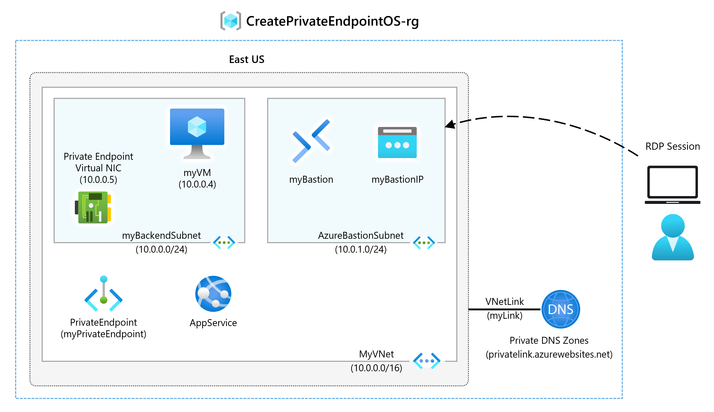

---
Exercise:
  title: 'M07: Unidad 6 Creación de un punto de conexión privado de Azure mediante Azure PowerShell'
  module: Module 07 - Design and implement private access to Azure Services
---

# M07: Unidad 6 Creación de un punto de conexión privado de Azure mediante Azure PowerShell

## Escenario del ejercicio

Comience a trabajar con Azure Private Link usando un punto de conexión privado para conectarse de forma segura a una aplicación web de Azure. Hay muchas maneras de crear puntos de conexión, como el portal, la CLI, PowerShell, etc.




   >**Nota:** Hay disponible una **[simulación de laboratorio interactiva](https://mslabs.cloudguides.com/guides/AZ-700%20Lab%20Simulation%20-%20Create%20an%20Azure%20private%20endpoint%20using%20Azure%20PowerShell)** que le permite realizar sus propias selecciones a su entera discreción. Es posible que encuentre pequeñas diferencias entre la simulación interactiva y el laboratorio hospedado, pero las ideas y los conceptos básicos que se muestran son los mismos.

### Tiempo estimado: 45 minutos

Creará un punto de conexión privado para una aplicación web de Azure e implementará una máquina virtual para probar la conexión privada.

Se pueden crear puntos de conexión privados para distintos tipos de servicios de Azure, como Azure SQL y Azure Storage.

**Requisitos previos**

- Una aplicación web de Azure con un plan de servicio de aplicaciones de nivel PremiumV2 o superior implementado en la suscripción de Azure.

- Los pasos siguientes le guiarán a través de la creación del grupo de recursos y la aplicación web necesarios.

1. Busca y abre **parameters.json** en la carpeta M07. Ábralo en el Bloc de notas y busque la línea "value": "GEN-UNIQUE". Reemplace la cadena GEN-UNIQUE de marcador de posición por un valor único para el nombre de la aplicación web. Guarde este cambio.

1. En Azure Portal, abre la sesión de **PowerShell** en el panel **Cloud Shell**.

1. En la barra de herramientas del panel de Cloud Shell, selecciona el icono **Administrar archivos**, en el menú desplegable, selecciona **Cargar** y carga los siguientes archivos **template.json** y **parameters.json** en el directorio principal de Cloud Shell.

    > **Nota:** Si estás trabajando en tu propia suscripción los [archivos de plantilla](https://github.com/MicrosoftLearning/AZ-700-Designing-and-Implementing-Microsoft-Azure-Networking-Solutions/tree/master/Allfiles/Exercises) están disponibles en el repositorio de laboratorio de GitHub.

Si decide instalar y usar PowerShell de forma local, para realizar los pasos de este ejemplo necesita la versión 5.4.1 del módulo de Azure PowerShell o cualquier versión posterior. Ejecute ```Get-Module -ListAvailable Az``` para buscar la versión instalada. Si necesita actualizarla, consulte [Instalación del módulo de Azure PowerShell](https://docs.microsoft.com/en-us/powershell/azure/install-az-ps). Si PowerShell se ejecuta localmente, también debe ejecutar ```Connect-AzAccount``` para crear una conexión con Azure.

En este ejercicio, aprenderá a:

- Tarea 1: Creación de un grupo de recursos
- Tarea 2: Creación de una red virtual y un host bastión
- Tarea 3: Creación de una máquina virtual de prueba
- Tarea 4: Creación de un punto de conexión privado
- Tarea 5: Configuración de la zona DNS privada
- Tarea 6: Prueba de la conectividad con el punto de conexión privado

## Tarea 1: Creación de un grupo de recursos e implementación de la aplicación web de requisitos previos

Un grupo de recursos de Azure es un contenedor lógico en el que se implementan y se administran los recursos de Azure.

Cree un grupo de recursos con [New-AzResourceGroup](https://docs.microsoft.com/en-us/powershell/module/az.resources/new-azresourcegroup):

```PowerShell
New-AzResourceGroup -Name 'CreatePrivateEndpointQS-rg' -Location 'eastus'
```

Implementa las plantillas de ARM siguientes a fin de crear las máquinas virtuales necesarias para este ejercicio:

   ```powershell
   $RGName = "CreatePrivateEndpointQS-rg"
   
   New-AzResourceGroupDeployment -ResourceGroupName $RGName -TemplateFile template.json -TemplateParameterFile parameters.json
   ```

Si recibes un error (por ejemplo, mientras examinas el estado de implementación en el portal), como “El sitio web con el nombre especificado GEN-UNIQUE ya existe”. Asegúrate de ir a los requisitos previos mencionados anteriormente con respecto a la edición de la plantilla.

## Tarea 2: Creación de una red virtual y un host bastión

Creará una red virtual, una subred y un host bastión.

El host bastión se utilizará para conectarse de forma segura a la máquina virtual a fin de probar el punto de conexión privado.

Creación de una red virtual y un host bastión con:

- New-AzVirtualNetwork

- New-AzPublicIpAddress

- New-AzBastion

```PowerShell

## Create backend subnet config. ##

$subnetConfig = New-AzVirtualNetworkSubnetConfig -Name myBackendSubnet -AddressPrefix 10.0.0.0/24

## Create Azure Bastion subnet. ##

$bastsubnetConfig = New-AzVirtualNetworkSubnetConfig -Name AzureBastionSubnet -AddressPrefix 10.0.1.0/24

## Create the virtual network. ##

$parameters1 = @{

 Name = 'MyVNet'

 ResourceGroupName = 'CreatePrivateEndpointQS-rg'

 Location = 'eastus'

 AddressPrefix = '10.0.0.0/16'

 Subnet = $subnetConfig, $bastsubnetConfig

}

$vnet = New-AzVirtualNetwork @parameters1

## Create public IP address for bastion host. ##

$parameters2 = @{

 Name = 'myBastionIP'

 ResourceGroupName = 'CreatePrivateEndpointQS-rg'

 Location = 'eastus'

 Sku = 'Standard'

 AllocationMethod = 'Static'

}

$publicip = New-AzPublicIpAddress @parameters2

## Create bastion host ##

$parameters3 = @{

 ResourceGroupName = 'CreatePrivateEndpointQS-rg'

 Name = 'myBastion'

 PublicIpAddress = $publicip

 VirtualNetwork = $vnet

}

New-AzBastion @parameters3
```

## Tarea 3: Creación de una máquina virtual de prueba

En esta sección, creará una máquina virtual que se utilizará para probar el punto de conexión privado.

Usa los siguientes comandos para crear la máquina virtual:

- Get-Credential (Nota: Se te pedirá que proporciones una contraseña de administrador).

- New-AzNetworkInterface

- New-AzVM

- New-AzVMConfig

- Set-AzVMOperatingSystem

- Set-AzVMSourceImage

- Add-AzVMNetworkInterface

```PowerShell
## Set credentials for server admin and password. ##

$cred = Get-Credential

## Command to get virtual network configuration. ##

$vnet = Get-AzVirtualNetwork -Name myVNet -ResourceGroupName CreatePrivateEndpointQS-rg

## Command to create network interface for VM ##

$parameters1 = @{

 Name = 'myNicVM'

 ResourceGroupName = 'CreatePrivateEndpointQS-rg'

 Location = 'eastus'

 Subnet = $vnet.Subnets[0]

}

$nicVM = New-AzNetworkInterface @parameters1

## Create a virtual machine configuration.##

$parameters2 = @{

 VMName = 'myVM'

 VMSize = 'Standard_DS1_v2'

}

$parameters3 = @{

 ComputerName = 'myVM'

 Credential = $cred

}

$parameters4 = @{

 PublisherName = 'MicrosoftWindowsServer'

 Offer = 'WindowsServer'

 Skus = '2019-Datacenter'

 Version = 'latest'

}

$vmConfig = New-AzVMConfig @parameters2 | Set-AzVMOperatingSystem -Windows @parameters3 | Set-AzVMSourceImage @parameters4 | Add-AzVMNetworkInterface -Id $nicVM.Id

## Create the virtual machine ##

New-AzVM -ResourceGroupName 'CreatePrivateEndpointQS-rg' -Location 'eastus' -VM $vmConfig 


```

Azure proporciona una dirección IP efímera para las instancias de Azure Virtual Machines que no tienen asignada una dirección IP pública o que se encuentran en el grupo de back-end de una instancia de Azure Load Balancer del nivel Básico. El mecanismo de dirección IP efímera proporciona una dirección IP de salida que no se puede configurar.

La dirección IP efímera se deshabilita cuando se asigna una dirección IP pública a la máquina virtual o cuando se coloca la máquina virtual en el grupo de back-end de una instancia de Load Balancer Estándar con o sin reglas de salida. Si se asigna un recurso de puerta de enlace de Azure Virtual Network NAT a la subred de la máquina virtual, la dirección IP efímera se deshabilita.

Para más información sobre las conexiones salientes en Azure, consulte Uso de la Traducción de direcciones de red de origen (SNAT) para conexiones salientes.

## Tarea 4: Creación de un punto de conexión privado

En esta sección creará el punto de conexión privado y la conexión con:

- New-AzPrivateLinkServiceConnection

- New-AzPrivateEndpoint

```PowerShell
## Place web app into variable. This assumes that only one web app exists in the resource group. ##

$webapp = Get-AzWebApp -ResourceGroupName CreatePrivateEndpointQS-rg

## Create Private Endpoint connection. ##

$parameters1 = @{

 Name = 'myConnection'

 PrivateLinkServiceId = $webapp.ID

 GroupID = 'sites'

}

$privateEndpointConnection = New-AzPrivateLinkServiceConnection @parameters1

## Place virtual network into variable. ##

$vnet = Get-AzVirtualNetwork -ResourceGroupName 'CreatePrivateEndpointQS-rg' -Name 'myVNet'

## Disable private endpoint network policy ##

$vnet.Subnets[0].PrivateEndpointNetworkPolicies = "Disabled"

$vnet | Set-AzVirtualNetwork

## Create private endpoint

$parameters2 = @{

 ResourceGroupName = 'CreatePrivateEndpointQS-rg'

 Name = 'myPrivateEndpoint'

 Location = 'eastus'

 Subnet = $vnet.Subnets[0]

 PrivateLinkServiceConnection = $privateEndpointConnection

}

New-AzPrivateEndpoint @parameters2 
```

## Tarea 5: Configuración de la zona DNS privada

En esta sección creará y configurará la zona DNS privada con:

- New-AzPrivateDnsZone

- New-AzPrivateDnsVirtualNetworkLink

- New-AzPrivateDnsZoneConfig

- New-AzPrivateDnsZoneGroup

```PowerShell
## Place virtual network into variable. ##

$vnet = Get-AzVirtualNetwork -ResourceGroupName 'CreatePrivateEndpointQS-rg' -Name 'myVNet'

## Create private dns zone. ##

$parameters1 = @{

 ResourceGroupName = 'CreatePrivateEndpointQS-rg'

 Name = 'privatelink.azurewebsites.net'

}

$zone = New-AzPrivateDnsZone @parameters1

## Create dns network link. ##

$parameters2 = @{

 ResourceGroupName = 'CreatePrivateEndpointQS-rg'

 ZoneName = 'privatelink.azurewebsites.net'

 Name = 'myLink'

 VirtualNetworkId = $vnet.Id

}

$link = New-AzPrivateDnsVirtualNetworkLink @parameters2

## Create DNS configuration ##

$parameters3 = @{

 Name = 'privatelink.azurewebsites.net'

 PrivateDnsZoneId = $zone.ResourceId

}

$config = New-AzPrivateDnsZoneConfig @parameters3

## Create DNS zone group. ##

$parameters4 = @{

 ResourceGroupName = 'CreatePrivateEndpointQS-rg'

 PrivateEndpointName = 'myPrivateEndpoint'

 Name = 'myZoneGroup'

 PrivateDnsZoneConfig = $config

}

New-AzPrivateDnsZoneGroup @parameters4 
```

## Tarea 6: Prueba de la conectividad con el punto de conexión privado

En esta sección, usarás la máquina virtual creada en el paso anterior para conectarte a la aplicación web mediante el punto de conexión privado.

1. Inicie sesión en el [Portal de Azure](https://portal.azure.com/)

1. En el panel de navegación de la izquierda, seleccione **Grupos de recursos**.

1. Seleccione **CreatePrivateEndpointQS-rg**.

1. Seleccione **myVM**.

1. En la página de información general para **myVM**, seleccione **Conectar** y, luego, **Bastion**.

1. Seleccione el botón **Usar bastión** azul.

1. Especifique el nombre de usuario y la contraseña proporcionados durante la creación de la máquina virtual.

1. Abra Windows PowerShell en el servidor después de conectarse.

1. Escribe nslookup &lt;nombre-aplicación-web&gt;.azurewebsites.net. Reemplace &lt;your-webapp-name&gt; por el nombre de la aplicación web que creó en los pasos anteriores. Recibirá un mensaje similar al que se muestra a continuación:

  ```
  Server: UnKnown
  
  Address: 168.63.129.16
  
  Non-authoritative answer:
  
  Name: mywebapp8675.privatelink.azurewebsites.net
  
  Address: 10.0.0.5
  
  Aliases: mywebapp8675.azurewebsites.net 
  ```  

Se devuelve la dirección IP privada **10.0.0.5** para el nombre de la aplicación web. Esta dirección se encuentra en la subred de la red virtual que creó anteriormente.

1. En la conexión bastión a **myVM**, abra Internet Explorer.
1. Escribe la dirección URL de la aplicación web, **https://&lt;nombre-aplicación-web&gt;.azurewebsites.net**
1. Recibirás la página de la aplicación web predeterminada si tu aplicación no se ha implementado: 
1. Cierre la conexión con **myVM**.

## Limpieza de recursos

Cuando haya terminado con el punto de conexión privado y la máquina virtual, use [Remove-AzResourceGroup](https://docs.microsoft.com/en-us/powershell/module/az.resources/remove-azresourcegroup) para quitar el grupo de recursos y todos los recursos que contiene:

```PowerShell
Remove-AzResourceGroup -Name CreatePrivateEndpointQS-rg -Force -AsJob
```

## Ampliar el aprendizaje con Copilot

Copilot puede ayudarte a aprender a usar las herramientas de scripting de Azure. Copilot también puede ayudar en áreas no cubiertas en el laboratorio o donde necesitas más información. Abre un explorador Edge y elige Copilot (superior derecha) o ve a *copilot.microsoft.com*. Dedica unos minutos a probar estas indicaciones.
+ Proporciona un ejemplo de cuándo usar un punto de conexión privado en lugar de un punto de conexión de servicio.
+ ¿Cómo puedo solucionar problemas de conectividad del punto de conexión privado?

## Obtén más información con el aprendizaje autodirigido

+ [Introducción a Azure Private Link](https://learn.microsoft.com/training/modules/introduction-azure-private-link/). En este módulo, aprenderás cómo Azure Private Link habilita la conectividad privada con los servicios de Azure, incluidas sus características, su modo de funcionamiento y casos de uso.
+ [Diseño e implementación de acceso privado en los servicios de Azure](https://learn.microsoft.com/en-us/training/modules/design-implement-private-access-to-azure-services/). En este módulo, aprenderás a diseñar e implementar acceso privado en los servicios de Azure con Azure Private Link y puntos de conexión de servicio de red virtual.

## Puntos clave

+ Azure Private Link le permite acceder a los servicios PaaS de Azure (por ejemplo, Azure Storage y SQL Database) y a los servicios hospedados en Azure que son propiedad de los clientes, o a los servicios de los asociados, a través de un punto de conexión privado de la red virtual.
+ Un punto de conexión privado es una interfaz de red que usa una dirección IP privada de la red virtual. Esta interfaz de red le conecta de forma privada y segura a un servicio con la tecnología de Azure Private Link. 
