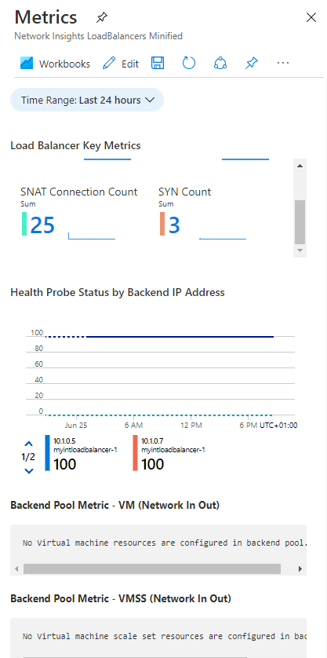
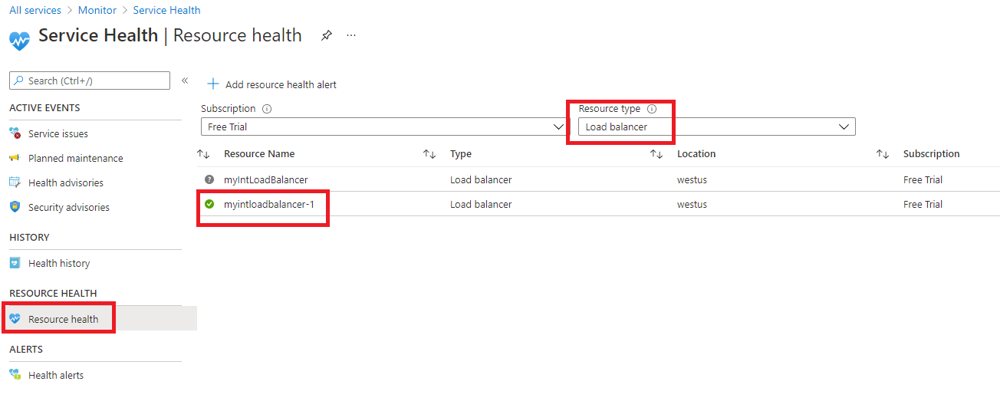

---
Exercise:
  title: 'M08: Unidad 3 Supervisión de un recurso de equilibrador de carga mediante Azure Monitor'
  module: Module 08 - Design and implement network monitoring
---

# M08: Unidad 3 Supervisión de un recurso de equilibrador de carga mediante Azure Monitor

## Escenario del ejercicio

En este ejercicio, creará un equilibrador de carga interno para la organización ficticia Contoso Ltd. Después, creará un área de trabajo de Log Analytics y usará conclusiones de Azure Monitor para ver información sobre el equilibrador de carga interno. Verá la vista de dependencia funcional, verá métricas detalladas para el recurso del equilibrador de carga y verá la información de estado de los recursos para el equilibrador de carga. Por último, establecerá la configuración de diagnóstico del equilibrador de carga para enviar métricas al área de trabajo de Log Analytics que ha creado.

En el diagrama siguiente se muestra el entorno que se va a implementar en este ejercicio.


### Aptitudes de trabajo

 En este ejercicio, aprenderás a:

+ Tarea 1: Creación de la red virtual
+ Tarea 2: Creación del equilibrador de carga
+ Tarea 3: Creación de un grupo de back-end
+ Tarea 4: Creación de un sondeo de estado
+ Tarea 5: Creación de una regla de equilibrador de carga
+ Tarea 6: Creación de servidores de back-end
+ Tarea 7: Incorporación de máquinas virtuales al grupo de back-end
+ Tarea 8: Prueba del equilibrador de carga
+ Tarea 9: Creación de un área de trabajo de Log Analytics
+ Tarea 110: Uso de la vista de dependencias funcionales
+ Tarea 11: Visualización de métricas detalladas
+ Tarea 12: Visualización del estado de los recursos
+ Tarea 13: Configuración de las opciones de diagnóstico

### Tiempo estimado: 55 minutos

## Tarea 1: Creación de la red virtual

En esta sección, creará una red virtual y una subred.

1. Inicie sesión en el Portal de Azure.

1. En Azure Portal, busque y seleccione **Redes virtuales**.

1. Seleccione **+ Create** (+ Crear).

   

1. En la pestaña **Datos básicos**, use la información de la tabla siguiente para crear la red virtual.

   | **Configuración**    | **Valor**                                           |
   | -------------- | --------------------------------------------------- |
   | Suscripción   | Selecciona la suscripción                            |
   | Resource group | Seleccione **Crear nuevo**.<br /><br />Nombre: **IntLB-RG** |
   | NOMBRE           | **IntLB-VNet**                                      |
   | Region         | **(EE. UU.) Oeste de EE. UU.**                                    |

1. Seleccione **Siguiente: Seguridad**.

1. En **BastionHost**, seleccione **Habilitar** y escriba la información de la tabla siguiente.

    | **Configuración**                       | **Valor**                                              |
    | --------------------------------- | ------------------------------------------------------ |
    | Nombre del bastión                      | **myBastionHost**                                      |
    | Dirección IP pública                 | Seleccione **Crear nuevo**.<br /><br />Nombre: **myBastionIP** |

1. Seleccione **Siguiente: Direcciones IP**.

1. **Elimine la dirección IP** y, a continuación, el **espacio de direcciones IPv4**. Escriba **10.1.0.0/16**.

1. Edite **AzureBastionSubnet** y cambie la **dirección de inicio** por **10.1.1.0**. **Guarde** el cambio. 

1. Seleccione **+ Agregar subred**; el nombre de la subred es `myBackendSubnet` y el intervalo de direcciones de subred es `10.1.0.0/24`. Seleccione **Agregar**.

1. Ahora debería tener una red virtual con dos subredes. 

1. Selecciona **Revisar + crear.**

1. Seleccione **Crear**.

## Tarea 2: Creación del equilibrador de carga

En esta sección, creará un equilibrador de carga de SKU estándar interno. La razón por la que en este ejercicio se va a crear un equilibrador de carga de SKU Estándar, en lugar de uno de SKU Básica, es que en ejercicios posteriores se necesitará una versión de SKU Estándar del equilibrador de carga.

1. En Azure Portal, busque y seleccione **Equilibradores de carga**.

1. Seleccione **Crear** y, a continuación, **Standard Load Balancer**.

1. En la pestaña **Datos básicos**, use la información de la tabla siguiente para crear el equilibrador de carga.

   | **Configuración**           | **Valor**                |
   | --------------------- | ------------------------ |
   | Pestaña Datos básicos            |                          |
   | Suscripción          | Selecciona la suscripción |
   | Resource group        | **IntLB-RG**             |
   | Nombre                  | **myIntLoadBalancer**    |
   | Region                | **(EE. UU.) Oeste de EE. UU.**         |
   | SKU                   | **Estándar**             |
   | Tipo                  | **Interno**             |

1. Vaya a la pestaña **Configuración de IP de front-end** y seleccione **+ Agregar una configuración de IP de front-end**.

   | **Configuración**            | **Valor**            |
   | Nombre                  | `LoadBalancerFrontEnd` |
   | Red virtual       | **IntLB-VNet**           |
   | Subred                | **myBackendSubnet**      |
   | Asignación de dirección IP | **Dinámica**              |

1. **Guarde** los cambios y seleccione **Revisar y crear**.

1. Después de una validación correcta, seleccione **Crear**.

## Tarea 3: Creación de un grupo de back-end

Un grupo de direcciones de back-end contiene las direcciones IP de las tarjetas de interfaz de red virtuales conectadas al equilibrador de carga.

1. En Azure Portal, busque y seleccione el recurso **myIntLoadBalancer**.

1. En **Configuración**, seleccione **Grupos de back-end** y después **Agregar**.

1. En la página **Agregar grupo de back-end,** escriba la información de la tabla siguiente.

   | **Configuración**     | **Valor**            |
   | --------------- | -------------------- |
   | Nombre            | **myBackendPool**    |
   | Virtual network | IntLB-VNet    |
   | Configuración del grupo de back-end   | **NIC** |

1. Seleccione **Guardar**.

   

## Tarea 4: Creación de un sondeo de estado

El equilibrador de carga supervisa el estado de la aplicación con un sondeo de estado. El sondeo de estado agrega o quita las máquinas virtuales del equilibrador de carga a partir de su respuesta a las comprobaciones de estado. Aquí creará un sondeo de estado para supervisar el estado de las máquinas virtuales.

1. En el recurso del equilibrador de carga, seleccione **Configuración**, **Sondeos de estado** y, después, **Agregar**.

1. En la página **Agregar sondeo de estado**, escriba la información de la tabla siguiente.

   | **Configuración**         | **Valor**         |
   | ------------------- | ----------------- |
   | Nombre                | `myHealthProbe` |
   | Protocolo            | **HTTP**          |
   | Port                | **80**            |
   | Ruta de acceso                | **/**             |
   | Intervalo            | **15**            |

1. Seleccione **Guardar**.

   

## Tarea 5: Creación de una regla de equilibrador de carga

Las reglas de equilibrador de carga se utilizan para definir cómo se distribuye el tráfico a las máquinas virtuales. Defina la configuración IP del front-end para el tráfico entrante y el grupo de direcciones IP de back-end para recibir el tráfico. Los puertos de origen y de destino se definen en la regla. Aquí creará una regla de equilibrador de carga.

1. En el recurso del equilibrador de carga, seleccione **Configuración**, **Reglas de equilibrio de carga** y, después, **Agregar**.

   | **Configuración**            | **Valor**                |
   | ---------------------- | ------------------------ |
   | Nombre                   | **myHTTPRule**           |
   | Versión de la dirección IP             | **IPv4**                 |
   | Dirección IP del front-end    | **LoadBalancerFrontEnd** |
   | Grupo back-end           | **myBackendPool**        |
   | Protocolo               | **TCP**                  |
   | Port                   | **80**                   |
   | Puerto back-end           | **80**                   |
   | Sondeo de mantenimiento           | **myHealthProbe**        |
   | Persistencia de la sesión    | **None**                 |
   | Tiempo de espera de inactividad (minutos) | **15**                   |
   | Dirección IP flotante            | **Deshabilitado**             |

   

## Tarea 6: Creación de servidores de back-end

En esta sección, creará tres máquinas virtuales para el grupo de back-end del equilibrador de carga, las agregará al grupo de back-end y, después, instalará IIS en las tres máquinas virtuales para probar el equilibrador de carga.

1. En Azure Portal, selecciona el icono Cloud Shell (parte superior derecha). Si es necesario, configura el shell.  
    + Selecciona **PowerShell**.
    + Selecciona **No se requiere cuenta de almacenamiento** y tu **Suscripción**, después, selecciona **Aplicar**.
    + Espera a que se cree el terminal y se muestre una solicitud. 

1. En la barra de herramientas del panel de Cloud Shell, selecciona el icono **Administrar archivos**, en el menú desplegable, selecciona **Cargar** y carga los siguientes archivos **azuredeploy.json** y **azuredeploy.parameters.json** en el directorio particular de Cloud Shell.

    > **Nota:** Si estás trabajando en tu propia suscripción los [archivos de plantilla](https://github.com/MicrosoftLearning/AZ-700-Designing-and-Implementing-Microsoft-Azure-Networking-Solutions/tree/master/Allfiles/Exercises) están disponibles en el repositorio de laboratorio de GitHub.

1. Implemente las siguientes plantillas de ARM para crear la red virtual, las subredes y las máquinas virtuales necesarias para este ejercicio. **Nota**: Se le pedirá que proporcione una contraseña de administrador.

   ```powershell
   $RGName = "IntLB-RG"
   New-AzResourceGroupDeployment -ResourceGroupName $RGName -TemplateFile azuredeploy.json -TemplateParameterFile azuredeploy.parameters.json
   ```
1. La implementación puede tardar varios minutos. Puede comprobar el progreso en el portal actualizando la página de recursos de la máquina virtual.   

## Tarea 7: Adición de máquinas virtuales al grupo de back-end

1. En Azure Portal, busque y seleccione el recurso **myIntLoadBalancer**.

1. En **Configuración**, seleccione **Grupos de back-end** y después **myBackendPool**.

1. En la sección **Configuraciones de IP**, seleccione **Agregar**.

1. Seleccione todas las máquinas virtuales que se muestran y, a continuación, seleccione **Agregar**.

1. Active las casillas **myVM1** y **myVM2** y, a continuación, seleccione **Agregar**.

1. En la página ** myBackendPool** selecciona **Guardar**.

## Tarea 8: Prueba del equilibrador de carga

En esta sección, creará una máquina virtual de prueba y, después, probará el equilibrador de carga.

### Conexión a la máquina virtual de prueba (VM3) para probar el equilibrador de carga

1. En Azure Portal, busque y seleccione el recurso **myIntLoadBalancer**.

1. En la página **Información general**, anote la **Dirección IP privada** o cópiela en el Portapapeles. Nota: Es posible que tengas que seleccionar **Ver más** para ver la **Dirección IP privada**.

1. Busque y seleccione **myVM3**. 

1. Seleccione **Conectar** y, a continuación, **Conectar a través de Bastion**.

1. En el cuadro **Nombre de usuario**, escribe **TestUser** y en el cuadro **Contraseña**, escribe la contraseña que has proporcionado durante la implementación y luego selecciona **Conectar**.

1. La ventana **myTestVM** se abrirá en otra pestaña del explorador.

1. Si aparece el panel **Redes**, selecciona **Sí**.

1. Selecciona el icono **Internet Explorer** de la barra de tareas para abrir el explorador web.

1. Selecciona **Aceptar** en el cuadro de diálogo **Configurar Internet Explorer 11**.

1. Escriba (o pegue) la dirección IP del equilibrador de carga (por ejemplo, 10.1.0.4).

1. Una de las dos máquinas virtuales de servidores back-end (myVM1 o myVM2) responderá. Continúe actualizando la página y observe que la respuesta procede aleatoriamente de los servidores back-end. 

## Tarea 9: Creación de un área de trabajo de Log Analytics

1. En Azure Portal, busque y seleccione el recurso **Áreas de trabajo de Log Analytics**.
   
1. Seleccione **Crear**.

1. En la página **Crear área de trabajo de Log Analytics**, en la pestaña **Datos básicos**, use la información de la tabla siguiente para crear el área de trabajo.

   | **Configuración**    | **Valor**                |
   | -------------- | ------------------------ |
   | Suscripción   | Selecciona la suscripción |
   | Resource group | **IntLB-RG**             |
   | NOMBRE           | **myLAworkspace**        |
   | Region         | **Oeste de EE. UU.**              |

1. Seleccione **Revisar y crear** y, a continuación, seleccione **Crear**.

## Tarea 110: Uso de la vista de dependencias funcionales

1. En Azure Portal, busque y seleccione el recurso **myIntLoadBalancer**. 

   

1. En **Supervisión**, seleccione **Conclusiones**.

1. En el panel Métricas se proporciona una vista rápida de algunas métricas clave para este recurso de equilibrador de carga, en forma de gráficos de barras y líneas.

    

## Tarea 11: Visualización de métricas detalladas

1. Para ver métricas más completas sobre este recurso de red, selecciona **Ver métricas detalladas**.
   

1. Se abrirá una página **Métricas** completa de gran tamaño en la plataforma de conclusiones de red de Azure. La primera pestaña es **Información general**, en la que se muestra el estado de disponibilidad del equilibrador de carga y el rendimiento general de los datos y la disponibilidad de front-end y back-end para cada una de las direcciones IP de front-end asociadas al equilibrador de carga. Estas métricas indican si la dirección IP de front-end tiene capacidad de respuesta y las instancias de proceso del grupo de back-end están respondiendo individualmente a las conexiones entrantes.
   

1. Selecciona la pestaña **Disponibilidad de front-end&amp; y back-end** y desplázate hacia abajo por la página para ver los gráficos de estado del sondeo de estado. Si ve **valores inferiores a 100** para estos elementos, significa que hay una interrupción de algún tipo en esos recursos.
   

1. Selecciona la pestaña **Rendimiento de datos** y desplázate hacia abajo en la página para ver los otros gráficos de rendimiento de datos.

1. Mantenga el puntero sobre algunos de los puntos de datos de los gráficos y verá que los valores cambian para mostrar el valor exacto en ese momento dado.
   

1. Selecciona la pestaña **Distribución del flujo** y desplázate hacia abajo en la página para ver los gráficos de la sección **Creación de flujos y tráfico de red de máquina virtual**.

   

## Tarea 12: Visualización del estado de los recursos

1. Para ver el estado de los recursos de equilibrador de carga, en la página principal de Azure Portal, selecciona **Todos los servicios** y después selecciona **Monitor**.

1. En la página **Monitor&gt;Información general**, en el menú de la izquierda, selecciona **Estado del servicio**.

1. En la página **Estado del servicio&gt;Problemas de servicio**, en el menú de la izquierda selecciona **Estado de los recursos**.

1. En la página **Service Health&gt;Estado de los recursos**, desplácese hacia abajo en la lista desplegable **Tipo de recurso** y seleccione **Equilibrador de carga**.

   

1. Después, seleccione el nombre del equilibrador de carga en la lista.

1. En la página **Estado de los recursos** se identificarán los principales problemas de disponibilidad con el recurso de equilibrador de carga. Si hay algún evento en la sección **Historial de estado**, puede expandirlo para ver más detalles. Incluso puede guardar los detalles sobre el evento como un archivo PDF para su posterior revisión y para crear informes.

   

## Tarea 13: Configuración de las opciones de diagnóstico

1. En la página principal de Azure Portal, selecciona **Grupos de recursos** y después selecciona el grupo de recursos **IntLB-RG** en la lista.

1. En la página **IntLB-RG**, selecciona en el nombre del recurso de equilibrador de carga **myIntLoadBalancer** en la lista de recursos.

1. En **Supervisión**, selecciona **Configuración de diagnóstico** y luego selecciona **Agregar configuración de diagnóstico**:

   

1. En la página **Configuración de diagnóstico**, en el cuadro de nombre, escribe **myLBDiagnostics**.

1. Active la casilla **AllMetrics** y después la casilla **Send to Log Analytics workspace** (Enviar al área de trabajo de Log Analytics).

1. Seleccione la suscripción en la lista y después **myLAworkspace (westus)** en la lista desplegable de áreas de trabajo.

1. Seleccione **Guardar**.

   

## Limpieza de recursos

>**Nota**: No olvide quitar los recursos de Azure recién creados que ya no use. La eliminación de los recursos sin usar garantiza que no verás cargos inesperados.

1. En Azure Portal, abre la sesión de **PowerShell** en el panel **Cloud Shell**.

1. Ejecute el comando siguiente para eliminar todos los grupos de recursos que ha creado en los laboratorios de este módulo:

   ```powershell
   Remove-AzResourceGroup -Name 'IntLB-RG' -Force -AsJob
   ```

>**Nota**: el comando se ejecuta de forma asincrónica (según determina el parámetro -AsJob). Aunque podrás ejecutar otro comando de PowerShell inmediatamente después en la misma sesión de PowerShell, los grupos de recursos tardarán unos minutos en eliminarse.
    
## Ampliar el aprendizaje con Copilot

Copilot puede ayudarte a aprender a usar las herramientas de scripting de Azure. Copilot también puede ayudar en áreas no cubiertas en el laboratorio o donde necesitas más información. Abre un explorador Edge y elige Copilot (superior derecha) o ve a *copilot.microsoft.com*. Dedica unos minutos a probar estas indicaciones.
+ Resume las herramientas de Azure que están disponibles para la supervisión de redes virtuales.
+ ¿Qué herramientas de supervisión de Azure Network Watcher están disponibles?

## Más información con el aprendizaje autodirigido

+ [Introducción a Azure Monitor](https://learn.microsoft.com/training/modules/intro-to-azure-monitor/). En este módulos, aprenderás a usar Azure Monitor para proporcionar información sobre el rendimiento y las operaciones de los recursos de Azure.
+ [Supervisión y solución de problemas de la infraestructura de red de Azure de un extremo a otro mediante herramientas de supervisión de red](https://learn.microsoft.com/training/modules/troubleshoot-azure-network-infrastructure/). En este módulo, aprederás a utilizar herramientas, diagnósticos y registros de Azure Network Watcher para encontrar y corregir incidencias de red en la infraestructura de Azure.

## Puntos clave

Enhorabuena por completar el laboratorio. Estas son las principales conclusiones del laboratorio. 

+ Azure Monitor proporciona características y herramientas para recopilar, administrar y analizar datos de TI de todos los recursos de Azure, otras nubes y locales.
+ Las métricas son medidas cuantitativas que muestran instantáneas del rendimiento de las aplicaciones o recursos. Las métricas suelen ser valores numéricos que se pueden medir con el tiempo.
+ Los registros son registros textuales de eventos, acciones y mensajes que se producen en un recurso o aplicación. 
+ La información, las visualizaciones y los paneles de Azure Monitor pueden consumir y transmitir información de supervisión sobre tus aplicaciones.
+ Las alertas le notifican las condiciones críticas y pueden tomar medidas correctivas. Las reglas de alerta se pueden basar en datos de métricas o de registro.+ 
    
